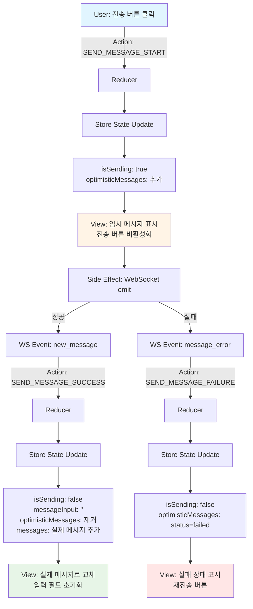
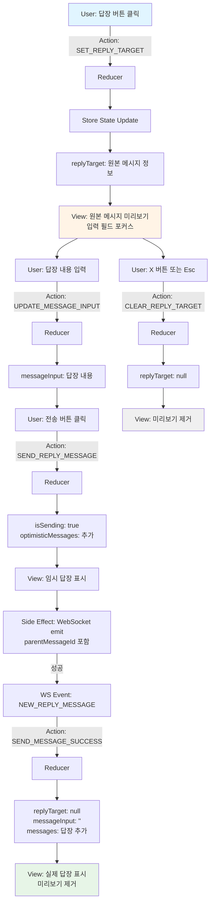
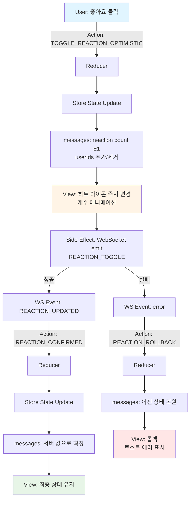
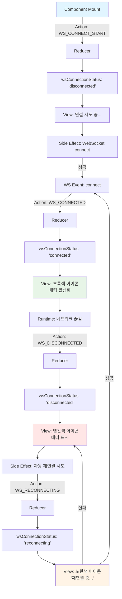

# 채팅방 페이지 상태관리 설계 문서

## 문서 정보
- **페이지**: `/rooms/{roomId}` - 채팅방 페이지
- **작성일**: 2025-10-17
- **관련 UC**: UC-004, UC-005, UC-006, UC-007
- **버전**: 1.0

---

## 1. 관리해야 할 상태 데이터 목록

### 1.1 서버 상태 (Server State)
React Query로 관리하는 서버에서 가져오는 데이터

| 상태명 | 타입 | 설명 | 관리 방법 |
|--------|------|------|-----------|
| `messages` | `Message[]` | 채팅방의 메시지 목록 | `useQuery` + WebSocket으로 실시간 업데이트 |
| `chatRoom` | `ChatRoom` | 채팅방 기본 정보 (이름, 생성자 등) | `useQuery` |
| `currentUser` | `User` | 현재 로그인한 사용자 정보 | `useQuery` (전역) |

**Message 타입 구조**:
```typescript
interface Message {
  id: number;
  room_id: number;
  user: {
    id: number;
    nickname: string;
  };
  content: string;
  parent_message_id: number | null;  // 답장인 경우 원본 메시지 ID
  parent_message?: {                  // 답장인 경우 원본 메시지 정보
    id: number;
    content: string;
    user_nickname: string;
    created_at: string;
  } | null;
  reactions: {
    like: {
      count: number;
      userIds: number[];
    };
  };
  created_at: string;

  // Optimistic Update용 임시 필드
  _tempId?: string;        // 전송 중인 메시지의 임시 ID
  _status?: 'sending' | 'sent' | 'failed';  // 전송 상태
}
```

### 1.2 클라이언트 상태 (Client State)
React 컴포넌트 내부 또는 Zustand로 관리하는 UI 상태

| 상태명 | 타입 | 설명 | 관리 방법 |
|--------|------|------|-----------|
| `messageInput` | `string` | 메시지 입력 필드 내용 | `useState` |
| `isSending` | `boolean` | 메시지 전송 중 여부 | `useState` |
| `replyTarget` | `ReplyTarget \| null` | 답장 대상 메시지 정보 | `useState` |
| `wsConnectionStatus` | `'connected' \| 'disconnected' \| 'reconnecting'` | WebSocket 연결 상태 | `useState` (Context) |
| `showScrollToBottom` | `boolean` | '새 메시지' 버튼 표시 여부 | `useState` |
| `isAtBottom` | `boolean` | 스크롤이 최하단에 있는지 여부 | `useState` |
| `optimisticMessages` | `Message[]` | Optimistic Update용 임시 메시지 목록 | `useState` |

**ReplyTarget 타입 구조**:
```typescript
interface ReplyTarget {
  messageId: number;
  content: string;
  userNickname: string;
  createdAt: string;
}
```

### 1.3 WebSocket 이벤트 상태
실시간 통신으로 수신하는 이벤트 데이터

| 이벤트 타입 | 처리 방법 | 상태 업데이트 |
|------------|----------|--------------|
| `new_message` | 서버에서 새 메시지 수신 | `messages` 배열에 추가 |
| `NEW_REPLY_MESSAGE` | 답장 메시지 수신 | `messages` 배열에 추가 (parent_message 포함) |
| `REACTION_UPDATED` | 반응 변경 수신 | 해당 메시지의 `reactions` 필드 업데이트 |
| `message_error` | 메시지 전송 실패 | Optimistic 메시지를 실패 상태로 변경 |

---

## 2. 화면상 보이지만 상태가 아닌 데이터 (Derived State)

계산으로 도출되는 값들로, 별도 상태로 관리하지 않음

| 데이터 | 계산 방식 | 설명 |
|--------|----------|------|
| `isOwnMessage` | `message.user.id === currentUser.id` | 메시지가 본인의 것인지 여부 (좌/우 정렬 결정) |
| `formattedTimestamp` | `formatDistanceToNow(message.created_at)` | "방금 전", "5분 전" 등 상대적 시간 표시 |
| `hasReacted` | `message.reactions.like.userIds.includes(currentUser.id)` | 현재 사용자가 해당 메시지에 반응했는지 여부 |
| `displayMessages` | `[...messages, ...optimisticMessages].sort(...)` | 실제 메시지 + Optimistic 메시지 통합 정렬 |
| `shouldShowDateDivider` | 이전 메시지와 날짜 비교 | "오늘", "어제" 등 날짜 구분선 표시 여부 |
| `shouldGroupMessage` | 이전 메시지 작성자와 비교 | 연속된 같은 사용자 메시지 그룹핑 여부 |
| `canSendMessage` | `messageInput.trim().length > 0 && !isSending && wsConnectionStatus === 'connected'` | 전송 버튼 활성화 여부 |
| `messageInputLineCount` | `messageInput.split('\n').length` | 입력 필드 높이 조정용 줄 수 |

---

## 3. 상태 변경 조건 및 화면 변화

### 3.1 메시지 입력 관련 상태

| 상태 | 변경 조건 | 변경 전 화면 | 변경 후 화면 |
|------|----------|-------------|-------------|
| `messageInput` | 사용자가 텍스트 입력 | 입력 필드 비어있음, 전송 버튼 비활성화 | 입력한 텍스트 표시, 전송 버튼 활성화 |
| `messageInput` | 메시지 전송 완료 (성공 시) | 입력한 텍스트 표시 | 입력 필드 초기화 (빈 문자열) |
| `messageInput` | Enter 키 입력 (Shift 없음) | 입력한 텍스트 표시 | 메시지 전송 → 입력 필드 초기화 |
| `messageInput` | Shift+Enter 키 입력 | 1줄 텍스트 | 줄바꿈 추가 (최대 5줄까지 자동 확장) |

### 3.2 메시지 전송 관련 상태

| 상태 | 변경 조건 | 변경 전 화면 | 변경 후 화면 |
|------|----------|-------------|-------------|
| `isSending` | 전송 버튼 클릭 또는 Enter 키 입력 | `false`, 전송 버튼 활성화 | `true`, 전송 버튼 비활성화, 스피너 표시 |
| `isSending` | 서버 응답 수신 (성공/실패) | `true`, 스피너 표시 | `false`, 전송 버튼 재활성화 |
| `optimisticMessages` | 메시지 전송 시작 | 빈 배열 또는 이전 임시 메시지 | 새 임시 메시지 추가 (흐리게 표시, 스피너) |
| `optimisticMessages` | 서버에서 `new_message` 수신 | 임시 메시지 표시 중 | 임시 메시지 제거, 실제 메시지로 교체 |
| `optimisticMessages` | 전송 실패 (`message_error`) | 임시 메시지 '전송 중' 상태 | 임시 메시지 '실패' 상태로 변경, 재전송 버튼 표시 |

### 3.3 답장 관련 상태

| 상태 | 변경 조건 | 변경 전 화면 | 변경 후 화면 |
|------|----------|-------------|-------------|
| `replyTarget` | 특정 메시지의 '답장' 버튼 클릭 | `null`, 일반 입력 모드 | 원본 메시지 미리보기 표시, 입력 필드 포커스 |
| `replyTarget` | 답장 미리보기의 'X' 버튼 클릭 | 답장 미리보기 표시 중 | `null`, 미리보기 제거, 일반 입력 모드로 전환 |
| `replyTarget` | 답장 메시지 전송 완료 | 답장 미리보기 표시 중 | `null`, 미리보기 제거 |
| `replyTarget` | Esc 키 입력 | 답장 미리보기 표시 중 | `null`, 미리보기 제거 |

### 3.4 메시지 목록 관련 상태

| 상태 | 변경 조건 | 변경 전 화면 | 변경 후 화면 |
|------|----------|-------------|-------------|
| `messages` | WebSocket에서 `new_message` 수신 | 이전 메시지 목록 | 새 메시지 추가, 스크롤 최하단 이동 (조건부) |
| `messages` | WebSocket에서 `NEW_REPLY_MESSAGE` 수신 | 이전 메시지 목록 | 답장 메시지 추가 (원본 메시지 인용 표시) |
| `messages` | WebSocket에서 `REACTION_UPDATED` 수신 | 반응 개수: 5, 하트 비활성 | 반응 개수: 6, 하트 활성화 (애니메이션) |
| `messages` | 페이지 첫 로드 (`useQuery` 성공) | 로딩 스피너 표시 | 기존 메시지 목록 렌더링, 스크롤 최하단 |

### 3.5 WebSocket 연결 상태

| 상태 | 변경 조건 | 변경 전 화면 | 변경 후 화면 |
|------|----------|-------------|-------------|
| `wsConnectionStatus` | 채팅방 페이지 진입 시 연결 성공 | `'disconnected'` | `'connected'`, 헤더에 연결 상태 아이콘 초록색 |
| `wsConnectionStatus` | 네트워크 끊김 감지 | `'connected'`, 초록색 아이콘 | `'disconnected'`, 빨간색 아이콘, "연결 끊김" 배너 표시 |
| `wsConnectionStatus` | 자동 재연결 시도 중 | `'disconnected'` | `'reconnecting'`, 노란색 아이콘, "재연결 중..." 배너 |
| `wsConnectionStatus` | 재연결 성공 | `'reconnecting'`, 노란색 아이콘 | `'connected'`, 초록색 아이콘, 배너 자동 숨김 |

### 3.6 스크롤 관련 상태

| 상태 | 변경 조건 | 변경 전 화면 | 변경 후 화면 |
|------|----------|-------------|-------------|
| `isAtBottom` | 사용자가 스크롤을 위로 올림 | `true` | `false` |
| `isAtBottom` | 스크롤이 최하단에 도달 | `false` | `true` |
| `showScrollToBottom` | `!isAtBottom && 새 메시지 수신` | `false`, 버튼 숨김 | `true`, "새 메시지 ↓" 버튼 표시 (우측 하단) |
| `showScrollToBottom` | `isAtBottom` 또는 버튼 클릭 | `true`, 버튼 표시 중 | `false`, 버튼 숨김, 스크롤 최하단 이동 |

---

## 4. 상태 관리 전략

### 4.1 서버 상태 관리 (React Query)

**메시지 목록 조회**:
```typescript
const { data: messages, isLoading } = useQuery({
  queryKey: ['chatRoom', roomId, 'messages'],
  queryFn: () => fetchMessages(roomId),
  staleTime: Infinity,  // 메시지는 WebSocket으로만 업데이트
  refetchOnWindowFocus: false,
});
```

**WebSocket 실시간 업데이트**:
```typescript
useEffect(() => {
  const ws = connectWebSocket(roomId);

  ws.on('new_message', (newMessage) => {
    queryClient.setQueryData(['chatRoom', roomId, 'messages'], (old) => {
      return [...old, newMessage];
    });
  });

  ws.on('REACTION_UPDATED', (update) => {
    queryClient.setQueryData(['chatRoom', roomId, 'messages'], (old) => {
      return old.map(msg =>
        msg.id === update.messageId
          ? { ...msg, reactions: updateReactions(msg.reactions, update) }
          : msg
      );
    });
  });

  return () => ws.disconnect();
}, [roomId]);
```

### 4.2 Optimistic Update 전략

**메시지 전송 시 낙관적 업데이트**:
```typescript
const sendMessage = async (content: string, parentMessageId?: number) => {
  const tempId = `temp-${Date.now()}`;
  const optimisticMessage: Message = {
    _tempId: tempId,
    _status: 'sending',
    content,
    user: currentUser,
    created_at: new Date().toISOString(),
    parent_message_id: parentMessageId || null,
    reactions: { like: { count: 0, userIds: [] } },
  };

  // UI에 즉시 표시
  setOptimisticMessages(prev => [...prev, optimisticMessage]);

  try {
    // WebSocket으로 전송
    await ws.emit('send_message', { content, parentMessageId });

    // 서버 응답 대기 (new_message 이벤트에서 처리)
  } catch (error) {
    // 실패 시 상태 변경
    setOptimisticMessages(prev =>
      prev.map(msg =>
        msg._tempId === tempId
          ? { ...msg, _status: 'failed' }
          : msg
      )
    );
  }
};
```

**서버 응답 수신 시 Optimistic 메시지 제거**:
```typescript
ws.on('new_message', (serverMessage) => {
  // Optimistic 메시지 제거 (시간과 내용으로 매칭)
  setOptimisticMessages(prev =>
    prev.filter(msg => {
      const timeDiff = Math.abs(
        new Date(msg.created_at).getTime() -
        new Date(serverMessage.created_at).getTime()
      );
      return timeDiff > 5000 || msg.content !== serverMessage.content;
    })
  );

  // 실제 메시지를 React Query 캐시에 추가
  queryClient.setQueryData(['chatRoom', roomId, 'messages'], (old) => {
    return [...old, serverMessage];
  });
});
```

### 4.3 스크롤 자동화 로직

```typescript
useEffect(() => {
  const messageContainer = messageContainerRef.current;
  if (!messageContainer) return;

  // 새 메시지 추가 시
  if (isAtBottom) {
    // 최하단에 있으면 자동 스크롤
    messageContainer.scrollTop = messageContainer.scrollHeight;
  } else {
    // 위에 있으면 "새 메시지" 버튼 표시
    setShowScrollToBottom(true);
  }
}, [messages, optimisticMessages]);

// 스크롤 위치 감지
const handleScroll = () => {
  const { scrollTop, scrollHeight, clientHeight } = messageContainerRef.current;
  const atBottom = scrollHeight - scrollTop - clientHeight < 50; // 50px 여유
  setIsAtBottom(atBottom);

  if (atBottom) {
    setShowScrollToBottom(false);
  }
};
```

---

## 5. 컴포넌트 구조 및 상태 배치

### 5.1 컴포넌트 계층 구조

```
ChatRoomPage
├─ ChatRoomHeader (채팅방 이름, 연결 상태 표시)
│  └─ ConnectionStatus (wsConnectionStatus)
│
├─ MessageList (메시지 목록 영역)
│  ├─ DateDivider (날짜 구분선)
│  ├─ MessageItem (개별 메시지)
│  │  ├─ MessageBubble (메시지 내용)
│  │  ├─ ReplyPreview (답장인 경우 원본 메시지 미리보기)
│  │  ├─ ReactionButton (좋아요 버튼)
│  │  └─ MessageActions (답장 버튼 등)
│  └─ OptimisticMessageItem (전송 중 메시지)
│
├─ ScrollToBottomButton (showScrollToBottom)
│
└─ MessageInputArea (메시지 입력 영역)
   ├─ ReplyTargetPreview (replyTarget)
   ├─ MessageTextarea (messageInput)
   └─ SendButton (isSending)
```

### 5.2 상태 소유권

| 컴포넌트 | 소유한 상태 | 전달받는 Props |
|---------|------------|---------------|
| `ChatRoomPage` | `messages`, `wsConnectionStatus`, `currentUser` | `roomId` (라우터) |
| `MessageInputArea` | `messageInput`, `isSending`, `replyTarget` | `onSendMessage`, `wsConnectionStatus` |
| `MessageList` | `isAtBottom`, `showScrollToBottom` | `messages`, `optimisticMessages` |
| `MessageItem` | (없음 - stateless) | `message`, `isOwnMessage`, `currentUser` |
| `ReactionButton` | (낙관적 업데이트용 로컬 상태) | `message`, `onToggleReaction` |

---

## 6. 에러 상태 관리

### 6.1 에러 타입 정의

```typescript
type MessageError =
  | { type: 'SEND_FAILED'; message: string; retryable: boolean }
  | { type: 'CONNECTION_LOST'; message: string }
  | { type: 'MESSAGE_TOO_LONG'; message: string }
  | { type: 'UNAUTHORIZED'; message: string };
```

### 6.2 에러 처리 전략

| 에러 타입 | 화면 표시 | 사용자 액션 |
|----------|----------|------------|
| `SEND_FAILED` | 메시지 옆에 빨간 경고 아이콘 | "재전송" 버튼 제공 |
| `CONNECTION_LOST` | 상단 배너: "연결이 끊어졌습니다" | 자동 재연결 시도, 수동 새로고침 버튼 |
| `MESSAGE_TOO_LONG` | 입력 필드 하단 에러 텍스트 | 메시지 길이 줄이기 |
| `UNAUTHORIZED` | 전체 페이지 리디렉션 | 로그인 페이지로 이동 |

---

## 7. 성능 최적화 전략

### 7.1 메모이제이션

```typescript
// 메시지 목록 렌더링 최적화
const displayMessages = useMemo(() => {
  return [...messages, ...optimisticMessages]
    .sort((a, b) => new Date(a.created_at).getTime() - new Date(b.created_at).getTime());
}, [messages, optimisticMessages]);

// 메시지 아이템 메모이제이션
const MessageItem = React.memo(({ message, isOwnMessage }) => {
  // ...
}, (prevProps, nextProps) => {
  return prevProps.message.id === nextProps.message.id &&
         prevProps.message.reactions.like.count === nextProps.message.reactions.like.count;
});
```

### 7.2 가상 스크롤링 (선택사항)

메시지가 1000개 이상일 경우 `react-window` 사용:
```typescript
import { VariableSizeList } from 'react-window';

<VariableSizeList
  height={600}
  itemCount={displayMessages.length}
  itemSize={getMessageHeight}  // 메시지 높이 계산
  width="100%"
>
  {({ index, style }) => (
    <div style={style}>
      <MessageItem message={displayMessages[index]} />
    </div>
  )}
</VariableSizeList>
```

---

## 8. 테스트 시나리오

### 8.1 상태 변경 테스트

| 테스트 케이스 | 초기 상태 | 액션 | 기대 상태 |
|-------------|----------|------|----------|
| 메시지 입력 | `messageInput: ''` | 텍스트 입력 "안녕" | `messageInput: '안녕'`, 전송 버튼 활성화 |
| 메시지 전송 | `messageInput: '안녕'`, `isSending: false` | 전송 버튼 클릭 | `isSending: true`, Optimistic 메시지 추가 |
| 전송 완료 | `isSending: true`, Optimistic 메시지 있음 | `new_message` 수신 | `isSending: false`, `messageInput: ''`, Optimistic 제거, 실제 메시지 추가 |
| 답장 시작 | `replyTarget: null` | 메시지 답장 버튼 클릭 | `replyTarget: { messageId, content, ... }`, 미리보기 표시 |
| 답장 취소 | `replyTarget: {...}` | 'X' 버튼 클릭 | `replyTarget: null`, 미리보기 제거 |
| 반응 토글 | `message.reactions.like.count: 5` | 좋아요 클릭 | Optimistic: count 6, 서버 응답 후 확정 |
| 연결 끊김 | `wsConnectionStatus: 'connected'` | 네트워크 끊김 | `wsConnectionStatus: 'disconnected'`, 배너 표시 |
| 재연결 | `wsConnectionStatus: 'disconnected'` | 자동 재연결 | `wsConnectionStatus: 'reconnecting'` → `'connected'` |

---

## 9. 구현 우선순위

### Phase 1: 기본 메시지 기능
1. ✅ 메시지 목록 조회 및 표시 (`messages`)
2. ✅ 메시지 입력 (`messageInput`)
3. ✅ 메시지 전송 (`isSending`, Optimistic Update)
4. ✅ WebSocket 연결 및 실시간 수신 (`wsConnectionStatus`)

### Phase 2: 상호작용 기능
5. ✅ 답장 기능 (`replyTarget`)
6. ✅ 반응 기능 (메시지 내 `reactions` 상태)
7. ✅ 스크롤 자동화 (`isAtBottom`, `showScrollToBottom`)

### Phase 3: UX 개선
8. 에러 처리 및 재시도 로직
9. 연결 상태 표시 및 재연결
10. 메시지 로딩 상태 및 스켈레톤 UI

### Phase 4: 성능 최적화
11. 메모이제이션 및 렌더링 최적화
12. 가상 스크롤링 (메시지 1000개 이상 시)
13. WebSocket 재연결 전략 개선

---

## 10. 변경 이력

| 버전 | 날짜 | 작성자 | 변경 내용 |
|------|------|--------|-----------|
| 1.0  | 2025-10-17 | Claude | 초기 작성 - 채팅방 페이지 상태관리 설계 |

---

---

## 11. Flux 패턴 시각화 (Action → Store → View)

### 11.1 메시지 전송 플로우 (Optimistic Update)



### 11.2 답장 플로우



### 11.3 반응 토글 플로우 (Optimistic Update)



### 11.4 WebSocket 연결 상태 플로우



---

## 12. useReducer 기반 상태 관리 구현

### 12.1 상태 타입 정의

```typescript
// src/features/chat/types/state.ts

import type { Message, ReplyTarget, MessageError } from './message';

export type WSConnectionStatus = 'connected' | 'disconnected' | 'reconnecting';

export interface ChatRoomState {
  // 메시지 관련
  messageInput: string;
  isSending: boolean;
  optimisticMessages: Message[];

  // 답장 관련
  replyTarget: ReplyTarget | null;

  // WebSocket 연결
  wsConnectionStatus: WSConnectionStatus;

  // 스크롤 관련
  isAtBottom: boolean;
  showScrollToBottom: boolean;

  // 에러 상태
  error: MessageError | null;
}

export const initialState: ChatRoomState = {
  messageInput: '',
  isSending: false,
  optimisticMessages: [],
  replyTarget: null,
  wsConnectionStatus: 'disconnected',
  isAtBottom: true,
  showScrollToBottom: false,
  error: null,
};
```

### 12.2 액션 타입 정의

```typescript
// src/features/chat/types/actions.ts

import type { Message, ReplyTarget, MessageError } from './message';

export type ChatRoomAction =
  // 메시지 입력
  | { type: 'UPDATE_MESSAGE_INPUT'; payload: string }
  | { type: 'CLEAR_MESSAGE_INPUT' }

  // 메시지 전송
  | { type: 'SEND_MESSAGE_START'; payload: { message: Message } }
  | { type: 'SEND_MESSAGE_SUCCESS'; payload: { tempId: string } }
  | { type: 'SEND_MESSAGE_FAILURE'; payload: { tempId: string; error: MessageError } }

  // 답장
  | { type: 'SET_REPLY_TARGET'; payload: ReplyTarget }
  | { type: 'CLEAR_REPLY_TARGET' }

  // 반응 (Optimistic Update)
  | { type: 'TOGGLE_REACTION_OPTIMISTIC'; payload: { messageId: number; userId: number } }
  | { type: 'REACTION_CONFIRMED'; payload: { messageId: number; totalCount: number; userIds: number[] } }
  | { type: 'REACTION_ROLLBACK'; payload: { messageId: number } }

  // WebSocket 연결
  | { type: 'WS_CONNECT_START' }
  | { type: 'WS_CONNECTED' }
  | { type: 'WS_DISCONNECTED' }
  | { type: 'WS_RECONNECTING' }

  // 스크롤
  | { type: 'SET_IS_AT_BOTTOM'; payload: boolean }
  | { type: 'SET_SHOW_SCROLL_TO_BOTTOM'; payload: boolean }

  // 에러
  | { type: 'SET_ERROR'; payload: MessageError | null }
  | { type: 'CLEAR_ERROR' };
```

### 12.3 Reducer 함수

```typescript
// src/features/chat/reducers/chatRoomReducer.ts

import type { ChatRoomState, ChatRoomAction } from '../types';

export const chatRoomReducer = (
  state: ChatRoomState,
  action: ChatRoomAction
): ChatRoomState => {
  switch (action.type) {
    // 메시지 입력
    case 'UPDATE_MESSAGE_INPUT':
      return {
        ...state,
        messageInput: action.payload,
        error: null,
      };

    case 'CLEAR_MESSAGE_INPUT':
      return {
        ...state,
        messageInput: '',
      };

    // 메시지 전송
    case 'SEND_MESSAGE_START':
      return {
        ...state,
        isSending: true,
        optimisticMessages: [...state.optimisticMessages, action.payload.message],
        error: null,
      };

    case 'SEND_MESSAGE_SUCCESS':
      return {
        ...state,
        isSending: false,
        messageInput: '',
        replyTarget: null,
        optimisticMessages: state.optimisticMessages.filter(
          (msg) => msg._tempId !== action.payload.tempId
        ),
      };

    case 'SEND_MESSAGE_FAILURE':
      return {
        ...state,
        isSending: false,
        optimisticMessages: state.optimisticMessages.map((msg) =>
          msg._tempId === action.payload.tempId
            ? { ...msg, _status: 'failed' as const }
            : msg
        ),
        error: action.payload.error,
      };

    // 답장
    case 'SET_REPLY_TARGET':
      return {
        ...state,
        replyTarget: action.payload,
      };

    case 'CLEAR_REPLY_TARGET':
      return {
        ...state,
        replyTarget: null,
      };

    // WebSocket 연결
    case 'WS_CONNECT_START':
      return {
        ...state,
        wsConnectionStatus: 'disconnected',
      };

    case 'WS_CONNECTED':
      return {
        ...state,
        wsConnectionStatus: 'connected',
        error: null,
      };

    case 'WS_DISCONNECTED':
      return {
        ...state,
        wsConnectionStatus: 'disconnected',
        error: { type: 'CONNECTION_LOST', message: '연결이 끊어졌습니다' },
      };

    case 'WS_RECONNECTING':
      return {
        ...state,
        wsConnectionStatus: 'reconnecting',
      };

    // 스크롤
    case 'SET_IS_AT_BOTTOM':
      return {
        ...state,
        isAtBottom: action.payload,
      };

    case 'SET_SHOW_SCROLL_TO_BOTTOM':
      return {
        ...state,
        showScrollToBottom: action.payload,
      };

    // 에러
    case 'SET_ERROR':
      return {
        ...state,
        error: action.payload,
      };

    case 'CLEAR_ERROR':
      return {
        ...state,
        error: null,
      };

    default:
      return state;
  }
};
```

### 12.4 커스텀 Hook 구현

```typescript
// src/features/chat/hooks/useChatRoomState.ts

import { useReducer, useCallback, useEffect } from 'react';
import { useQueryClient } from '@tanstack/react-query';
import { chatRoomReducer, initialState } from '../reducers/chatRoomReducer';
import { useWebSocket } from './useWebSocket';
import type { Message, ReplyTarget } from '../types';

export const useChatRoomState = (roomId: string, currentUser: User) => {
  const [state, dispatch] = useReducer(chatRoomReducer, initialState);
  const queryClient = useQueryClient();
  const ws = useWebSocket(roomId);

  // WebSocket 연결 상태 동기화
  useEffect(() => {
    if (!ws) return;

    const handleConnect = () => dispatch({ type: 'WS_CONNECTED' });
    const handleDisconnect = () => dispatch({ type: 'WS_DISCONNECTED' });
    const handleReconnecting = () => dispatch({ type: 'WS_RECONNECTING' });

    ws.on('connect', handleConnect);
    ws.on('disconnect', handleDisconnect);
    ws.on('reconnecting', handleReconnecting);

    return () => {
      ws.off('connect', handleConnect);
      ws.off('disconnect', handleDisconnect);
      ws.off('reconnecting', handleReconnecting);
    };
  }, [ws]);

  // 메시지 입력 핸들러
  const updateMessageInput = useCallback((value: string) => {
    dispatch({ type: 'UPDATE_MESSAGE_INPUT', payload: value });
  }, []);

  // 메시지 전송 핸들러 (Optimistic Update)
  const sendMessage = useCallback(
    async (content: string) => {
      if (!ws || state.wsConnectionStatus !== 'connected') {
        dispatch({
          type: 'SET_ERROR',
          payload: { type: 'CONNECTION_LOST', message: '서버와 연결되지 않았습니다' },
        });
        return;
      }

      const tempId = `temp-${Date.now()}-${Math.random()}`;
      const optimisticMessage: Message = {
        _tempId: tempId,
        _status: 'sending',
        room_id: Number(roomId),
        user: currentUser,
        content,
        parent_message_id: state.replyTarget?.messageId ?? null,
        parent_message: state.replyTarget ? {
          id: state.replyTarget.messageId,
          content: state.replyTarget.content,
          user_nickname: state.replyTarget.userNickname,
          created_at: state.replyTarget.createdAt,
        } : null,
        reactions: { like: { count: 0, userIds: [] } },
        created_at: new Date().toISOString(),
      } as Message;

      // Optimistic Update
      dispatch({
        type: 'SEND_MESSAGE_START',
        payload: { message: optimisticMessage },
      });

      try {
        // WebSocket으로 전송
        await ws.emit('send_message', {
          roomId,
          content,
          parentMessageId: state.replyTarget?.messageId,
        });

        // 성공 처리는 WebSocket 이벤트 리스너에서 수행
      } catch (error) {
        dispatch({
          type: 'SEND_MESSAGE_FAILURE',
          payload: {
            tempId,
            error: {
              type: 'SEND_FAILED',
              message: '메시지 전송에 실패했습니다',
              retryable: true,
            },
          },
        });
      }
    },
    [ws, state.wsConnectionStatus, state.replyTarget, roomId, currentUser]
  );

  // WebSocket 이벤트 리스너: 서버에서 메시지 수신
  useEffect(() => {
    if (!ws) return;

    const handleNewMessage = (serverMessage: Message) => {
      // Optimistic 메시지 찾기 및 제거
      const matchingOptimistic = state.optimisticMessages.find(
        (msg) =>
          msg.content === serverMessage.content &&
          Math.abs(
            new Date(msg.created_at).getTime() -
            new Date(serverMessage.created_at).getTime()
          ) < 5000 // 5초 이내
      );

      if (matchingOptimistic?._tempId) {
        dispatch({
          type: 'SEND_MESSAGE_SUCCESS',
          payload: { tempId: matchingOptimistic._tempId },
        });
      }

      // React Query 캐시에 실제 메시지 추가
      queryClient.setQueryData(['chatRoom', roomId, 'messages'], (old: Message[] = []) => {
        return [...old, serverMessage];
      });
    };

    const handleMessageError = (error: { code: string; message: string }) => {
      // 가장 최근 optimistic 메시지를 실패 처리
      const lastOptimistic = state.optimisticMessages[state.optimisticMessages.length - 1];
      if (lastOptimistic?._tempId) {
        dispatch({
          type: 'SEND_MESSAGE_FAILURE',
          payload: {
            tempId: lastOptimistic._tempId,
            error: {
              type: 'SEND_FAILED',
              message: error.message,
              retryable: true,
            },
          },
        });
      }
    };

    ws.on('new_message', handleNewMessage);
    ws.on('message_error', handleMessageError);

    return () => {
      ws.off('new_message', handleNewMessage);
      ws.off('message_error', handleMessageError);
    };
  }, [ws, roomId, queryClient, state.optimisticMessages]);

  // 답장 관련 핸들러
  const setReplyTarget = useCallback((target: ReplyTarget) => {
    dispatch({ type: 'SET_REPLY_TARGET', payload: target });
  }, []);

  const clearReplyTarget = useCallback(() => {
    dispatch({ type: 'CLEAR_REPLY_TARGET' });
  }, []);

  // 스크롤 관련 핸들러
  const setIsAtBottom = useCallback((isAtBottom: boolean) => {
    dispatch({ type: 'SET_IS_AT_BOTTOM', payload: isAtBottom });
  }, []);

  const setShowScrollToBottom = useCallback((show: boolean) => {
    dispatch({ type: 'SET_SHOW_SCROLL_TO_BOTTOM', payload: show });
  }, []);

  return {
    state,
    actions: {
      updateMessageInput,
      sendMessage,
      setReplyTarget,
      clearReplyTarget,
      setIsAtBottom,
      setShowScrollToBottom,
    },
  };
};
```

### 12.5 컴포넌트에서 사용 예시

```typescript
// src/app/rooms/[roomId]/page.tsx

'use client';

import { useChatRoomState } from '@/features/chat/hooks/useChatRoomState';
import { useQuery } from '@tanstack/react-query';
import { MessageList } from '@/features/chat/components/MessageList';
import { MessageInputArea } from '@/features/chat/components/MessageInputArea';

export default function ChatRoomPage({ params }: { params: Promise<{ roomId: string }> }) {
  const resolvedParams = use(params);
  const { roomId } = resolvedParams;

  // 서버 상태 (React Query)
  const { data: messages = [], isLoading } = useQuery({
    queryKey: ['chatRoom', roomId, 'messages'],
    queryFn: () => fetchMessages(roomId),
  });

  const { data: currentUser } = useQuery({
    queryKey: ['currentUser'],
    queryFn: fetchCurrentUser,
  });

  // 클라이언트 상태 (useReducer)
  const { state, actions } = useChatRoomState(roomId, currentUser);

  // Derived State: 실제 메시지 + Optimistic 메시지 통합
  const displayMessages = useMemo(() => {
    return [...messages, ...state.optimisticMessages].sort(
      (a, b) => new Date(a.created_at).getTime() - new Date(b.created_at).getTime()
    );
  }, [messages, state.optimisticMessages]);

  // Enter 키 핸들러
  const handleKeyDown = (e: React.KeyboardEvent) => {
    if (e.key === 'Enter' && !e.shiftKey) {
      e.preventDefault();
      if (state.messageInput.trim() && !state.isSending) {
        actions.sendMessage(state.messageInput);
      }
    } else if (e.key === 'Escape' && state.replyTarget) {
      actions.clearReplyTarget();
    }
  };

  if (isLoading) return <div>Loading...</div>;

  return (
    <div className="flex h-screen flex-col">
      {/* 연결 상태 배너 */}
      {state.wsConnectionStatus !== 'connected' && (
        <ConnectionBanner status={state.wsConnectionStatus} />
      )}

      {/* 메시지 목록 */}
      <MessageList
        messages={displayMessages}
        currentUser={currentUser}
        isAtBottom={state.isAtBottom}
        onScroll={(atBottom) => actions.setIsAtBottom(atBottom)}
      />

      {/* 스크롤 버튼 */}
      {state.showScrollToBottom && (
        <ScrollToBottomButton onClick={() => {
          scrollToBottom();
          actions.setShowScrollToBottom(false);
        }} />
      )}

      {/* 메시지 입력 영역 */}
      <MessageInputArea
        value={state.messageInput}
        onChange={actions.updateMessageInput}
        onSend={() => actions.sendMessage(state.messageInput)}
        onKeyDown={handleKeyDown}
        isSending={state.isSending}
        isConnected={state.wsConnectionStatus === 'connected'}
        replyTarget={state.replyTarget}
        onClearReply={actions.clearReplyTarget}
      />
    </div>
  );
}
```

---

## 13. 변경 이력

| 버전 | 날짜 | 작성자 | 변경 내용 |
|------|------|--------|-----------|
| 1.1  | 2025-10-17 | Claude | Flux 패턴 시각화 추가 (mermaid 다이어그램) |
| 1.1  | 2025-10-17 | Claude | useReducer 기반 상태 관리 코드 추가 |
| 1.0  | 2025-10-17 | Claude | 초기 작성 - 채팅방 페이지 상태관리 설계 |

---

## 참고 문서
- [UC-005: 메시지 전송하기](../usecases/005-send-message.md)
- [UC-006: 메시지에 답장하기](../usecases/006-reply-to-message.md)
- [UC-007: 메시지에 반응하기](../usecases/007-react-to-message.md)
- [데이터베이스 스키마](../database.md)
