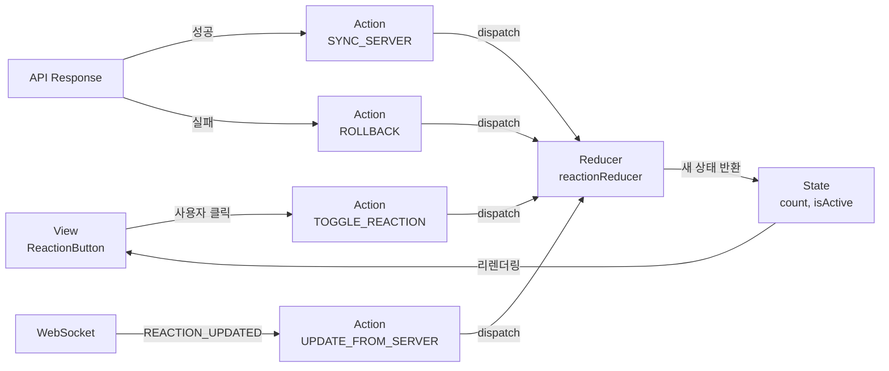
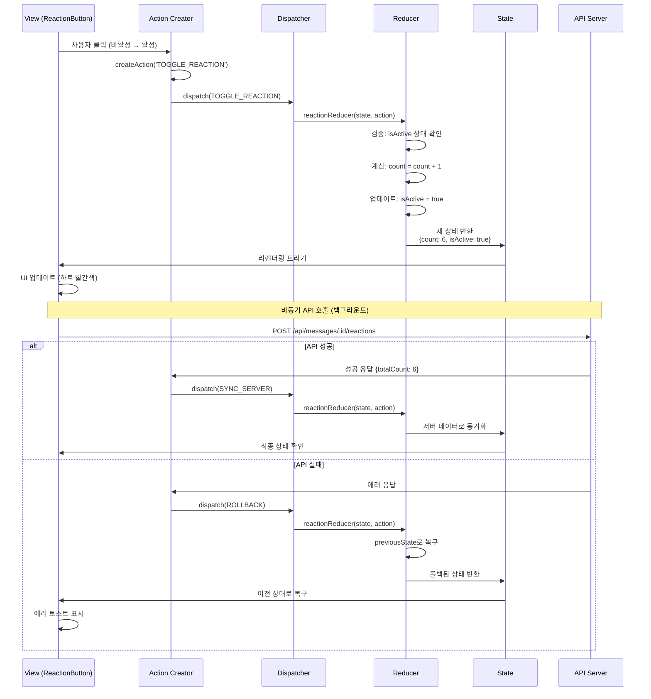
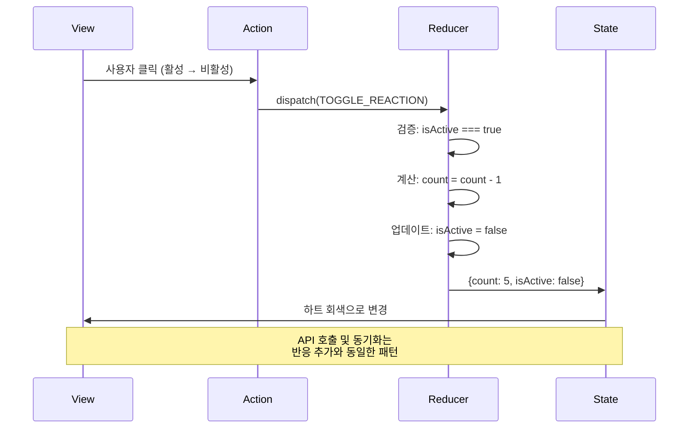
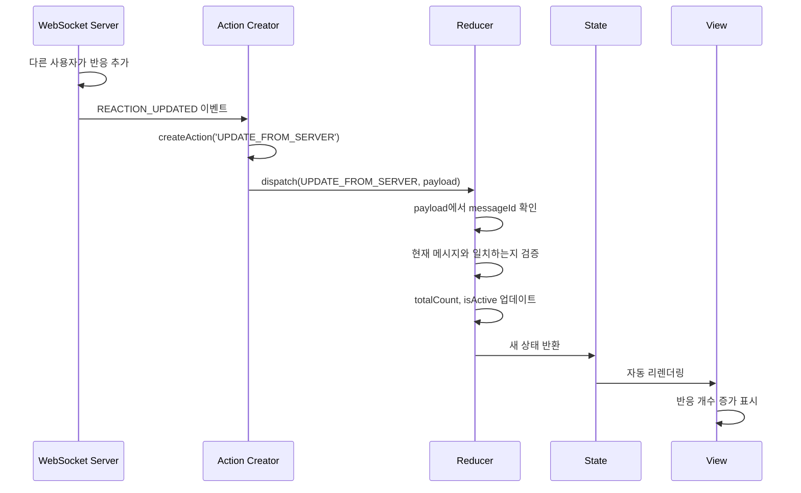
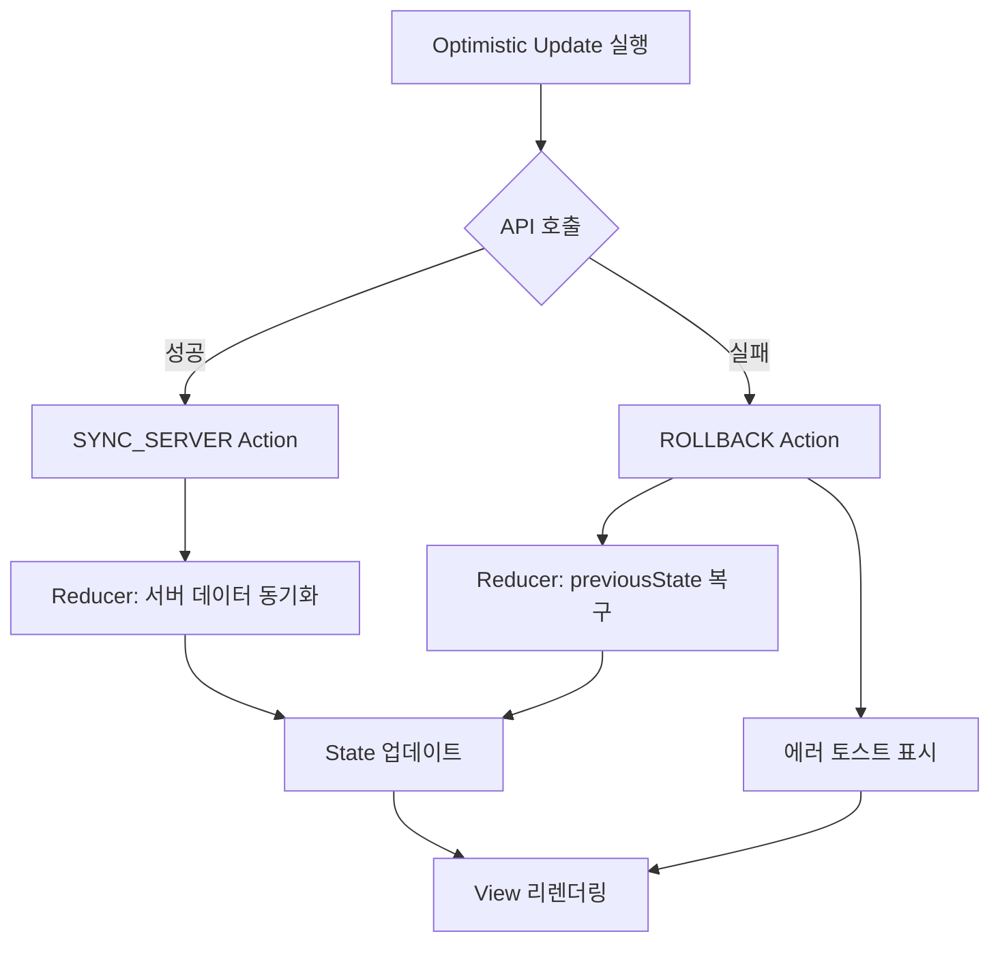
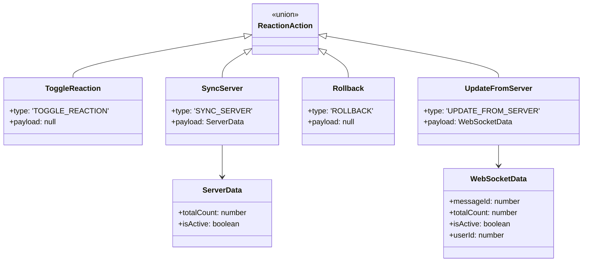
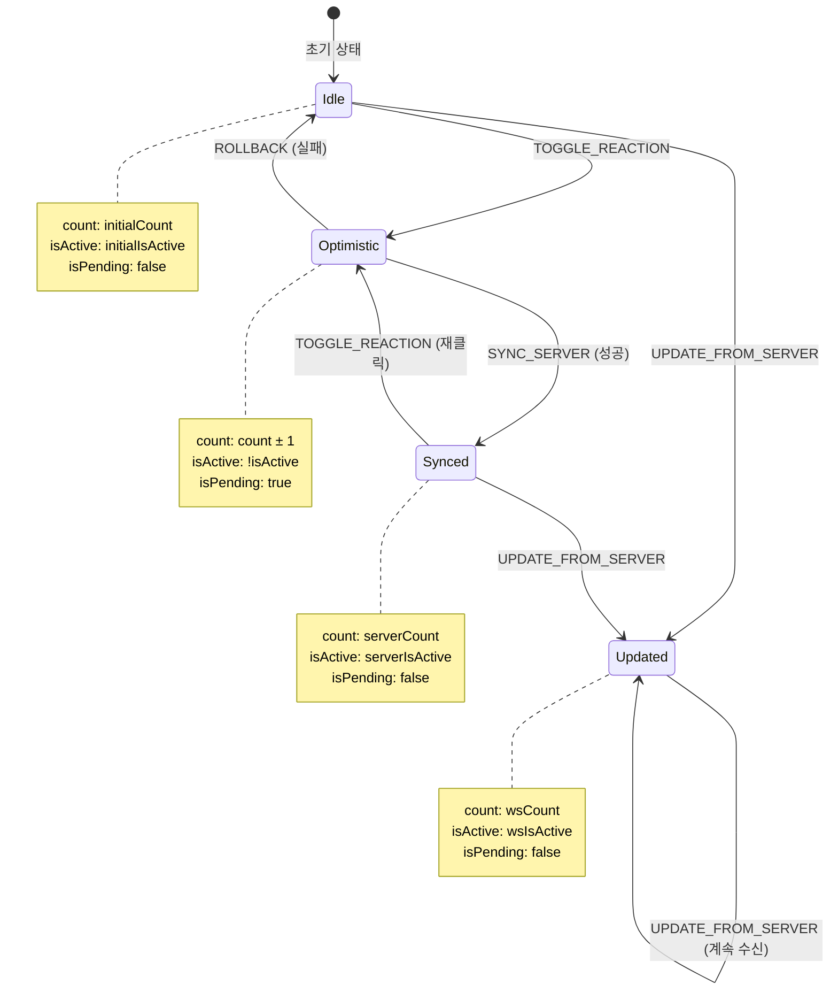
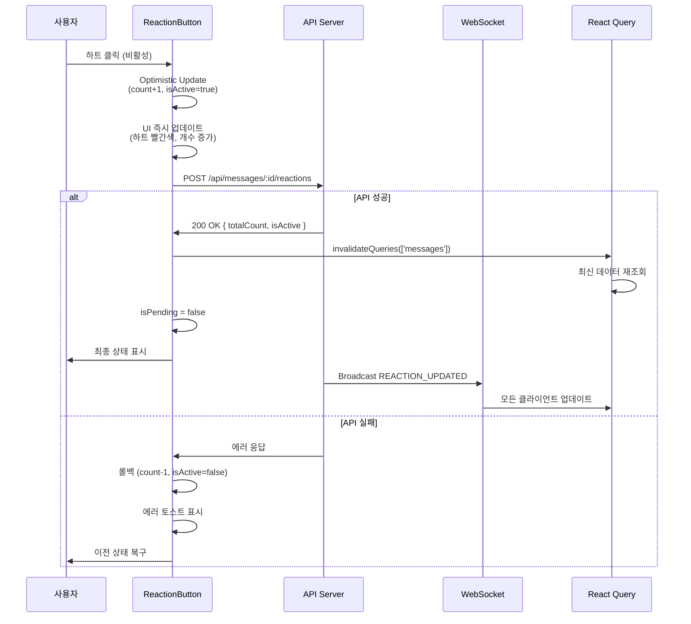
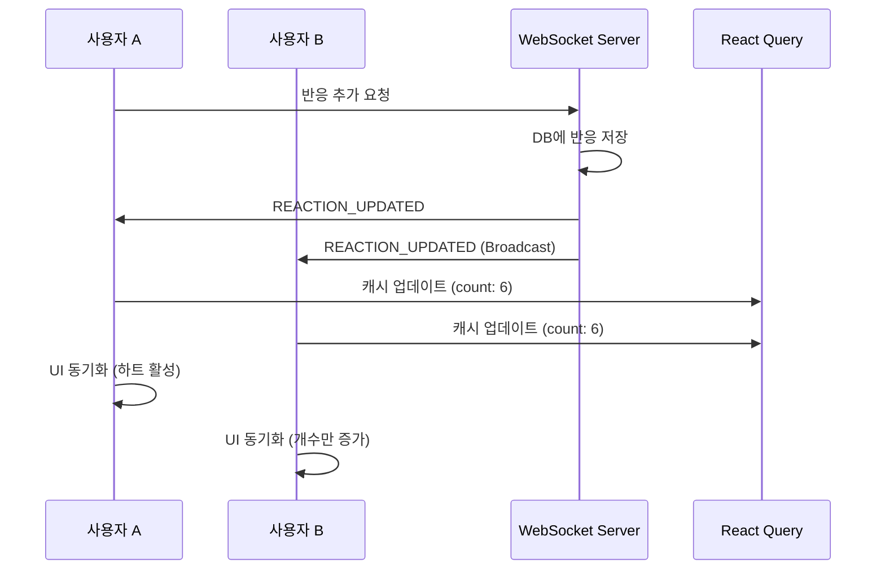

# 메시지 반응하기 상태관리 설계 문서

## 문서 정보
- **기능**: 메시지에 반응하기 (좋아요 ❤️)
- **작성일**: 2025-10-17
- **관련 UC**: UC-007
- **버전**: 1.0

---

## 목차

1. [관리해야 할 상태 데이터](#1-관리해야-할-상태-데이터-목록)
2. [Derived State (계산된 값)](#2-화면상-보이지만-상태가-아닌-데이터-derived-state)
3. [상태 변경 조건 및 화면 변화](#3-상태-변경-조건-및-화면-변화)
4. [상태 관리 전략](#4-상태-관리-전략)
5. [컴포넌트 구조 및 상태 배치](#5-컴포넌트-구조-및-상태-배치)
6. [에러 상태 관리](#6-에러-상태-관리)
7. [성능 최적화 전략](#7-성능-최적화-전략)
8. [테스트 시나리오](#8-테스트-시나리오)
9. [구현 우선순위](#9-구현-우선순위)
10. [Flux 패턴 시각화](#10-flux-패턴-시각화-action--reducer--state--view)
11. [useReducer 기반 상태 관리 구현](#11-usereducer-기반-상태-관리-구현)

---

## 1. 관리해야 할 상태 데이터 목록

### 1.1 서버 상태 (Server State)
React Query로 관리하는 서버에서 가져오는 데이터

| 상태명 | 타입 | 설명 | 관리 방법 |
|--------|------|------|-----------|
| `messages` | `Message[]` | 메시지 목록 (반응 정보 포함) | `useQuery` + WebSocket 실시간 업데이트 |
| `currentUser` | `User` | 현재 로그인한 사용자 정보 | `useQuery` (전역) |

**Message 타입 구조** (반응 관련 필드):
```typescript
interface Message {
  id: number;
  roomId: number;
  userId: number;
  user: {
    id: number;
    nickname: string;
  };
  content: string;
  parentMessageId: number | null;
  parentMessage?: ParentMessage | null;
  createdAt: string;

  // 반응 관련 필드
  reactionCount: number;        // 총 반응 개수 (default: 0)
  hasUserReacted: boolean;      // 현재 사용자의 반응 여부 (default: false)
}
```

### 1.2 클라이언트 상태 (Client State)
컴포넌트 로컬 상태로 관리 (useState)

| 상태명 | 타입 | 설명 | 관리 방법 |
|--------|------|------|-----------|
| `count` | `number` | 현재 메시지의 반응 개수 (Optimistic Update용) | `useState` (ReactionButton) |
| `isActive` | `boolean` | 현재 사용자의 반응 활성화 여부 (Optimistic Update용) | `useState` (ReactionButton) |
| `isPending` | `boolean` | 반응 토글 API 호출 진행 중 여부 | `useMutation.isPending` |

**Optimistic Update 로직**:
```typescript
// 클릭 시 즉시 UI 업데이트 (서버 응답 전)
const handleClick = () => {
  const previousCount = count;
  const previousIsActive = isActive;

  // 낙관적 업데이트
  setIsActive(!isActive);
  setCount(isActive ? count - 1 : count + 1);

  try {
    await toggleReactionMutation.mutateAsync({ messageId });
    // 성공 시: 서버에서 최신 데이터 받아서 동기화
  } catch (error) {
    // 실패 시: 이전 상태로 롤백
    setIsActive(previousIsActive);
    setCount(previousCount);
  }
};
```

### 1.3 WebSocket 이벤트 상태
실시간 통신으로 수신하는 이벤트 데이터

| 이벤트 타입 | 처리 방법 | 상태 업데이트 |
|------------|----------|--------------|
| `REACTION_UPDATED` | 서버에서 반응 변경 수신 | 해당 메시지의 `reactionCount`, `hasUserReacted` 필드 업데이트 |

**WebSocket Payload**:
```typescript
{
  type: 'REACTION_UPDATED',
  payload: {
    messageId: number,      // 대상 메시지 ID
    reactionType: 'like',   // 반응 타입
    totalCount: number,     // 해당 메시지의 총 반응 개수
    isActive: boolean,      // 현재 사용자가 반응했는지 여부
    userId: number          // 반응을 토글한 사용자 ID
  }
}
```

---

## 2. 화면상 보이지만 상태가 아닌 데이터 (Derived State)

계산으로 도출되는 값들로, 별도 상태로 관리하지 않음

| 데이터 | 계산 방식 | 설명 |
|--------|----------|------|
| `buttonDisabled` | `isPending` | 반응 토글 중에는 버튼 비활성화 |
| `heartColor` | `isActive ? 'text-red-500' : 'text-gray-400'` | 반응 여부에 따른 하트 색상 |
| `heartFill` | `isActive ? 'fill-current' : ''` | 반응 여부에 따른 하트 채우기 |
| `heartScale` | `isActive ? 'scale-125' : 'scale-100'` | 반응 여부에 따른 하트 크기 |
| `buttonBackground` | `isActive ? 'bg-red-50' : 'hover:bg-gray-100'` | 반응 여부에 따른 버튼 배경색 |
| `showCount` | `count > 0` | 반응 개수가 0보다 클 때만 표시 |
| `ariaLabel` | `isActive ? '좋아요 취소' : '좋아요'` | 접근성을 위한 레이블 |
| `cursorStyle` | `isPending ? 'cursor-wait' : 'cursor-pointer'` | 로딩 중 커서 스타일 |

**계산 예시**:
```typescript
// 하트 아이콘 클래스
const heartClass = `h-4 w-4 transition-all duration-300 ${
  isActive ? 'fill-current scale-125' : 'scale-100'
}`;

// 버튼 클래스
const buttonClass = `
  flex items-center gap-1 rounded px-2 py-1
  transition-all duration-300
  ${isActive ? 'bg-red-50 text-red-500' : 'text-gray-400 hover:bg-gray-100 hover:text-red-500'}
  ${isPending ? 'opacity-50 cursor-wait' : 'hover:scale-110'}
`;
```

---

## 3. 상태 변경 조건 및 화면 변화

### 3.1 반응 버튼 클릭 (Optimistic Update)

| 상태 | 변경 조건 | 변경 전 화면 | 변경 후 화면 |
|------|----------|-------------|-------------|
| `isActive` | 사용자가 비활성 상태에서 하트 클릭 | ♡ 빈 하트, 회색 (`text-gray-400`) | ❤️ 꽉 찬 하트, 빨간색 (`text-red-500 fill-current`) |
| `count` | 반응 추가 | 개수: 5 | 개수: 6 (즉시 증가) |
| `isPending` | API 호출 시작 | 버튼 클릭 가능 | 버튼 비활성화, 커서 `cursor-wait` |

| 상태 | 변경 조건 | 변경 전 화면 | 변경 후 화면 |
|------|----------|-------------|-------------|
| `isActive` | 사용자가 활성 상태에서 하트 클릭 | ❤️ 꽉 찬 하트, 빨간색 | ♡ 빈 하트, 회색 |
| `count` | 반응 제거 | 개수: 6 | 개수: 5 (즉시 감소) |
| `isPending` | API 호출 시작 | 버튼 클릭 가능 | 버튼 비활성화 |

### 3.2 서버 응답 수신 (성공)

| 상태 | 변경 조건 | 변경 전 화면 | 변경 후 화면 |
|------|----------|-------------|-------------|
| `isPending` | API 호출 성공 | 버튼 비활성화, 로딩 중 | 버튼 재활성화, 정상 상태 |
| `count`, `isActive` | 서버에서 최종 데이터 수신 | Optimistic 상태 | 서버 데이터로 동기화 (대부분 동일) |
| `messages` (React Query) | `invalidateQueries` 실행 | 이전 캐시 데이터 | 서버에서 최신 메시지 목록 재조회 |

### 3.3 서버 응답 수신 (실패)

| 상태 | 변경 조건 | 변경 전 화면 | 변경 후 화면 |
|------|----------|-------------|-------------|
| `isActive` | API 호출 실패 (롤백) | ❤️ 활성 상태 (Optimistic) | ♡ 비활성 상태로 롤백 |
| `count` | API 호출 실패 (롤백) | 개수: 6 (Optimistic) | 개수: 5로 롤백 |
| `isPending` | API 호출 실패 | 버튼 비활성화 | 버튼 재활성화 |
| (토스트) | 에러 코드에 따라 | 없음 | 에러 메시지 토스트 표시 |

### 3.4 WebSocket 실시간 업데이트 수신

| 상태 | 변경 조건 | 변경 전 화면 | 변경 후 화면 |
|------|----------|-------------|-------------|
| `messages` | `REACTION_UPDATED` 이벤트 수신 | 반응 개수: 5 | 반응 개수: 6 (다른 사용자의 반응 추가) |
| `reactionCount` | 다른 사용자가 반응 추가 | 5 | 6 |
| `hasUserReacted` | 자신이 반응 추가 (다른 기기) | `false` | `true` |

### 3.5 초기 렌더링 (props 변경)

| 상태 | 변경 조건 | 변경 전 화면 | 변경 후 화면 |
|------|----------|-------------|-------------|
| `count` | `initialCount` props 변경 | 이전 값 | 새로운 초기 값으로 동기화 |
| `isActive` | `initialIsActive` props 변경 | 이전 값 | 새로운 초기 값으로 동기화 |

**useEffect 동기화**:
```typescript
useEffect(() => {
  setCount(initialCount);
  setIsActive(initialIsActive);
}, [initialCount, initialIsActive]);
```

---

## 4. 상태 관리 전략

### 4.1 서버 상태 관리 (React Query)

**메시지 목록 조회 시 반응 정보 포함**:
```typescript
const { data: messages } = useQuery({
  queryKey: ['messages', roomId],
  queryFn: () => fetchMessages(roomId),
  staleTime: Infinity,  // WebSocket으로 실시간 업데이트
  refetchOnWindowFocus: false,
});

// Backend에서 각 메시지에 반응 정보 추가
// getMessagesService에서 JOIN 및 계산
const messagesWithReactions = messages.map(msg => ({
  ...msg,
  reactionCount: countReactions(msg.id),  // COUNT(*)
  hasUserReacted: checkUserReaction(msg.id, userId)  // EXISTS 쿼리
}));
```

**반응 토글 Mutation**:
```typescript
const toggleReactionMutation = useMutation({
  mutationFn: async ({ messageId }: { messageId: number }) => {
    return apiClient.post(`/api/messages/${messageId}/reactions`, {});
  },
  onSuccess: () => {
    // 메시지 목록 캐시 무효화하여 최신 데이터 가져오기
    queryClient.invalidateQueries({ queryKey: ['messages'] });
  },
});
```

### 4.2 Optimistic Update 전략

**클라이언트 측 즉시 반영**:
```typescript
const handleClick = async () => {
  // 1. 이전 상태 백업
  const previousCount = count;
  const previousIsActive = isActive;

  // 2. Optimistic Update (서버 응답 전)
  setIsActive(!isActive);
  setCount(isActive ? count - 1 : count + 1);

  try {
    // 3. API 호출
    await toggleReactionMutation.mutateAsync({ messageId });
    // 성공 시: React Query가 자동으로 최신 데이터 동기화
  } catch (error) {
    // 4. 실패 시: 롤백
    setIsActive(previousIsActive);
    setCount(previousCount);

    // 5. 에러 토스트 표시
    toast({ variant: 'destructive', title: getErrorMessage(error) });
  }
};
```

### 4.3 WebSocket 실시간 업데이트

**REACTION_UPDATED 이벤트 처리**:
```typescript
useEffect(() => {
  const ws = connectWebSocket(roomId);

  ws.on('REACTION_UPDATED', (event) => {
    queryClient.setQueryData(['messages', roomId], (oldMessages) => {
      return oldMessages.map(msg =>
        msg.id === event.payload.messageId
          ? {
              ...msg,
              reactionCount: event.payload.totalCount,
              hasUserReacted: event.payload.isActive && event.payload.userId === currentUserId
            }
          : msg
      );
    });
  });

  return () => ws.disconnect();
}, [roomId]);
```

---

## 5. 컴포넌트 구조 및 상태 배치

### 5.1 컴포넌트 계층 구조

```
ChatRoomPage
└─ MessageList
   └─ MessageItem (각 메시지)
      ├─ MessageBubble (메시지 내용)
      ├─ ReplyPreview (답장인 경우)
      └─ MessageActions
         ├─ ReactionButton ← 상태 관리 컴포넌트
         │  ├─ count (useState)
         │  ├─ isActive (useState)
         │  └─ useToggleReaction (useMutation)
         └─ ReplyButton
```

### 5.2 상태 배치

| 컴포넌트 | 관리하는 상태 | 상태 관리 방법 |
|---------|-------------|---------------|
| **ChatRoomPage** | `messages` (서버 상태) | `useQuery` + WebSocket |
| **MessageList** | 없음 (props로 받음) | - |
| **MessageItem** | 없음 (props로 받음) | - |
| **ReactionButton** | `count`, `isActive` | `useState` (Optimistic Update용) |
| **useToggleReaction** | `isPending` | `useMutation` |

### 5.3 Props 전달 구조

```typescript
// ChatRoomPage
<MessageList messages={messages} currentUserId={currentUser.id} />

// MessageList
{messages.map(message => (
  <MessageItem
    key={message.id}
    message={message}
    currentUserId={currentUserId}
  />
))}

// MessageItem
<ReactionButton
  messageId={message.id}
  initialCount={message.reactionCount}
  initialIsActive={message.hasUserReacted}
  isOwnMessage={message.userId === currentUserId}
/>
```

---

## 6. 에러 상태 관리

### 6.1 에러 타입 정의

```typescript
type ReactionError =
  | { type: 'MESSAGE_NOT_FOUND'; message: string }
  | { type: 'UNAUTHORIZED'; message: string }
  | { type: 'REACTION_TOGGLE_FAILED'; message: string }
  | { type: 'NETWORK_ERROR'; message: string };
```

### 6.2 에러 처리 전략

| 에러 타입 | 화면 표시 | 사용자 액션 |
|----------|----------|------------|
| `MESSAGE_NOT_FOUND` | 토스트: "메시지를 찾을 수 없습니다" | Optimistic Update 롤백, 페이지 새로고침 안내 |
| `UNAUTHORIZED` | 토스트: "로그인이 필요합니다" | 로그인 페이지로 리디렉션 |
| `REACTION_TOGGLE_FAILED` | 토스트: "반응 처리에 실패했습니다" | Optimistic Update 롤백, 재시도 가능 |
| `NETWORK_ERROR` | 토스트: "네트워크 오류가 발생했습니다" | Optimistic Update 롤백, 재시도 안내 |

### 6.3 에러 메시지 상수

```typescript
// src/features/messages/constants/text.ts
export const MESSAGE_UI_TEXT = {
  REACTION_LIKE: '좋아요',
  ERROR_REACTION_FAILED: '반응 처리에 실패했습니다. 다시 시도해주세요.',
  ERROR_MESSAGE_NOT_FOUND: '메시지를 찾을 수 없습니다. 페이지를 새로고침해주세요.',
  ERROR_UNAUTHORIZED: '로그인이 필요합니다.',
  ERROR_NETWORK: '네트워크 오류가 발생했습니다. 연결을 확인해주세요.',
};
```

---

## 7. 성능 최적화 전략

### 7.1 메모이제이션

```typescript
// MessageItem 컴포넌트 메모이제이션
const MessageItem = React.memo(({ message, currentUserId }) => {
  // ...
}, (prevProps, nextProps) => {
  // reactionCount나 hasUserReacted 변경 시에만 리렌더링
  return (
    prevProps.message.id === nextProps.message.id &&
    prevProps.message.reactionCount === nextProps.message.reactionCount &&
    prevProps.message.hasUserReacted === nextProps.message.hasUserReacted
  );
});
```

### 7.2 Debouncing (중복 클릭 방지)

```typescript
// 이미 isPending 상태로 버튼 비활성화하여 중복 클릭 방지
<button
  onClick={handleClick}
  disabled={toggleReactionMutation.isPending}
  // ...
>
```

### 7.3 React Query 캐시 최적화

```typescript
// 불필요한 refetch 방지
const { data: messages } = useQuery({
  queryKey: ['messages', roomId],
  queryFn: () => fetchMessages(roomId),
  staleTime: Infinity,  // WebSocket으로만 업데이트
  refetchOnWindowFocus: false,  // 포커스 시 자동 refetch 방지
  refetchOnReconnect: false,    // 재연결 시 자동 refetch 방지
});
```

### 7.4 WebSocket 이벤트 최적화

```typescript
// 이벤트 핸들러 메모이제이션
const handleReactionUpdate = useCallback((event) => {
  queryClient.setQueryData(['messages', roomId], (old) => {
    // Immutable update
    return old.map(msg =>
      msg.id === event.payload.messageId
        ? { ...msg, reactionCount: event.payload.totalCount, hasUserReacted: event.payload.isActive }
        : msg
    );
  });
}, [roomId, queryClient]);

useEffect(() => {
  ws.on('REACTION_UPDATED', handleReactionUpdate);
  return () => ws.off('REACTION_UPDATED', handleReactionUpdate);
}, [handleReactionUpdate]);
```

---

## 8. 테스트 시나리오

| 테스트 케이스 | 초기 상태 | 액션 | 기대 상태 |
|-------------|----------|------|----------|
| 반응 추가 | `count: 5`, `isActive: false` | 하트 클릭 | `count: 6`, `isActive: true`, 하트 빨간색 |
| 반응 제거 | `count: 6`, `isActive: true` | 하트 클릭 | `count: 5`, `isActive: false`, 하트 회색 |
| 서버 응답 성공 | Optimistic 상태 | API 응답 수신 | 서버 데이터로 동기화, `isPending: false` |
| 서버 응답 실패 | Optimistic 상태 | API 에러 | 이전 상태로 롤백, 에러 토스트 표시 |
| WebSocket 업데이트 | `count: 5` | `REACTION_UPDATED` (count: 6) 수신 | `count: 6`, UI 자동 업데이트 |
| 중복 클릭 방지 | `isPending: true` | 하트 클릭 | 버튼 비활성화, 아무 동작 안 함 |
| Props 동기화 | `count: 5`, `initialCount: 7` | `useEffect` 실행 | `count: 7` (props와 동기화) |

---

## 9. 구현 우선순위

### Phase 1: 기본 반응 기능
1. ✅ ReactionButton 컴포넌트 구현
2. ✅ useToggleReaction 훅 구현
3. ✅ Optimistic Update 로직 구현
4. ✅ 에러 처리 및 롤백 로직

### Phase 2: 실시간 동기화
5. WebSocket REACTION_UPDATED 이벤트 구독
6. 실시간 반응 개수 업데이트
7. 다중 사용자 환경 테스트

### Phase 3: UX 개선
8. ✅ 하트 애니메이션 (scale, fill)
9. ✅ 로딩 상태 표시 (isPending)
10. ✅ 접근성 (ARIA 레이블, 키보드 네비게이션)

### Phase 4: 성능 최적화
11. React.memo로 불필요한 리렌더링 방지
12. WebSocket 이벤트 핸들러 최적화
13. React Query 캐시 전략 개선

---

## 10. Flux 패턴 시각화 (Action → Reducer → State → View)

### 10.1 전체 Flux 아키텍처



### 10.2 반응 추가 플로우 (Optimistic Update)



### 10.3 반응 제거 플로우 (Optimistic Update)



### 10.4 WebSocket 실시간 동기화 플로우



### 10.5 에러 롤백 플로우



### 10.6 Action Types와 Payload 구조



### 10.7 State 변화 추적



---

## 11. useReducer 기반 상태 관리 구현

### 11.1 Action Types 정의

```typescript
// src/features/messages/types/reactionActions.ts

export type ReactionAction =
  | { type: 'TOGGLE_REACTION' }
  | { type: 'SYNC_SERVER'; payload: { totalCount: number; isActive: boolean } }
  | { type: 'ROLLBACK' }
  | { type: 'UPDATE_FROM_SERVER'; payload: { messageId: number; totalCount: number; isActive: boolean; userId: number } }
  | { type: 'RESET'; payload: { count: number; isActive: boolean } };

export const ReactionActionType = {
  TOGGLE_REACTION: 'TOGGLE_REACTION',
  SYNC_SERVER: 'SYNC_SERVER',
  ROLLBACK: 'ROLLBACK',
  UPDATE_FROM_SERVER: 'UPDATE_FROM_SERVER',
  RESET: 'RESET',
} as const;
```

### 11.2 State 타입 정의

```typescript
// src/features/messages/types/reactionState.ts

export interface ReactionState {
  // 현재 상태
  count: number;
  isActive: boolean;
  isPending: boolean;

  // 롤백을 위한 이전 상태
  previousCount: number;
  previousIsActive: boolean;

  // 에러 상태
  error: string | null;
}

export const initialReactionState: ReactionState = {
  count: 0,
  isActive: false,
  isPending: false,
  previousCount: 0,
  previousIsActive: false,
  error: null,
};
```

### 11.3 Reducer 함수 구현

```typescript
// src/features/messages/reducers/reactionReducer.ts

import type { ReactionState } from '../types/reactionState';
import type { ReactionAction } from '../types/reactionActions';

export function reactionReducer(
  state: ReactionState,
  action: ReactionAction
): ReactionState {
  switch (action.type) {
    case 'TOGGLE_REACTION': {
      // Optimistic Update: 즉시 상태 변경
      return {
        ...state,
        // 이전 상태 백업 (롤백용)
        previousCount: state.count,
        previousIsActive: state.isActive,
        // 새 상태 계산
        count: state.isActive ? state.count - 1 : state.count + 1,
        isActive: !state.isActive,
        isPending: true,
        error: null,
      };
    }

    case 'SYNC_SERVER': {
      // 서버 응답으로 상태 동기화 (성공)
      const { totalCount, isActive } = action.payload;
      return {
        ...state,
        count: totalCount,
        isActive,
        isPending: false,
        error: null,
      };
    }

    case 'ROLLBACK': {
      // 에러 발생 시 이전 상태로 롤백
      return {
        ...state,
        count: state.previousCount,
        isActive: state.previousIsActive,
        isPending: false,
        error: 'Failed to update reaction',
      };
    }

    case 'UPDATE_FROM_SERVER': {
      // WebSocket 실시간 업데이트
      const { totalCount, isActive } = action.payload;
      return {
        ...state,
        count: totalCount,
        isActive,
        isPending: false,
        error: null,
      };
    }

    case 'RESET': {
      // Props 변경 시 초기화
      const { count, isActive } = action.payload;
      return {
        ...state,
        count,
        isActive,
        previousCount: count,
        previousIsActive: isActive,
        isPending: false,
        error: null,
      };
    }

    default:
      return state;
  }
}
```

### 11.4 Action Creator 함수

```typescript
// src/features/messages/actions/reactionActions.ts

import type { ReactionAction } from '../types/reactionActions';

export const reactionActions = {
  toggleReaction: (): ReactionAction => ({
    type: 'TOGGLE_REACTION',
  }),

  syncServer: (totalCount: number, isActive: boolean): ReactionAction => ({
    type: 'SYNC_SERVER',
    payload: { totalCount, isActive },
  }),

  rollback: (): ReactionAction => ({
    type: 'ROLLBACK',
  }),

  updateFromServer: (
    messageId: number,
    totalCount: number,
    isActive: boolean,
    userId: number
  ): ReactionAction => ({
    type: 'UPDATE_FROM_SERVER',
    payload: { messageId, totalCount, isActive, userId },
  }),

  reset: (count: number, isActive: boolean): ReactionAction => ({
    type: 'RESET',
    payload: { count, isActive },
  }),
};
```

### 11.5 Custom Hook 구현

```typescript
// src/features/messages/hooks/useReactionState.ts

import { useReducer, useEffect } from 'react';
import { reactionReducer } from '../reducers/reactionReducer';
import { reactionActions } from '../actions/reactionActions';
import type { ReactionState } from '../types/reactionState';

interface UseReactionStateProps {
  initialCount: number;
  initialIsActive: boolean;
}

export function useReactionState({
  initialCount,
  initialIsActive,
}: UseReactionStateProps) {
  const initialState: ReactionState = {
    count: initialCount,
    isActive: initialIsActive,
    isPending: false,
    previousCount: initialCount,
    previousIsActive: initialIsActive,
    error: null,
  };

  const [state, dispatch] = useReducer(reactionReducer, initialState);

  // Props 변경 시 상태 동기화
  useEffect(() => {
    dispatch(reactionActions.reset(initialCount, initialIsActive));
  }, [initialCount, initialIsActive]);

  // Action Creator 함수들을 반환
  const actions = {
    toggleReaction: () => dispatch(reactionActions.toggleReaction()),
    syncServer: (totalCount: number, isActive: boolean) =>
      dispatch(reactionActions.syncServer(totalCount, isActive)),
    rollback: () => dispatch(reactionActions.rollback()),
    updateFromServer: (
      messageId: number,
      totalCount: number,
      isActive: boolean,
      userId: number
    ) =>
      dispatch(
        reactionActions.updateFromServer(messageId, totalCount, isActive, userId)
      ),
  };

  return { state, actions };
}
```

### 11.6 컴포넌트 사용 예시

```typescript
// src/features/messages/components/ReactionButton.tsx (useReducer 버전)

'use client';

import { Heart } from 'lucide-react';
import { useReactionState } from '../hooks/useReactionState';
import { useToggleReaction } from '../hooks/useToggleReaction';
import { useToast } from '@/hooks/use-toast';
import { MESSAGE_UI_TEXT } from '../constants/text';

interface ReactionButtonProps {
  messageId: number;
  initialCount: number;
  initialIsActive: boolean;
  isOwnMessage?: boolean;
}

export function ReactionButton({
  messageId,
  initialCount,
  initialIsActive,
  isOwnMessage = false,
}: ReactionButtonProps) {
  const { state, actions } = useReactionState({ initialCount, initialIsActive });
  const { toast } = useToast();
  const toggleReactionMutation = useToggleReaction();

  const handleClick = async () => {
    // 1. Optimistic Update (Flux Action: TOGGLE_REACTION)
    actions.toggleReaction();

    try {
      // 2. API 호출
      const response = await toggleReactionMutation.mutateAsync({ messageId });

      // 3. 성공 시 서버 데이터로 동기화 (Flux Action: SYNC_SERVER)
      actions.syncServer(response.totalCount, response.isActive);
    } catch (error: any) {
      // 4. 실패 시 롤백 (Flux Action: ROLLBACK)
      actions.rollback();

      const errorCode = error?.response?.data?.error?.code;
      let errorMessage: string = MESSAGE_UI_TEXT.ERROR_REACTION_FAILED;

      if (errorCode === 'MESSAGE_NOT_FOUND') {
        errorMessage = MESSAGE_UI_TEXT.ERROR_MESSAGE_NOT_FOUND;
      } else if (errorCode === 'UNAUTHORIZED') {
        errorMessage = MESSAGE_UI_TEXT.ERROR_UNAUTHORIZED;
      }

      toast({
        variant: 'destructive',
        title: errorMessage,
      });
    }
  };

  return (
    <button
      type="button"
      onClick={handleClick}
      disabled={state.isPending}
      className={`flex items-center gap-1 rounded px-2 py-1 transition-all duration-300 ${
        isOwnMessage
          ? state.isActive
            ? 'bg-white/20 text-white'
            : 'text-white/70 hover:bg-white/10 hover:text-white'
          : state.isActive
          ? 'bg-red-50 text-red-500'
          : 'text-gray-400 hover:bg-gray-100 hover:text-red-500'
      } ${state.isPending ? 'opacity-50 cursor-wait' : 'hover:scale-110'}`}
      aria-label={state.isActive ? `${MESSAGE_UI_TEXT.REACTION_LIKE} 취소` : MESSAGE_UI_TEXT.REACTION_LIKE}
    >
      <Heart
        className={`h-4 w-4 transition-all duration-300 ${
          state.isActive ? 'fill-current scale-125' : 'scale-100'
        }`}
      />
      {state.count > 0 && <span className="text-xs font-medium">{state.count}</span>}
    </button>
  );
}
```

### 11.7 WebSocket 통합 예시

```typescript
// src/features/messages/hooks/useReactionWebSocket.ts

import { useEffect } from 'react';
import type { ReactionState } from '../types/reactionState';

interface UseReactionWebSocketProps {
  messageId: number;
  currentUserId: number;
  actions: {
    updateFromServer: (messageId: number, totalCount: number, isActive: boolean, userId: number) => void;
  };
}

export function useReactionWebSocket({
  messageId,
  currentUserId,
  actions,
}: UseReactionWebSocketProps) {
  useEffect(() => {
    // WebSocket 연결은 상위 컴포넌트에서 관리
    const handleReactionUpdate = (event: {
      type: 'REACTION_UPDATED';
      payload: {
        messageId: number;
        totalCount: number;
        isActive: boolean;
        userId: number;
      };
    }) => {
      // 현재 메시지에 대한 업데이트만 처리
      if (event.payload.messageId === messageId) {
        // Flux Action: UPDATE_FROM_SERVER
        actions.updateFromServer(
          event.payload.messageId,
          event.payload.totalCount,
          event.payload.isActive && event.payload.userId === currentUserId,
          event.payload.userId
        );
      }
    };

    // WebSocket 이벤트 리스너 등록
    window.addEventListener('reaction-updated', handleReactionUpdate as any);

    return () => {
      window.removeEventListener('reaction-updated', handleReactionUpdate as any);
    };
  }, [messageId, currentUserId, actions]);
}
```

### 11.8 테스트 예시

```typescript
// src/features/messages/reducers/reactionReducer.test.ts

import { describe, it, expect } from 'vitest';
import { reactionReducer } from './reactionReducer';
import { reactionActions } from '../actions/reactionActions';
import type { ReactionState } from '../types/reactionState';

describe('reactionReducer', () => {
  const initialState: ReactionState = {
    count: 5,
    isActive: false,
    isPending: false,
    previousCount: 5,
    previousIsActive: false,
    error: null,
  };

  it('TOGGLE_REACTION: 반응 추가 시 count 증가 및 isActive true', () => {
    const action = reactionActions.toggleReaction();
    const newState = reactionReducer(initialState, action);

    expect(newState.count).toBe(6);
    expect(newState.isActive).toBe(true);
    expect(newState.isPending).toBe(true);
    expect(newState.previousCount).toBe(5);
    expect(newState.previousIsActive).toBe(false);
  });

  it('TOGGLE_REACTION: 반응 제거 시 count 감소 및 isActive false', () => {
    const activeState: ReactionState = {
      ...initialState,
      count: 6,
      isActive: true,
    };
    const action = reactionActions.toggleReaction();
    const newState = reactionReducer(activeState, action);

    expect(newState.count).toBe(5);
    expect(newState.isActive).toBe(false);
    expect(newState.isPending).toBe(true);
  });

  it('SYNC_SERVER: 서버 응답으로 상태 동기화', () => {
    const optimisticState: ReactionState = {
      ...initialState,
      count: 6,
      isActive: true,
      isPending: true,
    };
    const action = reactionActions.syncServer(6, true);
    const newState = reactionReducer(optimisticState, action);

    expect(newState.count).toBe(6);
    expect(newState.isActive).toBe(true);
    expect(newState.isPending).toBe(false);
    expect(newState.error).toBe(null);
  });

  it('ROLLBACK: 이전 상태로 롤백', () => {
    const optimisticState: ReactionState = {
      count: 6,
      isActive: true,
      isPending: true,
      previousCount: 5,
      previousIsActive: false,
      error: null,
    };
    const action = reactionActions.rollback();
    const newState = reactionReducer(optimisticState, action);

    expect(newState.count).toBe(5);
    expect(newState.isActive).toBe(false);
    expect(newState.isPending).toBe(false);
    expect(newState.error).toBe('Failed to update reaction');
  });

  it('UPDATE_FROM_SERVER: WebSocket 이벤트로 상태 업데이트', () => {
    const action = reactionActions.updateFromServer(123, 7, false, 456);
    const newState = reactionReducer(initialState, action);

    expect(newState.count).toBe(7);
    expect(newState.isActive).toBe(false);
    expect(newState.isPending).toBe(false);
  });

  it('RESET: Props 변경 시 상태 초기화', () => {
    const modifiedState: ReactionState = {
      ...initialState,
      count: 10,
      isActive: true,
    };
    const action = reactionActions.reset(8, true);
    const newState = reactionReducer(modifiedState, action);

    expect(newState.count).toBe(8);
    expect(newState.isActive).toBe(true);
    expect(newState.previousCount).toBe(8);
    expect(newState.previousIsActive).toBe(true);
  });
});
```

---

## 12. 변경 이력

| 버전 | 날짜 | 작성자 | 변경 내용 |
|------|------|--------|-----------|
| 1.1  | 2025-10-17 | Claude | Flux 패턴 시각화 및 useReducer 구현 추가 |
| 1.0  | 2025-10-17 | Claude | 초기 작성 - 메시지 반응하기 상태관리 설계 |

---

## 참고 문서
- [UC-007: 메시지에 반응하기](../usecases/007-react-to-message.md)
- [UC-007 구현 계획](../usecases/007-react-to-message-plan.md)
- [데이터베이스 스키마](../database.md)
- [사용자 플로우](../userflow.md)

---

## 상태 흐름도 (Mermaid)

### 반응 추가 플로우



### WebSocket 실시간 동기화 플로우



---

## 추가 고려사항

### 1. 다양한 반응 타입 확장 (향후)
현재는 '좋아요(❤️)'만 지원하지만, 향후 다른 반응 타입 추가 가능:
- 반응 타입을 enum으로 관리: `'like' | 'love' | 'haha' | 'wow' | 'sad' | 'angry'`
- UI에서 반응 선택 드롭다운 추가
- DB 스키마는 이미 `reaction VARCHAR(50)` 으로 확장 가능

### 2. 반응한 사용자 목록 표시 (향후)
- 반응 개수 클릭 시 모달로 사용자 목록 표시
- API: `GET /api/messages/:id/reactions/users`
- 새로운 상태: `showReactionModal`, `reactionUsers`

### 3. 반응 취소 확인 (선택사항)
- 반응 개수가 많은 메시지의 경우 실수 방지를 위한 확인 다이얼로그
- 설정 옵션으로 제공 가능

### 4. 오프라인 지원 (향후)
- 오프라인 상태에서 반응 클릭 시 로컬 큐에 저장
- 온라인 복구 시 자동 동기화
- Service Worker + IndexedDB 활용
