# 메시지 답장 기능 상태관리 설계 문서

## 문서 정보
- **기능**: 메시지에 답장하기 (Reply to a Message)
- **작성일**: 2025-10-17
- **관련 UC**: UC-006
- **버전**: 1.0

---

## 1. 관리해야 할 상태 데이터 목록

### 1.1 클라이언트 상태 (Client State)

React 컴포넌트 또는 Context로 관리하는 답장 기능 관련 상태

| 상태명 | 타입 | 설명 | 초기값 | 관리 방법 |
|--------|------|------|--------|-----------|
| `replyTarget` | `ReplyTarget \| null` | 답장 대상 메시지 정보 | `null` | `useState` 또는 `useReducer` |
| `isReplyMode` | `boolean` | 답장 모드 활성화 여부 | `false` | Derived (replyTarget !== null) |
| `messageInput` | `string` | 답장 메시지 입력 내용 (일반 메시지와 공유) | `''` | `useState` |
| `isSendingReply` | `boolean` | 답장 전송 중 여부 | `false` | `useState` |
| `replyPreviewVisible` | `boolean` | 원본 메시지 미리보기 표시 여부 | `false` | Derived (replyTarget !== null) |

**ReplyTarget 타입 구조**:
```typescript
interface ReplyTarget {
  messageId: number;           // 원본 메시지 ID
  content: string;             // 원본 메시지 내용 (전체)
  userNickname: string;        // 원본 메시지 작성자 닉네임
  createdAt: string;           // 원본 메시지 생성 시각 (ISO 8601)
}
```

### 1.2 서버 상태 (Server State)

React Query로 관리하는 답장 관련 서버 데이터

| 상태명 | 타입 | 설명 | 관리 방법 |
|--------|------|------|-----------|
| `messages` | `Message[]` | 채팅방의 전체 메시지 (답장 포함) | `useQuery` + WebSocket 실시간 업데이트 |

**Message 타입 (답장 필드 포함)**:
```typescript
interface Message {
  id: number;
  room_id: number;
  user: {
    id: number;
    nickname: string;
  };
  content: string;
  parent_message_id: number | null;  // 답장인 경우 원본 메시지 ID
  parent_message?: {                  // 답장인 경우 원본 메시지 정보 (JOIN)
    id: number;
    content: string;
    user_nickname: string;
    created_at: string;
  } | null;
  created_at: string;

  // Optimistic Update용 필드
  _tempId?: string;
  _status?: 'sending' | 'sent' | 'failed';
}
```

### 1.3 Optimistic Update 상태

답장 전송 시 낙관적 업데이트를 위한 임시 상태

| 상태명 | 타입 | 설명 | 관리 방법 |
|--------|------|------|-----------|
| `optimisticReplyMessages` | `Message[]` | 전송 중인 임시 답장 메시지 목록 | `useState` (ChatRoom 컨텍스트) |

---

## 2. 화면상 보이지만 상태가 아닌 데이터 (Derived State)

계산으로 도출되는 값들로, 별도 상태로 관리하지 않음

| 데이터 | 계산 방식 | 설명 |
|--------|----------|------|
| `isReplyMode` | `replyTarget !== null` | 답장 모드 활성화 여부 |
| `replyPreviewText` | `replyTarget?.content.substring(0, 30) + (replyTarget.content.length > 30 ? '...' : '')` | 원본 메시지 미리보기 텍스트 (30자 제한) |
| `isCurrentMessageReply` | `message.parent_message_id !== null` | 현재 메시지가 답장인지 여부 |
| `replyCount` | `messages.filter(m => m.parent_message_id === messageId).length` | 특정 메시지에 대한 답장 개수 |
| `canSendReply` | `messageInput.trim().length > 0 && !isSendingReply && wsConnectionStatus === 'connected' && replyTarget !== null` | 답장 전송 버튼 활성화 여부 |
| `replyChain` | `messages.filter(m => m.parent_message_id === parentId)` | 특정 원본 메시지에 대한 모든 답장 목록 |
| `parentMessageDisplayInfo` | 원본 메시지 정보 포맷팅 | 답장 UI에 표시할 원본 메시지 정보 |

---

## 3. 상태 변경 조건 및 화면 변화

### 3.1 답장 대상 선택 관련 상태

| 상태 | 변경 조건 | 변경 전 화면 | 변경 후 화면 |
|------|----------|-------------|-------------|
| `replyTarget` | 특정 메시지의 '답장' 버튼 클릭 | `null`, 일반 메시지 입력 모드 | 원본 메시지 정보 설정, 미리보기 표시 |
| `replyTarget` | 답장 미리보기의 'X' 버튼 클릭 | 원본 메시지 미리보기 표시 중 | `null`, 미리보기 제거, 일반 입력 모드 |
| `replyTarget` | `Esc` 키 입력 | 원본 메시지 미리보기 표시 중 | `null`, 미리보기 제거 |
| `replyTarget` | 답장 메시지 전송 완료 (성공 시) | 원본 메시지 미리보기 표시 중 | `null`, 미리보기 제거 |
| `replyTarget` | 다른 메시지의 '답장' 버튼 클릭 | 기존 원본 메시지 A 미리보기 | 새 원본 메시지 B 미리보기로 교체 |

### 3.2 답장 메시지 입력 관련 상태

| 상태 | 변경 조건 | 변경 전 화면 | 변경 후 화면 |
|------|----------|-------------|-------------|
| `messageInput` | 답장 모드에서 텍스트 입력 | 입력 필드 비어있음, 전송 버튼 비활성화 | 입력한 텍스트 표시, 전송 버튼 활성화 |
| `messageInput` | 답장 전송 완료 (성공 시) | 입력한 답장 텍스트 표시 | 입력 필드 초기화 (빈 문자열) |
| `messageInput` | 답장 모드 취소 (`replyTarget = null`) | 입력 중이던 텍스트 표시 | 입력 필드 유지 (텍스트 보존) |

### 3.3 답장 전송 관련 상태

| 상태 | 변경 조건 | 변경 전 화면 | 변경 후 화면 |
|------|----------|-------------|-------------|
| `isSendingReply` | 답장 전송 버튼 클릭 또는 Enter 키 | `false`, 전송 버튼 활성화 | `true`, 전송 버튼 비활성화, 로딩 스피너 |
| `isSendingReply` | 서버 응답 수신 (성공) | `true`, 스피너 표시 | `false`, 전송 버튼 재활성화 |
| `isSendingReply` | 서버 응답 수신 (실패) | `true`, 스피너 표시 | `false`, 전송 버튼 재활성화, 에러 메시지 |
| `optimisticReplyMessages` | 답장 전송 시작 | 빈 배열 또는 이전 임시 메시지 | 새 임시 답장 메시지 추가 (흐리게 표시) |
| `optimisticReplyMessages` | 서버에서 `NEW_REPLY_MESSAGE` 수신 | 임시 답장 메시지 표시 중 | 임시 메시지 제거, 실제 메시지로 교체 |
| `optimisticReplyMessages` | 전송 실패 (`message_error`) | 임시 메시지 '전송 중' 상태 | 임시 메시지 '실패' 상태, 재전송 버튼 |

### 3.4 답장 메시지 표시 관련 상태

| 상태 | 변경 조건 | 변경 전 화면 | 변경 후 화면 |
|------|----------|-------------|-------------|
| `messages` | WebSocket에서 `NEW_REPLY_MESSAGE` 수신 | 이전 메시지 목록 | 답장 메시지 추가 (원본 메시지 인용 스타일로 표시) |
| `messages` | 답장 메시지의 원본 미리보기 클릭 | 현재 스크롤 위치 | 스크롤이 원본 메시지로 이동, 원본 메시지 하이라이트 |
| `messages` | 원본 메시지 삭제 (DB에서 삭제됨) | 답장 메시지에 원본 인용 표시 | 답장 메시지 유지, 원본 인용은 "삭제된 메시지" 텍스트로 대체 |

### 3.5 UI 상호작용 상태

| 상태 | 변경 조건 | 변경 전 화면 | 변경 후 화면 |
|------|----------|-------------|-------------|
| `replyPreviewVisible` | `replyTarget` 설정됨 | 미리보기 숨김 | 입력 필드 상단에 원본 메시지 미리보기 표시 |
| `replyPreviewVisible` | `replyTarget` 해제됨 | 미리보기 표시 중 | 미리보기 숨김, 애니메이션 효과 |
| `inputFieldFocus` | 답장 버튼 클릭 | 입력 필드 포커스 없음 | 입력 필드 자동 포커스, 키보드 표시 (모바일) |
| `parentMessageHighlight` | 답장 메시지의 원본 미리보기 클릭 | 원본 메시지 일반 표시 | 원본 메시지 하이라이트 (배경색 변경, 2초 후 제거) |

---

## 4. 상태 관리 전략

### 4.1 답장 대상 상태 관리

**useState 기반 (간단한 경우)**:
```typescript
const [replyTarget, setReplyTarget] = useState<ReplyTarget | null>(null);

// 답장 시작
const handleReplyClick = (message: Message) => {
  setReplyTarget({
    messageId: message.id,
    content: message.content,
    userNickname: message.user.nickname,
    createdAt: message.created_at,
  });

  // 입력 필드 포커스
  messageInputRef.current?.focus();
};

// 답장 취소
const handleCancelReply = () => {
  setReplyTarget(null);
};
```

**useReducer 기반 (복잡한 경우)**:
```typescript
type ReplyAction =
  | { type: 'SET_REPLY_TARGET'; payload: ReplyTarget }
  | { type: 'CLEAR_REPLY_TARGET' }
  | { type: 'SEND_REPLY_START' }
  | { type: 'SEND_REPLY_SUCCESS' }
  | { type: 'SEND_REPLY_FAILURE'; payload: { error: string } };

const replyReducer = (state: ReplyState, action: ReplyAction): ReplyState => {
  switch (action.type) {
    case 'SET_REPLY_TARGET':
      return {
        ...state,
        replyTarget: action.payload,
        messageInput: state.messageInput, // 입력 내용 유지
      };

    case 'CLEAR_REPLY_TARGET':
      return {
        ...state,
        replyTarget: null,
      };

    case 'SEND_REPLY_START':
      return {
        ...state,
        isSending: true,
      };

    case 'SEND_REPLY_SUCCESS':
      return {
        ...state,
        isSending: false,
        messageInput: '',
        replyTarget: null,
      };

    case 'SEND_REPLY_FAILURE':
      return {
        ...state,
        isSending: false,
        error: action.payload.error,
      };

    default:
      return state;
  }
};
```

### 4.2 Optimistic Update 전략

**답장 전송 시 낙관적 업데이트**:
```typescript
const sendReply = async (content: string, parentMessageId: number) => {
  if (!replyTarget) return;

  const tempId = `temp-reply-${Date.now()}`;
  const optimisticReplyMessage: Message = {
    _tempId: tempId,
    _status: 'sending',
    id: tempId as any, // 임시 ID
    room_id: Number(roomId),
    user: currentUser,
    content,
    parent_message_id: parentMessageId,
    parent_message: {
      id: replyTarget.messageId,
      content: replyTarget.content,
      user_nickname: replyTarget.userNickname,
      created_at: replyTarget.createdAt,
    },
    created_at: new Date().toISOString(),
  };

  // UI에 즉시 표시 (Optimistic Update)
  setOptimisticMessages(prev => [...prev, optimisticReplyMessage]);
  setIsSending(true);

  try {
    // WebSocket으로 전송
    await ws.emit('REPLY_MESSAGE', {
      roomId,
      content,
      parentMessageId,
    });

    // 성공 처리는 WebSocket 이벤트 리스너에서 수행
  } catch (error) {
    // 실패 시 상태 변경
    setOptimisticMessages(prev =>
      prev.map(msg =>
        msg._tempId === tempId
          ? { ...msg, _status: 'failed' }
          : msg
      )
    );
    setIsSending(false);
  }
};
```

**서버 응답 수신 시 Optimistic 메시지 제거**:
```typescript
ws.on('NEW_REPLY_MESSAGE', (serverReplyMessage) => {
  // Optimistic 메시지 찾기 및 제거
  setOptimisticMessages(prev =>
    prev.filter(msg => {
      // 내용과 부모 메시지 ID로 매칭
      return !(
        msg.content === serverReplyMessage.content &&
        msg.parent_message_id === serverReplyMessage.parent_message_id &&
        Math.abs(
          new Date(msg.created_at).getTime() -
          new Date(serverReplyMessage.created_at).getTime()
        ) < 5000 // 5초 이내
      );
    })
  );

  // 실제 메시지를 React Query 캐시에 추가
  queryClient.setQueryData(['chatRoom', roomId, 'messages'], (old: Message[]) => {
    return [...old, serverReplyMessage];
  });

  // 답장 상태 초기화
  setReplyTarget(null);
  setMessageInput('');
  setIsSending(false);
});
```

### 4.3 원본 메시지로 스크롤 이동

**스크롤 이동 로직**:
```typescript
const scrollToParentMessage = (parentMessageId: number) => {
  // 원본 메시지 DOM 요소 찾기
  const parentMessageElement = document.querySelector(
    `[data-message-id="${parentMessageId}"]`
  );

  if (parentMessageElement) {
    // 스크롤 이동 (부드러운 애니메이션)
    parentMessageElement.scrollIntoView({
      behavior: 'smooth',
      block: 'center',
    });

    // 하이라이트 효과 추가
    parentMessageElement.classList.add('message-highlight');

    // 2초 후 하이라이트 제거
    setTimeout(() => {
      parentMessageElement.classList.remove('message-highlight');
    }, 2000);
  } else {
    // 원본 메시지가 화면에 없는 경우 (스크롤 영역 밖)
    // 메시지 목록을 다시 로드하거나 페이지네이션 처리
    console.warn('Parent message not found in current view');
  }
};
```

**하이라이트 CSS**:
```css
.message-highlight {
  background-color: rgba(139, 92, 246, 0.1); /* 연한 보라색 배경 */
  transition: background-color 0.3s ease-in-out;
}

.message-highlight.remove {
  background-color: transparent;
}
```

---

## 5. 컴포넌트 구조 및 상태 배치

### 5.1 컴포넌트 계층 구조 (답장 기능 중심)

```
ChatRoomPage
├─ MessageList (메시지 목록 영역)
│  └─ MessageItem (개별 메시지)
│     ├─ MessageBubble (메시지 내용)
│     ├─ ReplyIndicator (답장인 경우 원본 메시지 인용 표시) ← 새로 추가
│     │  └─ ParentMessagePreview (원본 메시지 미리보기, 클릭 가능)
│     ├─ ReactionButton (좋아요 버튼)
│     └─ MessageActions (답장 버튼 등)
│        └─ ReplyButton ← 새로 추가
│
└─ MessageInputArea (메시지 입력 영역)
   ├─ ReplyTargetPreview (답장 대상 원본 메시지 미리보기) ← 새로 추가
   │  ├─ OriginalMessageInfo (원본 메시지 정보 표시)
   │  └─ CancelReplyButton (X 버튼)
   ├─ MessageTextarea (messageInput)
   └─ SendButton (isSendingReply)
```

### 5.2 상태 소유권

| 컴포넌트 | 소유한 상태 | 전달받는 Props |
|---------|------------|---------------|
| `ChatRoomPage` | `replyTarget`, `optimisticMessages` | `roomId` (라우터) |
| `MessageInputArea` | `messageInput`, `isSending` | `replyTarget`, `onSendReply`, `onCancelReply` |
| `MessageList` | (없음 - stateless) | `messages`, `currentUser`, `onReplyClick` |
| `MessageItem` | (없음 - stateless) | `message`, `isOwnMessage`, `onReplyClick` |
| `ReplyIndicator` | (없음 - stateless) | `parentMessage`, `onParentClick` |
| `ReplyTargetPreview` | (없음 - stateless) | `replyTarget`, `onCancel` |

---

## 6. 답장 플로우 시각화

### 6.1 답장 시작 플로우

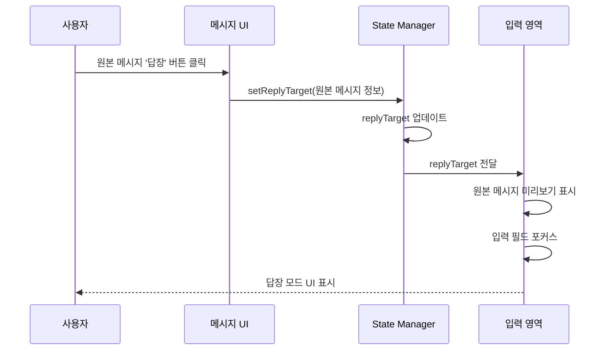

### 6.2 답장 전송 플로우 (Optimistic Update)

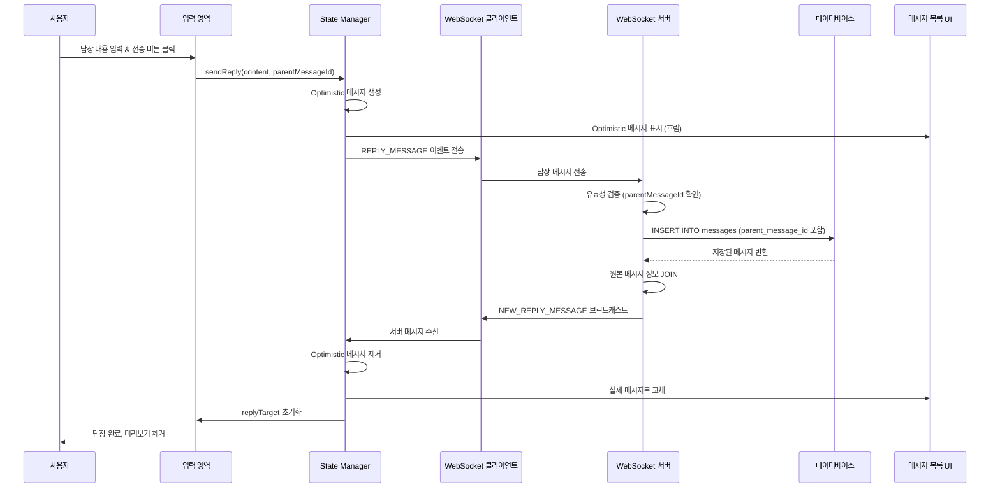

### 6.3 답장 취소 플로우

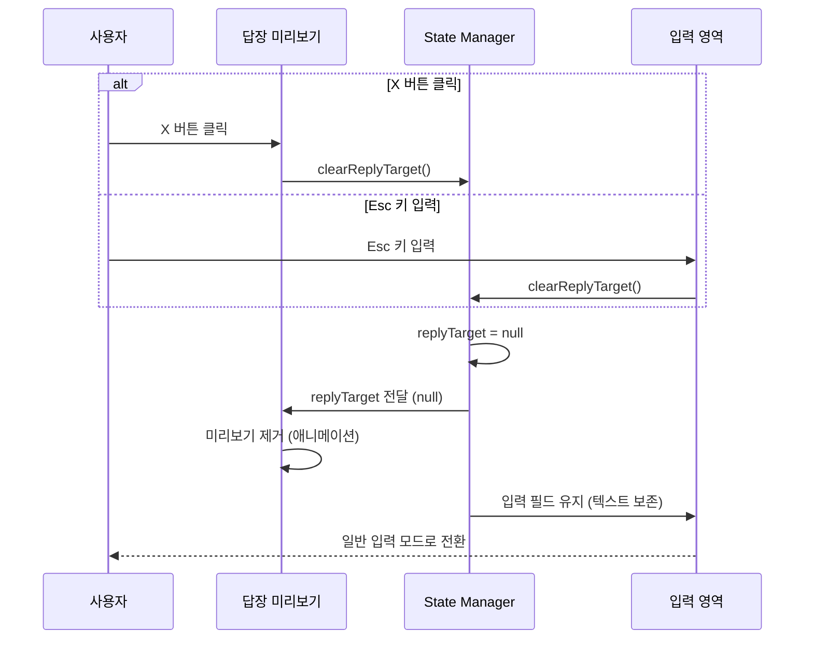

---

## 7. 에러 처리

### 7.1 에러 타입 정의

```typescript
type ReplyError =
  | { type: 'PARENT_MESSAGE_NOT_FOUND'; message: string }
  | { type: 'REPLY_SEND_FAILED'; message: string; retryable: boolean }
  | { type: 'INVALID_PARENT_MESSAGE'; message: string }
  | { type: 'CONNECTION_LOST'; message: string };
```

### 7.2 에러 처리 전략

| 에러 타입 | 발생 조건 | 화면 표시 | 사용자 액션 |
|----------|----------|----------|------------|
| `PARENT_MESSAGE_NOT_FOUND` | 원본 메시지가 DB에서 삭제됨 | 답장 미리보기에 "원본 메시지를 찾을 수 없습니다" | 답장 취소, 페이지 새로고침 |
| `REPLY_SEND_FAILED` | 서버 저장 실패 | 메시지 옆에 빨간 경고 아이콘 | "재전송" 버튼 제공 |
| `INVALID_PARENT_MESSAGE` | 다른 채팅방의 메시지에 답장 시도 | Toast 에러 메시지 | 답장 취소 |
| `CONNECTION_LOST` | WebSocket 연결 끊김 | 상단 배너: "연결이 끊어졌습니다" | 자동 재연결, 메시지 큐잉 |

---

## 8. UI/UX 요구사항

### 8.1 답장 대상 미리보기 (ReplyTargetPreview)

**위치**: 메시지 입력 필드 상단

**구성 요소**:
```
┌─────────────────────────────────────────────────┐
│ 답장 대상: @홍길동                                │
│ "안녕하세요. 오늘 회의 시간이..."               │  [X]
└─────────────────────────────────────────────────┘
```

**스타일**:
- 배경색: 연한 회색 (`bg-gray-100`) 또는 연한 보라색 (`bg-primary/5`)
- 좌측 보더: 2px 보라색 라인 (`border-l-2 border-primary`)
- 패딩: `p-3`
- 둥근 모서리: `rounded-lg`

**애니메이션**:
- 나타날 때: Slide down + Fade in (200ms)
- 사라질 때: Slide up + Fade out (150ms)

### 8.2 답장 메시지 표시 (ReplyIndicator)

**방법 1: 인용 스타일 (권장)**

```
┌─────────────────────────────────────────────────┐
│ 홍길동                                           │
│ ┌─────────────────────────────────────────────┐ │
│ │ @김철수: "회의 시간이..."                    │ │  ← 원본 메시지 인용
│ └─────────────────────────────────────────────┘ │
│ 오후 3시로 변경되었습니다.                      │  ← 답장 내용
│                                      14:32      │
└─────────────────────────────────────────────────┘
```

**스타일 (인용 블록)**:
- 배경색: 본인 메시지 - `bg-white/10`, 타인 메시지 - `bg-gray-50`
- 좌측 보더: `border-l-2 border-primary/30`
- 패딩: `pl-2 py-1`
- 텍스트 크기: `text-xs`
- 텍스트 색상: 본인 - `text-white/70`, 타인 - `text-gray-500`

**방법 2: 연결선 스타일 (선택사항)**

```
┌─────────────────────────────────────────────────┐
│ 김철수                                           │
│ 회의 시간이 언제인가요?                         │
│                                      14:30      │
└─────────────────────────────────────────────────┘
     │ (연결선)
     ↓
┌─────────────────────────────────────────────────┐
│ 홍길동                                           │
│ 오후 3시로 변경되었습니다.                      │
│                                      14:32      │
└─────────────────────────────────────────────────┘
```

### 8.3 원본 메시지 인용 클릭 동작

**기능**: 답장 메시지의 원본 인용 부분을 클릭하면 원본 메시지로 스크롤 이동

**UI 피드백**:
1. 스크롤 이동 (smooth scroll)
2. 원본 메시지 하이라이트 (배경색 변경)
3. 2초 후 하이라이트 자동 제거

**접근성**:
- 클릭 가능한 영역임을 나타내는 hover 효과
- 커서: `cursor-pointer`
- Hover 시 배경색 변화: `hover:bg-primary/10`

### 8.4 키보드 단축키

| 키 | 동작 | 조건 |
|---|------|------|
| `Enter` (Shift 없이) | 답장 메시지 전송 | `replyTarget !== null && messageInput.trim() !== ''` |
| `Shift + Enter` | 줄바꿈 | 답장 모드 포함 모든 경우 |
| `Esc` | 답장 취소 | `replyTarget !== null` |

---

## 9. 테스트 시나리오

### 9.1 성공 케이스

| 테스트 케이스 ID | 입력값 | 기대 결과 |
|-----------------|--------|----------|
| TC-REPLY-01 | 메시지 A의 '답장' 버튼 클릭 | 미리보기 표시, 입력 필드 포커스 |
| TC-REPLY-02 | 답장 내용 "동의합니다" 입력 후 전송 | 답장 메시지 표시 (원본 인용 포함), 미리보기 제거 |
| TC-REPLY-03 | 답장 미리보기 'X' 버튼 클릭 | 미리보기 제거, 입력 내용 유지 |
| TC-REPLY-04 | Esc 키 입력 | 미리보기 제거 |
| TC-REPLY-05 | 답장 메시지의 원본 인용 클릭 | 원본 메시지로 스크롤, 하이라이트 |
| TC-REPLY-06 | 여러 사용자가 동일 메시지에 답장 | 모든 답장이 원본 인용과 함께 표시 |

### 9.2 실패 케이스

| 테스트 케이스 ID | 입력값 | 기대 결과 |
|-----------------|--------|----------|
| TC-REPLY-07 | 빈 내용으로 답장 전송 시도 | 전송 버튼 비활성화 상태 유지 |
| TC-REPLY-08 | 삭제된 메시지에 답장 시도 | "원본 메시지를 찾을 수 없습니다" 에러 |
| TC-REPLY-09 | WebSocket 연결 끊긴 상태에서 답장 전송 | "연결이 끊어졌습니다" 배너, 재연결 시 자동 전송 |
| TC-REPLY-10 | 다른 채팅방의 메시지 ID로 답장 시도 | "잘못된 요청입니다" 에러 |

---

## 10. 성능 최적화

### 10.1 메모이제이션

```typescript
// 답장 여부 확인 (메모이제이션)
const isReplyMessage = useMemo(
  () => (messageId: number) => {
    return messages.some(m => m.parent_message_id === messageId);
  },
  [messages]
);

// 특정 메시지의 답장 개수 계산
const getReplyCount = useMemo(
  () => (messageId: number) => {
    return messages.filter(m => m.parent_message_id === messageId).length;
  },
  [messages]
);

// 답장 메시지 필터링
const replyMessages = useMemo(
  () => messages.filter(m => m.parent_message_id !== null),
  [messages]
);
```

### 10.2 컴포넌트 메모이제이션

```typescript
// 답장 인용 컴포넌트 메모이제이션
const ReplyIndicator = React.memo(({ parentMessage, onParentClick }) => {
  // ...
}, (prevProps, nextProps) => {
  return prevProps.parentMessage.id === nextProps.parentMessage.id &&
         prevProps.parentMessage.content === nextProps.parentMessage.content;
});

// 답장 미리보기 컴포넌트 메모이제이션
const ReplyTargetPreview = React.memo(({ replyTarget, onCancel }) => {
  // ...
}, (prevProps, nextProps) => {
  return prevProps.replyTarget?.messageId === nextProps.replyTarget?.messageId;
});
```

---

## 11. Flux 패턴 시각화 (Action → Store → View)

### 11.1 답장 대상 선택 플로우

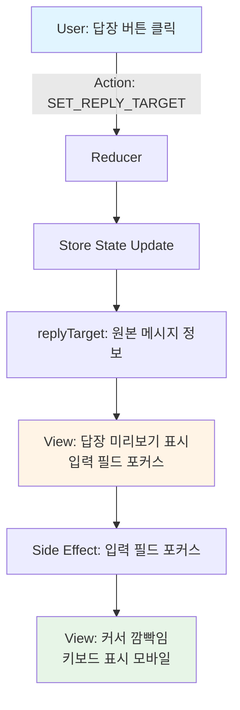

### 11.2 답장 전송 플로우 (Optimistic Update)

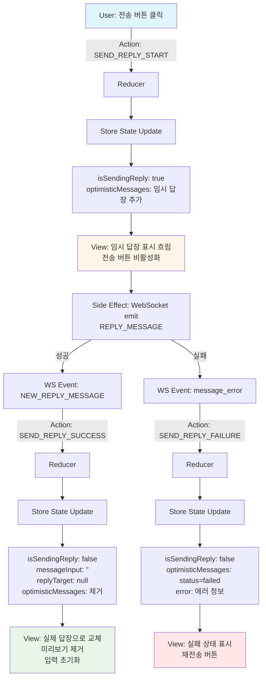

### 11.3 답장 취소 플로우

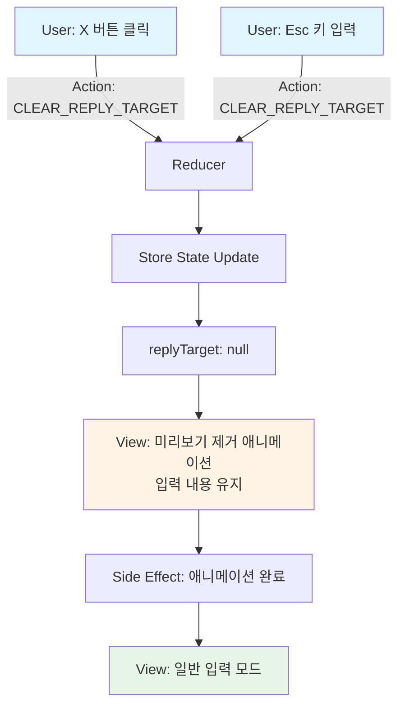

### 11.4 원본 메시지로 스크롤 플로우

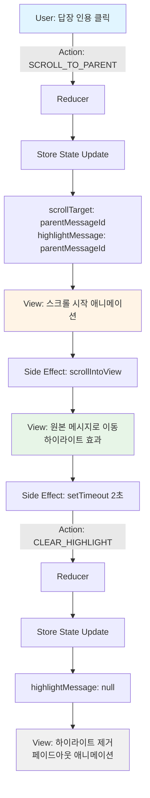

### 11.5 WebSocket 이벤트 처리 플로우

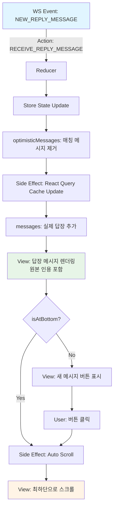

### 11.6 답장 메시지 표시 플로우 (Derived State)

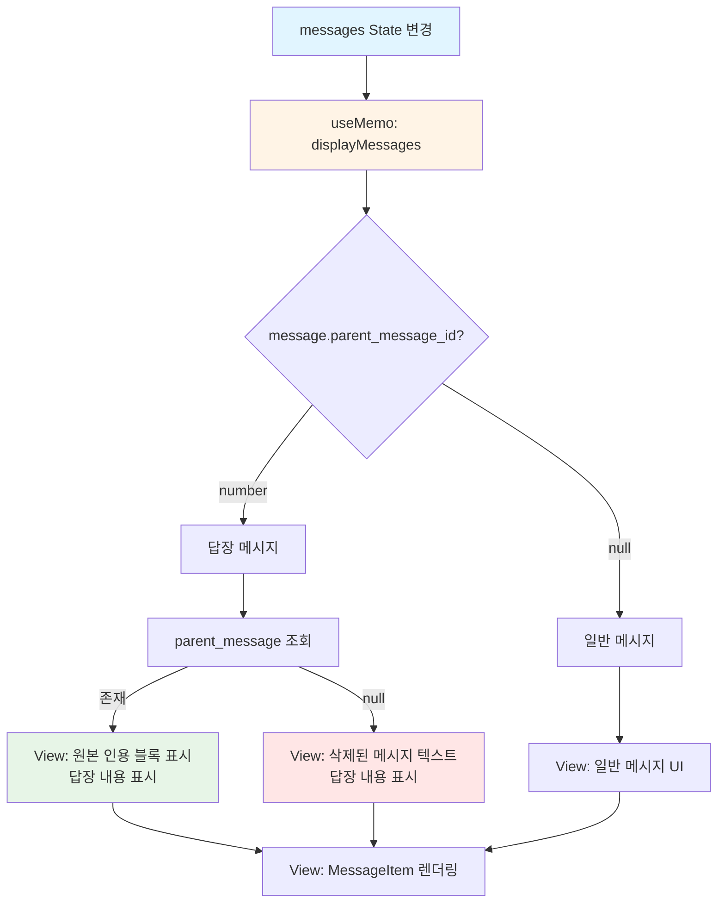

---

## 12. useReducer 기반 상태 관리 구현

### 12.1 상태 타입 정의

```typescript
// src/features/messages/types/reply-state.ts

import type { Message } from './message';

export interface ReplyTarget {
  messageId: number;
  content: string;
  userNickname: string;
  createdAt: string;
}

export interface ReplyError {
  type: 'PARENT_MESSAGE_NOT_FOUND' | 'REPLY_SEND_FAILED' | 'INVALID_PARENT_MESSAGE' | 'CONNECTION_LOST';
  message: string;
  retryable?: boolean;
}

export interface ReplyState {
  // 답장 대상
  replyTarget: ReplyTarget | null;

  // 전송 상태
  isSendingReply: boolean;

  // Optimistic Update
  optimisticReplyMessages: Message[];

  // 스크롤 및 하이라이트
  scrollTarget: number | null;
  highlightMessage: number | null;

  // 에러
  error: ReplyError | null;
}

export const initialReplyState: ReplyState = {
  replyTarget: null,
  isSendingReply: false,
  optimisticReplyMessages: [],
  scrollTarget: null,
  highlightMessage: null,
  error: null,
};
```

### 12.2 액션 타입 정의

```typescript
// src/features/messages/types/reply-actions.ts

import type { Message, ReplyTarget, ReplyError } from './reply-state';

export type ReplyAction =
  // 답장 대상 설정
  | { type: 'SET_REPLY_TARGET'; payload: ReplyTarget }
  | { type: 'CLEAR_REPLY_TARGET' }

  // 답장 전송
  | { type: 'SEND_REPLY_START'; payload: { optimisticMessage: Message } }
  | { type: 'SEND_REPLY_SUCCESS'; payload: { tempId: string } }
  | { type: 'SEND_REPLY_FAILURE'; payload: { tempId: string; error: ReplyError } }

  // WebSocket 이벤트
  | { type: 'RECEIVE_REPLY_MESSAGE'; payload: { serverMessage: Message } }

  // 스크롤 및 하이라이트
  | { type: 'SCROLL_TO_PARENT'; payload: { messageId: number } }
  | { type: 'CLEAR_HIGHLIGHT' }

  // 에러
  | { type: 'SET_ERROR'; payload: ReplyError }
  | { type: 'CLEAR_ERROR' };
```

### 12.3 Reducer 함수

```typescript
// src/features/messages/reducers/replyReducer.ts

import type { ReplyState, ReplyAction } from '../types';

export const replyReducer = (
  state: ReplyState,
  action: ReplyAction
): ReplyState => {
  switch (action.type) {
    // 답장 대상 설정
    case 'SET_REPLY_TARGET':
      return {
        ...state,
        replyTarget: action.payload,
        error: null,
      };

    case 'CLEAR_REPLY_TARGET':
      return {
        ...state,
        replyTarget: null,
      };

    // 답장 전송 시작 (Optimistic Update)
    case 'SEND_REPLY_START':
      return {
        ...state,
        isSendingReply: true,
        optimisticReplyMessages: [
          ...state.optimisticReplyMessages,
          action.payload.optimisticMessage,
        ],
        error: null,
      };

    // 답장 전송 성공
    case 'SEND_REPLY_SUCCESS':
      return {
        ...state,
        isSendingReply: false,
        replyTarget: null, // 답장 모드 종료
        optimisticReplyMessages: state.optimisticReplyMessages.filter(
          (msg) => msg._tempId !== action.payload.tempId
        ),
      };

    // 답장 전송 실패
    case 'SEND_REPLY_FAILURE':
      return {
        ...state,
        isSendingReply: false,
        optimisticReplyMessages: state.optimisticReplyMessages.map((msg) =>
          msg._tempId === action.payload.tempId
            ? { ...msg, _status: 'failed' as const }
            : msg
        ),
        error: action.payload.error,
      };

    // WebSocket에서 답장 메시지 수신
    case 'RECEIVE_REPLY_MESSAGE':
      // Optimistic 메시지 찾기 및 제거
      const matchingOptimistic = state.optimisticReplyMessages.find(
        (msg) =>
          msg.content === action.payload.serverMessage.content &&
          msg.parent_message_id === action.payload.serverMessage.parent_message_id &&
          Math.abs(
            new Date(msg.created_at).getTime() -
            new Date(action.payload.serverMessage.created_at).getTime()
          ) < 5000 // 5초 이내
      );

      return {
        ...state,
        optimisticReplyMessages: matchingOptimistic
          ? state.optimisticReplyMessages.filter(
              (msg) => msg._tempId !== matchingOptimistic._tempId
            )
          : state.optimisticReplyMessages,
      };

    // 원본 메시지로 스크롤
    case 'SCROLL_TO_PARENT':
      return {
        ...state,
        scrollTarget: action.payload.messageId,
        highlightMessage: action.payload.messageId,
      };

    // 하이라이트 제거
    case 'CLEAR_HIGHLIGHT':
      return {
        ...state,
        scrollTarget: null,
        highlightMessage: null,
      };

    // 에러 처리
    case 'SET_ERROR':
      return {
        ...state,
        error: action.payload,
      };

    case 'CLEAR_ERROR':
      return {
        ...state,
        error: null,
      };

    default:
      return state;
  }
};
```

### 12.4 커스텀 Hook 구현

```typescript
// src/features/messages/hooks/useReplyState.ts

import { useReducer, useCallback, useEffect, useRef } from 'react';
import { useQueryClient } from '@tanstack/react-query';
import { replyReducer, initialReplyState } from '../reducers/replyReducer';
import { useWebSocket } from './useWebSocket';
import { useCurrentUser } from '@/features/auth/hooks/useCurrentUser';
import type { Message, ReplyTarget } from '../types';

export const useReplyState = (roomId: string) => {
  const [state, dispatch] = useReducer(replyReducer, initialReplyState);
  const queryClient = useQueryClient();
  const ws = useWebSocket(roomId);
  const { user: currentUser } = useCurrentUser();
  const messageInputRef = useRef<HTMLTextAreaElement>(null);

  // 답장 대상 설정
  const setReplyTarget = useCallback((target: ReplyTarget) => {
    dispatch({ type: 'SET_REPLY_TARGET', payload: target });

    // 입력 필드 포커스 (Side Effect)
    setTimeout(() => {
      messageInputRef.current?.focus();
    }, 100);
  }, []);

  // 답장 취소
  const clearReplyTarget = useCallback(() => {
    dispatch({ type: 'CLEAR_REPLY_TARGET' });
  }, []);

  // 답장 전송 (Optimistic Update)
  const sendReply = useCallback(
    async (content: string) => {
      if (!state.replyTarget || !currentUser || !ws) {
        return;
      }

      const tempId = `temp-reply-${Date.now()}-${Math.random().toString(36).substr(2, 9)}`;

      const optimisticMessage: Message = {
        _tempId: tempId,
        _status: 'sending',
        id: tempId as any, // 임시 ID
        room_id: Number(roomId),
        user: {
          id: currentUser.id as any,
          nickname: currentUser.nickname,
        },
        content,
        parent_message_id: state.replyTarget.messageId,
        parent_message: {
          id: state.replyTarget.messageId,
          content: state.replyTarget.content,
          user_nickname: state.replyTarget.userNickname,
          created_at: state.replyTarget.createdAt,
        },
        created_at: new Date().toISOString(),
      } as Message;

      // Optimistic Update
      dispatch({
        type: 'SEND_REPLY_START',
        payload: { optimisticMessage },
      });

      try {
        // WebSocket으로 전송
        await ws.emit('REPLY_MESSAGE', {
          roomId: Number(roomId),
          content,
          parentMessageId: state.replyTarget.messageId,
        });

        // 성공 처리는 WebSocket 이벤트 리스너에서 수행
      } catch (error) {
        dispatch({
          type: 'SEND_REPLY_FAILURE',
          payload: {
            tempId,
            error: {
              type: 'REPLY_SEND_FAILED',
              message: '답장 전송에 실패했습니다.',
              retryable: true,
            },
          },
        });
      }
    },
    [state.replyTarget, currentUser, ws, roomId]
  );

  // 답장 재전송
  const retryReply = useCallback(
    async (failedMessage: Message) => {
      if (!failedMessage._tempId) return;

      // 실패한 메시지 제거
      dispatch({
        type: 'SEND_REPLY_SUCCESS',
        payload: { tempId: failedMessage._tempId },
      });

      // 다시 전송
      if (failedMessage.parent_message_id) {
        // replyTarget 복원
        const parentMessage = queryClient
          .getQueryData<Message[]>(['chatRoom', roomId, 'messages'])
          ?.find((m) => m.id === failedMessage.parent_message_id);

        if (parentMessage) {
          dispatch({
            type: 'SET_REPLY_TARGET',
            payload: {
              messageId: parentMessage.id,
              content: parentMessage.content,
              userNickname: parentMessage.user.nickname,
              createdAt: parentMessage.created_at,
            },
          });
        }

        await sendReply(failedMessage.content);
      }
    },
    [sendReply, queryClient, roomId]
  );

  // 원본 메시지로 스크롤
  const scrollToParentMessage = useCallback((messageId: number) => {
    dispatch({ type: 'SCROLL_TO_PARENT', payload: { messageId } });

    // Side Effect: 실제 스크롤 이동
    setTimeout(() => {
      const element = document.querySelector(`[data-message-id="${messageId}"]`);
      if (element) {
        element.scrollIntoView({ behavior: 'smooth', block: 'center' });
      }
    }, 100);

    // 2초 후 하이라이트 제거
    setTimeout(() => {
      dispatch({ type: 'CLEAR_HIGHLIGHT' });
    }, 2000);
  }, []);

  // WebSocket 이벤트 리스너: 답장 메시지 수신
  useEffect(() => {
    if (!ws) return;

    const handleNewReplyMessage = (serverMessage: Message) => {
      // Optimistic 메시지 제거
      dispatch({
        type: 'RECEIVE_REPLY_MESSAGE',
        payload: { serverMessage },
      });

      // React Query 캐시에 추가
      queryClient.setQueryData<Message[]>(
        ['chatRoom', roomId, 'messages'],
        (old = []) => [...old, serverMessage]
      );
    };

    const handleMessageError = (error: { code: string; message: string }) => {
      // 가장 최근 optimistic 메시지를 실패 처리
      const lastOptimistic =
        state.optimisticReplyMessages[state.optimisticReplyMessages.length - 1];

      if (lastOptimistic?._tempId) {
        dispatch({
          type: 'SEND_REPLY_FAILURE',
          payload: {
            tempId: lastOptimistic._tempId,
            error: {
              type: 'REPLY_SEND_FAILED',
              message: error.message,
              retryable: true,
            },
          },
        });
      }
    };

    ws.on('NEW_REPLY_MESSAGE', handleNewReplyMessage);
    ws.on('message_error', handleMessageError);

    return () => {
      ws.off('NEW_REPLY_MESSAGE', handleNewReplyMessage);
      ws.off('message_error', handleMessageError);
    };
  }, [ws, roomId, queryClient, state.optimisticReplyMessages]);

  // Esc 키 이벤트 리스너
  useEffect(() => {
    const handleKeyDown = (e: KeyboardEvent) => {
      if (e.key === 'Escape' && state.replyTarget) {
        clearReplyTarget();
      }
    };

    window.addEventListener('keydown', handleKeyDown);
    return () => window.removeEventListener('keydown', handleKeyDown);
  }, [state.replyTarget, clearReplyTarget]);

  return {
    state,
    actions: {
      setReplyTarget,
      clearReplyTarget,
      sendReply,
      retryReply,
      scrollToParentMessage,
    },
    refs: {
      messageInputRef,
    },
  };
};
```

### 12.5 컴포넌트에서 사용 예시

```typescript
// src/app/rooms/[roomId]/page.tsx (답장 기능 부분)

'use client';

import { use } from 'react';
import { useReplyState } from '@/features/messages/hooks/useReplyState';
import { useQuery } from '@tanstack/react-query';
import { MessageList } from '@/features/messages/components/MessageList';
import { MessageInputArea } from '@/features/messages/components/MessageInputArea';
import { ReplyTargetPreview } from '@/features/messages/components/ReplyTargetPreview';

export default function ChatRoomPage({ params }: { params: Promise<{ roomId: string }> }) {
  const resolvedParams = use(params);
  const { roomId } = resolvedParams;

  // 서버 상태 (React Query)
  const { data: messages = [] } = useQuery({
    queryKey: ['chatRoom', roomId, 'messages'],
    queryFn: () => fetchMessages(roomId),
  });

  const { data: currentUser } = useQuery({
    queryKey: ['currentUser'],
    queryFn: fetchCurrentUser,
  });

  // 답장 상태 (useReducer)
  const {
    state: replyState,
    actions: replyActions,
    refs: { messageInputRef },
  } = useReplyState(roomId);

  // 메시지 입력 상태 (로컬)
  const [messageInput, setMessageInput] = useState('');

  // Derived State: 실제 메시지 + Optimistic 답장 메시지 통합
  const displayMessages = useMemo(() => {
    return [...messages, ...replyState.optimisticReplyMessages].sort(
      (a, b) => new Date(a.created_at).getTime() - new Date(b.created_at).getTime()
    );
  }, [messages, replyState.optimisticReplyMessages]);

  // 답장 전송 핸들러
  const handleSendReply = useCallback(() => {
    if (!messageInput.trim() || replyState.isSendingReply) return;

    replyActions.sendReply(messageInput);
    setMessageInput(''); // 입력 필드 초기화
  }, [messageInput, replyState.isSendingReply, replyActions]);

  // Enter 키 핸들러
  const handleKeyDown = useCallback(
    (e: React.KeyboardEvent) => {
      if (e.key === 'Enter' && !e.shiftKey) {
        e.preventDefault();
        handleSendReply();
      }
    },
    [handleSendReply]
  );

  return (
    <div className="flex h-screen flex-col">
      {/* 메시지 목록 */}
      <MessageList
        messages={displayMessages}
        currentUser={currentUser}
        highlightMessageId={replyState.highlightMessage}
        onReplyClick={(message) => {
          replyActions.setReplyTarget({
            messageId: message.id,
            content: message.content,
            userNickname: message.user.nickname,
            createdAt: message.created_at,
          });
        }}
        onParentMessageClick={replyActions.scrollToParentMessage}
      />

      {/* 메시지 입력 영역 */}
      <div className="border-t bg-white p-4">
        {/* 답장 대상 미리보기 */}
        {replyState.replyTarget && (
          <ReplyTargetPreview
            replyTarget={replyState.replyTarget}
            onCancel={replyActions.clearReplyTarget}
          />
        )}

        {/* 입력 필드 */}
        <MessageInputArea
          ref={messageInputRef}
          value={messageInput}
          onChange={(e) => setMessageInput(e.target.value)}
          onKeyDown={handleKeyDown}
          onSend={handleSendReply}
          isSending={replyState.isSendingReply}
          placeholder={
            replyState.replyTarget
              ? `${replyState.replyTarget.userNickname}님에게 답장...`
              : '메시지를 입력하세요...'
          }
        />

        {/* 에러 표시 */}
        {replyState.error && (
          <div className="mt-2 text-sm text-red-600">
            {replyState.error.message}
          </div>
        )}
      </div>
    </div>
  );
}
```

### 12.6 ReplyTargetPreview 컴포넌트

```typescript
// src/features/messages/components/ReplyTargetPreview.tsx

'use client';

import { X } from 'lucide-react';
import type { ReplyTarget } from '../types';

interface ReplyTargetPreviewProps {
  replyTarget: ReplyTarget;
  onCancel: () => void;
}

export const ReplyTargetPreview = ({
  replyTarget,
  onCancel,
}: ReplyTargetPreviewProps) => {
  const previewText =
    replyTarget.content.length > 30
      ? `${replyTarget.content.substring(0, 30)}...`
      : replyTarget.content;

  return (
    <div
      className="mb-2 flex items-start justify-between rounded-lg border-l-2 border-primary bg-primary/5 p-3 animate-in slide-in-from-top-2 duration-200"
      role="alert"
      aria-label={`${replyTarget.userNickname}님의 메시지에 답장 중`}
    >
      <div className="flex-1">
        <p className="text-xs font-semibold text-primary">
          답장 대상: @{replyTarget.userNickname}
        </p>
        <p className="mt-1 text-sm text-gray-600">{previewText}</p>
      </div>

      <button
        type="button"
        onClick={onCancel}
        className="ml-2 rounded p-1 text-gray-400 transition-colors hover:bg-gray-200 hover:text-gray-600"
        aria-label="답장 취소"
      >
        <X className="h-4 w-4" />
      </button>
    </div>
  );
};
```

### 12.7 ReplyIndicator 컴포넌트

```typescript
// src/features/messages/components/ReplyIndicator.tsx

'use client';

import type { Message } from '../types';

interface ReplyIndicatorProps {
  parentMessage: NonNullable<Message['parent_message']>;
  isOwnMessage: boolean;
  onParentClick: (messageId: number) => void;
}

export const ReplyIndicator = ({
  parentMessage,
  isOwnMessage,
  onParentClick,
}: ReplyIndicatorProps) => {
  const previewText =
    parentMessage.content.length > 30
      ? `${parentMessage.content.substring(0, 30)}...`
      : parentMessage.content;

  return (
    <button
      type="button"
      onClick={() => onParentClick(parentMessage.id)}
      className={`mb-2 w-full rounded border-l-2 px-2 py-1 text-left text-xs transition-colors ${
        isOwnMessage
          ? 'border-white/30 bg-white/10 hover:bg-white/20'
          : 'border-primary/30 bg-gray-50 hover:bg-gray-100'
      }`}
      aria-label={`${parentMessage.user_nickname}님의 원본 메시지로 이동`}
    >
      <p
        className={`font-medium ${
          isOwnMessage ? 'text-white/90' : 'text-gray-700'
        }`}
      >
        @{parentMessage.user_nickname}:
      </p>
      <p
        className={`truncate ${
          isOwnMessage ? 'text-white/70' : 'text-gray-500'
        }`}
      >
        {previewText}
      </p>
    </button>
  );
};
```

---

## 13. Context + useReducer 아키텍처 설계

### 13.1 Context 아키텍처 개요

**설계 원칙**:
- Context는 답장 기능 관련 상태와 액션만 관리 (Single Responsibility)
- Provider는 ChatRoomPage 레벨에서 제공하여 모든 하위 컴포넌트에서 접근 가능
- useReducer로 복잡한 상태 로직을 중앙 집중화
- WebSocket, React Query와의 통합은 Provider 내부에서 처리
- Context 소비자는 필요한 상태/액션만 선택적으로 구독

**계층 구조**:
```
<ChatRoomPage>
  <ReplyProvider>  ← Context Provider
    <MessageList>
      <MessageItem>
        <ReplyButton />  ← useReplyContext()
        <ReplyIndicator />  ← useReplyContext()
    <MessageInputArea>
      <ReplyTargetPreview />  ← useReplyContext()
      <MessageTextarea />  ← useReplyContext()
      <SendButton />  ← useReplyContext()
```

---

### 13.2 Context Provider 데이터 흐름

#### 13.2.1 초기화 및 생명주기

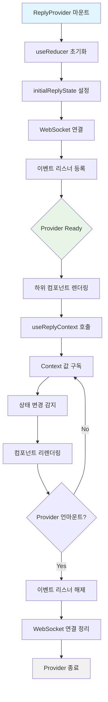

#### 13.2.2 액션 디스패치 및 상태 업데이트 흐름

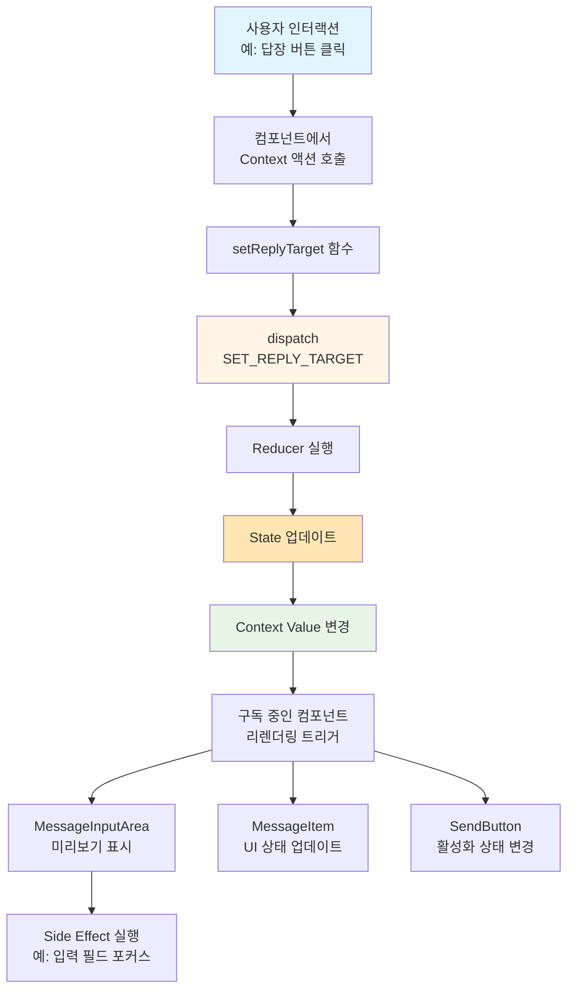

#### 13.2.3 WebSocket 이벤트 처리 흐름

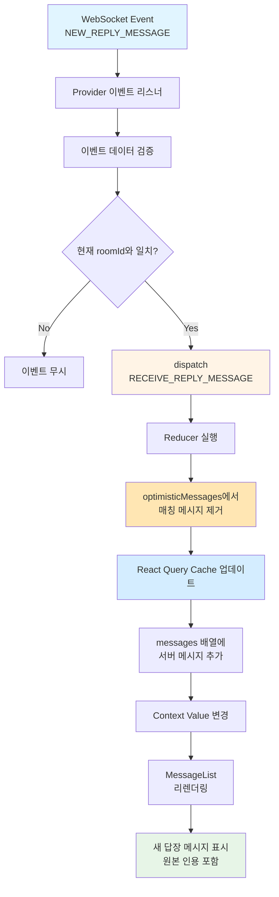

#### 13.2.4 Optimistic Update 흐름

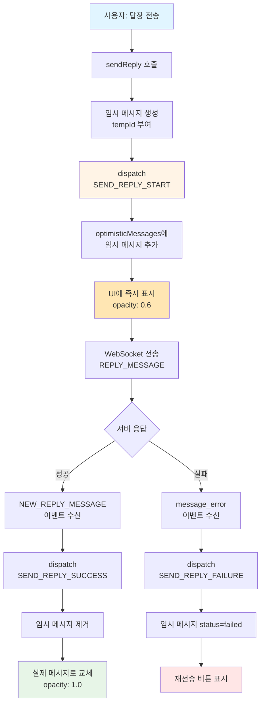

---

### 13.3 ReplyContext Interface 정의

#### 13.3.1 Context Value 타입

```typescript
// src/features/messages/context/ReplyContext.types.ts

import type { Message, ReplyTarget, ReplyError, ReplyState } from '../types';

/**
 * ReplyContext가 제공하는 전체 값의 타입
 */
export interface ReplyContextValue {
  // ===== 상태 (State) =====
  state: ReplyState;

  // ===== 액션 (Actions) =====
  actions: ReplyActions;

  // ===== Refs =====
  refs: ReplyRefs;

  // ===== 파생 상태 (Derived State) =====
  derived: ReplyDerivedState;
}

/**
 * 액션 인터페이스
 */
export interface ReplyActions {
  // 답장 대상 관리
  setReplyTarget: (target: ReplyTarget) => void;
  clearReplyTarget: () => void;

  // 답장 전송
  sendReply: (content: string) => Promise<void>;
  retryReply: (failedMessage: Message) => Promise<void>;

  // 스크롤 및 하이라이트
  scrollToParentMessage: (messageId: number) => void;
  clearHighlight: () => void;

  // 에러 관리
  clearError: () => void;
}

/**
 * Refs 인터페이스
 */
export interface ReplyRefs {
  messageInputRef: React.RefObject<HTMLTextAreaElement>;
}

/**
 * 파생 상태 인터페이스 (계산된 값)
 */
export interface ReplyDerivedState {
  // 답장 모드 활성화 여부
  isReplyMode: boolean;

  // 답장 전송 가능 여부
  canSendReply: boolean;

  // 미리보기 텍스트 (30자 제한)
  replyPreviewText: string | null;

  // 현재 표시할 메시지 목록 (실제 + Optimistic)
  displayMessages: Message[];
}
```

---

### 13.4 Context Provider 구조 및 책임

#### 13.4.1 Provider의 책임 범위

| 책임 | 설명 | 구현 위치 |
|------|------|-----------|
| **상태 관리** | useReducer로 답장 상태 중앙 집중화 | Provider 내부 |
| **액션 제공** | 하위 컴포넌트가 사용할 액션 함수 생성 및 메모이제이션 | Provider 내부 |
| **WebSocket 통합** | 답장 관련 WebSocket 이벤트 구독 및 처리 | Provider useEffect |
| **React Query 연동** | 서버 메시지 수신 시 캐시 업데이트 | Provider useEffect |
| **Side Effect 관리** | 입력 필드 포커스, 스크롤 이동 등 | Provider useEffect |
| **파생 상태 계산** | useMemo로 최적화된 계산 값 제공 | Provider 내부 |
| **에러 처리** | 답장 관련 에러 상태 관리 및 전파 | Provider + Reducer |

#### 13.4.2 Provider 초기화 프로세스

```typescript
// src/features/messages/context/ReplyProvider.interface.ts

export interface ReplyProviderProps {
  /**
   * 현재 채팅방 ID
   * WebSocket 연결 및 React Query 캐시 키에 사용
   */
  roomId: string;

  /**
   * React Query로 관리되는 전체 메시지 목록
   * Optimistic 메시지와 병합하여 displayMessages 생성
   */
  messages: Message[];

  /**
   * 현재 로그인한 사용자 정보
   * Optimistic 메시지 생성 시 필요
   */
  currentUser: CurrentUser | null;

  /**
   * 하위 컴포넌트
   */
  children: React.ReactNode;
}
```

**초기화 단계**:
1. **Props 검증**: roomId, currentUser 유효성 확인
2. **Reducer 초기화**: useReducer(replyReducer, initialReplyState)
3. **WebSocket 연결**: useWebSocket(roomId) 훅 호출
4. **Refs 생성**: messageInputRef 생성
5. **이벤트 리스너 등록**: WebSocket 이벤트 구독
6. **파생 상태 계산**: useMemo로 displayMessages 등 계산
7. **Context Value 생성**: 모든 값을 하나의 객체로 통합
8. **Provider 렌더링**: Context.Provider에 value 전달

---

### 13.5 하위 컴포넌트에서 Context 소비 패턴

#### 13.5.1 Hook 기반 소비 (권장)

```typescript
// src/features/messages/context/ReplyContext.hooks.ts

/**
 * 답장 Context를 소비하는 커스텀 훅
 * Provider 외부에서 호출 시 명확한 에러 메시지 제공
 */
export const useReplyContext = (): ReplyContextValue => {
  const context = useContext(ReplyContext);

  if (!context) {
    throw new Error(
      'useReplyContext must be used within ReplyProvider. ' +
      'Make sure <ReplyProvider> wraps your component tree.'
    );
  }

  return context;
};

/**
 * 선택적 구독을 위한 Selector Hook (성능 최적화)
 */
export const useReplySelector = <T,>(
  selector: (value: ReplyContextValue) => T
): T => {
  const context = useReplyContext();
  return selector(context);
};
```

#### 13.5.2 컴포넌트별 소비 패턴

**패턴 1: 전체 Context 사용 (작은 컴포넌트)**

```typescript
// MessageInputArea.tsx
const MessageInputArea = () => {
  const { state, actions, refs } = useReplyContext();

  return (
    <>
      {state.replyTarget && (
        <ReplyTargetPreview
          replyTarget={state.replyTarget}
          onCancel={actions.clearReplyTarget}
        />
      )}
      <textarea ref={refs.messageInputRef} />
    </>
  );
};
```

**패턴 2: 선택적 구독 (성능 최적화 필요 시)**

```typescript
// ReplyButton.tsx
const ReplyButton = ({ message }: { message: Message }) => {
  // 필요한 액션만 구독 (state 변경에 영향받지 않음)
  const setReplyTarget = useReplySelector(
    (ctx) => ctx.actions.setReplyTarget
  );

  const handleClick = () => {
    setReplyTarget({
      messageId: message.id,
      content: message.content,
      userNickname: message.user.nickname,
      createdAt: message.created_at,
    });
  };

  return <button onClick={handleClick}>답장</button>;
};
```

**패턴 3: 파생 상태 사용**

```typescript
// MessageList.tsx
const MessageList = () => {
  // Optimistic 메시지가 포함된 전체 메시지 목록
  const displayMessages = useReplySelector(
    (ctx) => ctx.derived.displayMessages
  );

  const highlightMessageId = useReplySelector(
    (ctx) => ctx.state.highlightMessage
  );

  return (
    <div>
      {displayMessages.map((msg) => (
        <MessageItem
          key={msg.id}
          message={msg}
          isHighlighted={msg.id === highlightMessageId}
        />
      ))}
    </div>
  );
};
```

**패턴 4: 에러 표시**

```typescript
// ReplyErrorBanner.tsx
const ReplyErrorBanner = () => {
  const error = useReplySelector((ctx) => ctx.state.error);
  const clearError = useReplySelector((ctx) => ctx.actions.clearError);

  if (!error) return null;

  return (
    <div className="error-banner">
      <p>{error.message}</p>
      {error.retryable && <button>재시도</button>}
      <button onClick={clearError}>닫기</button>
    </div>
  );
};
```

---

### 13.6 Context Value 메모이제이션 전략

#### 13.6.1 메모이제이션 필요성

Context value가 변경될 때마다 모든 소비자 컴포넌트가 리렌더링되므로, 불필요한 재생성을 방지해야 함.

#### 13.6.2 메모이제이션 계층

```typescript
// Provider 내부 메모이제이션 구조

// 1. 액션 함수 메모이제이션 (useCallback)
const setReplyTarget = useCallback((target: ReplyTarget) => {
  dispatch({ type: 'SET_REPLY_TARGET', payload: target });
  // Side effect는 별도 useEffect에서 처리
}, []);

const sendReply = useCallback(async (content: string) => {
  // ...구현
}, [state.replyTarget, currentUser, ws, roomId]);

// 2. Refs (항상 동일한 참조)
const messageInputRef = useRef<HTMLTextAreaElement>(null);

// 3. 파생 상태 메모이제이션 (useMemo)
const displayMessages = useMemo(() => {
  return [...messages, ...state.optimisticReplyMessages].sort(
    (a, b) => new Date(a.created_at).getTime() - new Date(b.created_at).getTime()
  );
}, [messages, state.optimisticReplyMessages]);

const isReplyMode = useMemo(() => state.replyTarget !== null, [state.replyTarget]);

const canSendReply = useMemo(() => {
  return (
    state.replyTarget !== null &&
    !state.isSendingReply &&
    wsConnectionStatus === 'connected'
  );
}, [state.replyTarget, state.isSendingReply, wsConnectionStatus]);

// 4. Context Value 메모이제이션 (useMemo)
const contextValue = useMemo<ReplyContextValue>(
  () => ({
    state,
    actions: {
      setReplyTarget,
      clearReplyTarget,
      sendReply,
      retryReply,
      scrollToParentMessage,
      clearHighlight,
      clearError,
    },
    refs: {
      messageInputRef,
    },
    derived: {
      isReplyMode,
      canSendReply,
      replyPreviewText,
      displayMessages,
    },
  }),
  [
    state, // Reducer state
    // Actions (useCallback으로 안정된 참조)
    setReplyTarget,
    clearReplyTarget,
    sendReply,
    retryReply,
    scrollToParentMessage,
    clearHighlight,
    clearError,
    // Derived (useMemo로 안정된 참조)
    isReplyMode,
    canSendReply,
    replyPreviewText,
    displayMessages,
  ]
);
```

---

### 13.7 Context와 다른 상태 관리의 통합

#### 13.7.1 React Query 통합 흐름

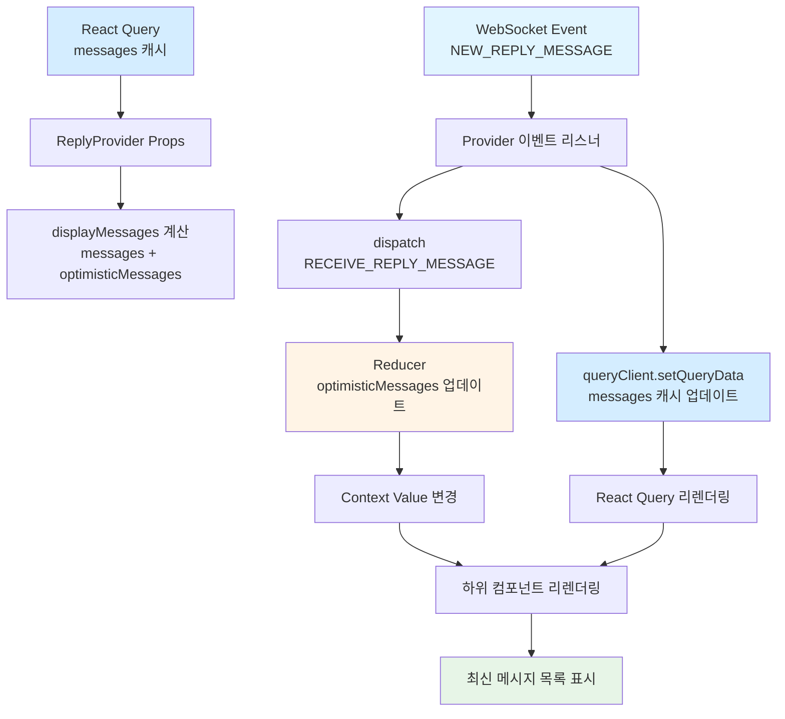

#### 13.7.2 WebSocket 통합 흐름

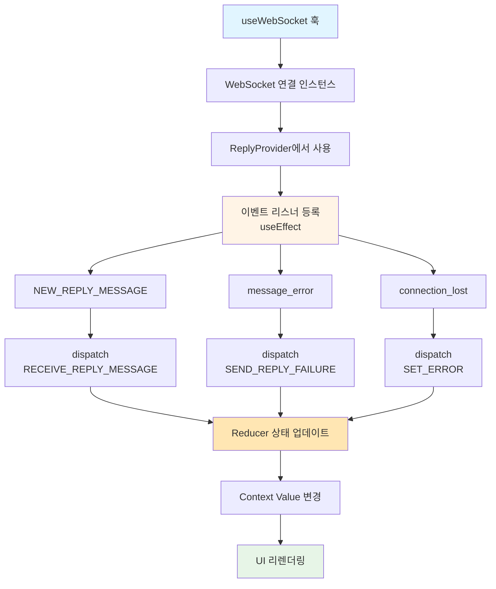

---

### 13.8 컴포넌트 계층별 Context 사용

| 컴포넌트 | 사용하는 Context 값 | 사용하는 액션 | 비고 |
|---------|-------------------|-------------|------|
| **ChatRoomPage** | - | - | Provider 제공 위치 |
| **MessageList** | `derived.displayMessages`<br/>`state.highlightMessage` | `actions.scrollToParentMessage` | 메시지 목록 렌더링 |
| **MessageItem** | `state.highlightMessage` | `actions.setReplyTarget`<br/>`actions.scrollToParentMessage` | 개별 메시지 UI |
| **ReplyButton** | - | `actions.setReplyTarget` | 답장 시작 버튼 |
| **ReplyIndicator** | - | `actions.scrollToParentMessage` | 원본 메시지 인용 |
| **MessageInputArea** | `state.replyTarget`<br/>`state.isSendingReply`<br/>`derived.canSendReply` | `actions.sendReply`<br/>`actions.clearReplyTarget` | 메시지 입력 영역 |
| **ReplyTargetPreview** | `state.replyTarget` | `actions.clearReplyTarget` | 답장 대상 미리보기 |
| **SendButton** | `state.isSendingReply`<br/>`derived.canSendReply` | `actions.sendReply` | 전송 버튼 |
| **ReplyErrorBanner** | `state.error` | `actions.clearError`<br/>`actions.retryReply` | 에러 표시 |

---

### 13.9 성능 최적화 체크리스트

#### Context 최적화

- [ ] Context Value를 useMemo로 메모이제이션
- [ ] 액션 함수를 useCallback으로 메모이제이션
- [ ] 파생 상태를 useMemo로 계산
- [ ] 불필요한 리렌더링 방지를 위한 선택적 구독 (useReplySelector)
- [ ] Context를 기능별로 분리 (필요 시 ReplyContext와 MessageContext 분리)

#### 컴포넌트 최적화

- [ ] React.memo로 순수 컴포넌트 최적화
- [ ] useCallback으로 이벤트 핸들러 메모이제이션
- [ ] 불필요한 Context 구독 최소화
- [ ] 큰 리스트는 가상화 (react-window, react-virtualized)

#### Reducer 최적화

- [ ] Reducer 함수는 순수 함수로 유지
- [ ] 불필요한 상태 복사 최소화 (Spread 연산자 최적화)
- [ ] 상태 구조를 flat하게 유지 (nested 최소화)

---

## 14. 구현 우선순위

### Phase 1: 기본 답장 기능 (MVP)
1. ✅ 답장 대상 선택 (`replyTarget` 상태 관리)
2. ✅ 답장 미리보기 UI (ReplyTargetPreview 컴포넌트)
3. ✅ 답장 메시지 전송 (parentMessageId 포함)
4. ✅ 답장 메시지 표시 (인용 스타일)

### Phase 2: UX 개선
5. ✅ 답장 취소 기능 (X 버튼, Esc 키)
6. ✅ Optimistic Update 구현
7. ✅ 원본 메시지로 스크롤 이동 및 하이라이트

### Phase 3: 안정화
8. 에러 처리 강화 (원본 메시지 삭제, 네트워크 오류)
9. 답장 미리보기 애니메이션
10. 접근성 개선 (ARIA 레이블, 키보드 네비게이션)

### Phase 4: 고급 기능 (선택사항)
11. 답장 스레드 그룹화 (같은 원본에 대한 답장들 묶기)
12. 답장 알림 (원본 메시지 작성자에게 푸시 알림)
13. 답장 통계 (가장 많이 답장받은 메시지 표시)

---

## 15. 변경 이력

| 버전 | 날짜 | 작성자 | 변경 내용 |
|------|------|--------|-----------|
| 1.0  | 2025-10-17 | Claude | 초기 작성 - 메시지 답장 기능 상태관리 설계 |
| 1.1  | 2025-10-17 | Claude | Context + useReducer 아키텍처 설계 추가 (섹션 13) |

---

## 참고 문서
- [UC-006: 메시지에 답장하기](../usecases/006-reply-to-message.md)
- [채팅방 페이지 상태관리 설계](./chat-room-state-management.md)
- [UC-005: 메시지 전송하기](../usecases/005-send-message.md)
- [데이터베이스 스키마](../database.md)
