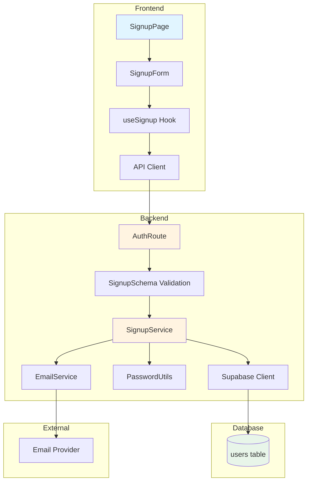

# UC-001: 사용자 회원가입 구현 계획

## 개요

### 모듈 목록

| 모듈명 | 경로 | 설명 |
|--------|------|------|
| **Backend Modules** |
| SignupSchema | `src/features/auth/backend/schema.ts` | 회원가입 요청/응답 Zod 스키마 정의 |
| SignupService | `src/features/auth/backend/service.ts` | 회원가입 비즈니스 로직 (중복 검증, 사용자 생성, 이메일 발송) |
| AuthRoute | `src/features/auth/backend/route.ts` | POST /api/auth/signup 엔드포인트 추가 |
| AuthError | `src/features/auth/backend/error.ts` | 회원가입 관련 에러 코드 추가 (중복, 유효성 등) |
| **Frontend Modules** |
| SignupPage | `src/app/signup/page.tsx` | 회원가입 페이지 컴포넌트 |
| SignupForm | `src/features/auth/components/SignupForm.tsx` | 회원가입 폼 UI 컴포넌트 |
| useSignup | `src/features/auth/hooks/useSignup.ts` | React Query mutation 훅 |
| AuthDTO | `src/features/auth/lib/dto.ts` | 스키마 타입 재노출 |
| **Shared Modules** |
| PasswordUtils | `src/lib/auth/password.ts` | 비밀번호 해싱 유틸리티 (bcrypt) |
| EmailService | `src/backend/email/service.ts` | 이메일 발송 서비스 (인증 토큰) |

---

## Diagram



---

## Implementation Plan

### 1. Backend Modules

#### 1.1 SignupSchema (`src/features/auth/backend/schema.ts`)

**책임:**
- 회원가입 요청/응답 데이터 검증 스키마 정의

**주요 함수/클래스:**
```typescript
// 추가할 스키마
export const SignupRequestSchema = z.object({
  nickname: z.string().min(2).max(50),
  email: z.string().email(),
  password: z.string().min(8),
  passwordConfirm: z.string().min(8),
}).refine(data => data.password === data.passwordConfirm, {
  message: "비밀번호가 일치하지 않습니다.",
  path: ["passwordConfirm"],
});

export const SignupResponseSchema = z.object({
  success: z.literal(true),
  data: z.object({
    message: z.string(),
    redirectTo: z.string(),
  }),
});

export type SignupRequest = z.infer<typeof SignupRequestSchema>;
export type SignupResponse = z.infer<typeof SignupResponseSchema>;
```

**의존성:**
- zod

**Unit Test:**
```typescript
describe('SignupRequestSchema', () => {
  it('should validate valid signup data', () => {
    const valid = {
      nickname: 'testuser',
      email: 'test@example.com',
      password: 'password123',
      passwordConfirm: 'password123',
    };
    expect(SignupRequestSchema.parse(valid)).toEqual(valid);
  });

  it('should reject mismatched passwords', () => {
    const invalid = {
      nickname: 'testuser',
      email: 'test@example.com',
      password: 'password123',
      passwordConfirm: 'different',
    };
    expect(() => SignupRequestSchema.parse(invalid)).toThrow();
  });

  it('should reject short password', () => {
    const invalid = {
      nickname: 'testuser',
      email: 'test@example.com',
      password: 'short',
      passwordConfirm: 'short',
    };
    expect(() => SignupRequestSchema.parse(invalid)).toThrow();
  });

  it('should reject invalid email', () => {
    const invalid = {
      nickname: 'testuser',
      email: 'invalid-email',
      password: 'password123',
      passwordConfirm: 'password123',
    };
    expect(() => SignupRequestSchema.parse(invalid)).toThrow();
  });
});
```

---

#### 1.2 AuthError (`src/features/auth/backend/error.ts`)

**책임:**
- 회원가입 관련 에러 코드 정의

**주가할 에러 코드:**
```typescript
export const AuthErrorCode = {
  // 기존 코드...

  // 회원가입 관련 에러 추가
  DUPLICATE_NICKNAME: {
    code: 'DUPLICATE_NICKNAME',
    statusCode: 409,
    message: '이미 사용 중인 닉네임입니다.',
  },

  DUPLICATE_EMAIL: {
    code: 'DUPLICATE_EMAIL',
    statusCode: 409,
    message: '이미 가입된 이메일입니다.',
  },

  EMAIL_SEND_FAILED: {
    code: 'EMAIL_SEND_FAILED',
    statusCode: 500,
    message: '이메일 발송에 실패했습니다. 잠시 후 다시 시도해주세요.',
  },
} as const;
```

---

#### 1.3 SignupService (`src/features/auth/backend/service.ts`)

**책임:**
- 회원가입 비즈니스 로직 수행
- 닉네임/이메일 중복 검증
- 비밀번호 해싱
- 사용자 생성 (status: 'pending')
- 이메일 인증 토큰 생성 및 발송

**주요 함수:**
```typescript
export interface SignupParams {
  nickname: string;
  email: string;
  password: string;
}

export async function signupService(
  params: SignupParams,
  c: AppEnv
): Promise<HandlerResult<{ message: string; redirectTo: string }, string>> {
  const { nickname, email, password } = params;
  const supabase = c.get('supabase');
  const logger = c.get('logger');

  try {
    // 1. 닉네임 중복 검증
    const { data: existingNickname } = await supabase
      .from('users')
      .select('id')
      .eq('nickname', nickname)
      .single();

    if (existingNickname) {
      return failure(409, 'DUPLICATE_NICKNAME', '이미 사용 중인 닉네임입니다.');
    }

    // 2. 이메일 중복 검증
    const { data: existingEmail } = await supabase
      .from('users')
      .select('id')
      .eq('email', email)
      .single();

    if (existingEmail) {
      return failure(409, 'DUPLICATE_EMAIL', '이미 가입된 이메일입니다.');
    }

    // 3. 비밀번호 해싱
    const passwordHash = await bcrypt.hash(password, 10);

    // 4. 사용자 생성
    const { data: newUser, error: insertError } = await supabase
      .from('users')
      .insert({
        nickname,
        email,
        password_hash: passwordHash,
        status: 'pending',
      })
      .select('id, email')
      .single();

    if (insertError || !newUser) {
      logger.error('Failed to create user', insertError);
      return failure(500, 'DB_ERROR', '회원가입 처리 중 오류가 발생했습니다.');
    }

    // 5. 이메일 인증 토큰 생성 및 발송
    // TODO: 실제 이메일 발송 구현
    logger.info(`[MOCK] Email verification link for ${email}: /verify-email?token=mock-token-${newUser.id}`);

    logger.info(`New user signed up: ${email}`);

    return success({
      message: '회원가입이 완료되었습니다. 이메일을 확인해주세요.',
      redirectTo: '/login',
    }, 201);

  } catch (err) {
    logger.error('Unexpected error during signup', err);
    return failure(500, 'SERVER_ERROR', '일시적인 오류가 발생했습니다.');
  }
}
```

**의존성:**
- bcrypt
- Supabase client
- AppEnv (context)
- HandlerResult (response helper)

**Unit Test:**
```typescript
describe('signupService', () => {
  it('should create user with pending status', async () => {
    const params = {
      nickname: 'newuser',
      email: 'new@example.com',
      password: 'password123',
    };
    const result = await signupService(params, mockContext);

    expect(result.ok).toBe(true);
    expect(result.status).toBe(201);
    expect(result.data.redirectTo).toBe('/login');
  });

  it('should reject duplicate nickname', async () => {
    const params = {
      nickname: 'existing',
      email: 'new@example.com',
      password: 'password123',
    };
    const result = await signupService(params, mockContext);

    expect(result.ok).toBe(false);
    expect(result.error.code).toBe('DUPLICATE_NICKNAME');
    expect(result.status).toBe(409);
  });

  it('should reject duplicate email', async () => {
    const params = {
      nickname: 'newuser',
      email: 'existing@example.com',
      password: 'password123',
    };
    const result = await signupService(params, mockContext);

    expect(result.ok).toBe(false);
    expect(result.error.code).toBe('DUPLICATE_EMAIL');
    expect(result.status).toBe(409);
  });

  it('should hash password with bcrypt', async () => {
    const params = {
      nickname: 'newuser',
      email: 'new@example.com',
      password: 'password123',
    };
    await signupService(params, mockContext);

    const user = await getUserByEmail('new@example.com');
    const isValid = await bcrypt.compare('password123', user.password_hash);
    expect(isValid).toBe(true);
  });
});
```

---

#### 1.4 AuthRoute (`src/features/auth/backend/route.ts`)

**책임:**
- POST /api/auth/signup 엔드포인트 추가

**구현:**
```typescript
// 기존 코드에 추가
export const authRoute = new Hono()
  .post(
    '/api/auth/signup',
    zValidator('json', SignupRequestSchema, (result, c) => {
      if (!result.success) {
        const validationError = result.error.errors[0];
        return c.json(
          {
            success: false,
            error: {
              code: 'VALIDATION_ERROR',
              message: validationError.message,
            },
          },
          400
        );
      }
    }),
    async (c) => {
      const { nickname, email, password } = await c.req.json();
      const result = await signupService({ nickname, email, password }, c);

      return respond(c, result);
    }
  )
  // 기존 /api/auth/login...
```

**의존성:**
- SignupRequestSchema
- signupService
- zValidator
- respond

---

### 2. Frontend Modules

#### 2.1 SignupPage (`src/app/signup/page.tsx`)

**책임:**
- 회원가입 페이지 렌더링
- SignupForm 컴포넌트 마운트

**구현:**
```typescript
'use client';

import { SignupForm } from '@/features/auth/components/SignupForm';

export default function SignupPage() {
  return (
    <div className="min-h-screen flex items-center justify-center bg-gray-50 py-12 px-4 sm:px-6 lg:px-8">
      <div className="max-w-md w-full space-y-8">
        <div>
          <h2 className="mt-6 text-center text-3xl font-bold text-gray-900">
            회원가입
          </h2>
          <p className="mt-2 text-center text-sm text-gray-600">
            SuperChat에 오신 것을 환영합니다
          </p>
        </div>
        <SignupForm />
      </div>
    </div>
  );
}
```

**의존성:**
- SignupForm

**QA Sheet:**
- [ ] 페이지가 정상적으로 로드되는가?
- [ ] 중앙 정렬이 적용되는가?
- [ ] 모바일/태블릿/데스크톱에서 반응형으로 표시되는가?
- [ ] 로그인 페이지로 이동하는 링크가 있는가?

---

#### 2.2 SignupForm (`src/features/auth/components/SignupForm.tsx`)

**책임:**
- 회원가입 폼 UI 렌더링
- 실시간 유효성 검증 피드백
- useSignup 훅 호출
- 로딩/성공/실패 상태 표시

**구현:**
```typescript
'use client';

import { useState } from 'react';
import { useRouter } from 'next/navigation';
import { Button } from '@/components/ui/button';
import { Input } from '@/components/ui/input';
import { Label } from '@/components/ui/label';
import { useSignup } from '@/features/auth/hooks/useSignup';
import { useToast } from '@/hooks/use-toast';

export function SignupForm() {
  const router = useRouter();
  const { toast } = useToast();
  const { mutate: signup, isPending } = useSignup();

  const [formData, setFormData] = useState({
    nickname: '',
    email: '',
    password: '',
    passwordConfirm: '',
  });

  const [errors, setErrors] = useState<Record<string, string>>({});

  const handleSubmit = async (e: React.FormEvent) => {
    e.preventDefault();

    // 클라이언트 검증
    if (formData.password !== formData.passwordConfirm) {
      setErrors({ passwordConfirm: '비밀번호가 일치하지 않습니다.' });
      return;
    }

    signup(formData, {
      onSuccess: (data) => {
        toast({
          title: '회원가입 성공',
          description: data.message,
        });
        setTimeout(() => {
          router.push(data.redirectTo);
        }, 2000);
      },
      onError: (error: any) => {
        toast({
          variant: 'destructive',
          title: '회원가입 실패',
          description: error.error?.message || '알 수 없는 오류가 발생했습니다.',
        });
      },
    });
  };

  return (
    <form onSubmit={handleSubmit} className="space-y-6">
      <div>
        <Label htmlFor="nickname">닉네임</Label>
        <Input
          id="nickname"
          type="text"
          value={formData.nickname}
          onChange={(e) => setFormData({ ...formData, nickname: e.target.value })}
          placeholder="2~50자"
          required
        />
        {errors.nickname && <p className="text-sm text-red-600 mt-1">{errors.nickname}</p>}
      </div>

      <div>
        <Label htmlFor="email">이메일</Label>
        <Input
          id="email"
          type="email"
          value={formData.email}
          onChange={(e) => setFormData({ ...formData, email: e.target.value })}
          placeholder="example@email.com"
          required
        />
        {errors.email && <p className="text-sm text-red-600 mt-1">{errors.email}</p>}
      </div>

      <div>
        <Label htmlFor="password">비밀번호</Label>
        <Input
          id="password"
          type="password"
          value={formData.password}
          onChange={(e) => setFormData({ ...formData, password: e.target.value })}
          placeholder="최소 8자"
          required
        />
        {errors.password && <p className="text-sm text-red-600 mt-1">{errors.password}</p>}
      </div>

      <div>
        <Label htmlFor="passwordConfirm">비밀번호 확인</Label>
        <Input
          id="passwordConfirm"
          type="password"
          value={formData.passwordConfirm}
          onChange={(e) => setFormData({ ...formData, passwordConfirm: e.target.value })}
          placeholder="비밀번호 재입력"
          required
        />
        {errors.passwordConfirm && <p className="text-sm text-red-600 mt-1">{errors.passwordConfirm}</p>}
      </div>

      <Button type="submit" className="w-full" disabled={isPending}>
        {isPending ? '처리 중...' : '회원가입'}
      </Button>

      <p className="text-center text-sm text-gray-600">
        이미 계정이 있으신가요?{' '}
        <a href="/login" className="text-primary hover:underline">
          로그인
        </a>
      </p>
    </form>
  );
}
```

**의존성:**
- shadcn-ui (Button, Input, Label)
- useSignup hook
- useToast hook
- useRouter (Next.js)

**QA Sheet:**
- [ ] 모든 필드가 정상적으로 입력되는가?
- [ ] 비밀번호 불일치 시 에러 메시지가 표시되는가?
- [ ] 제출 중 버튼이 비활성화되는가?
- [ ] 성공 시 Toast 메시지가 표시되는가?
- [ ] 성공 후 2초 후 로그인 페이지로 리디렉션되는가?
- [ ] 실패 시 에러 메시지가 표시되는가?
- [ ] 중복 닉네임/이메일 시 적절한 피드백이 표시되는가?
- [ ] 키보드 네비게이션이 작동하는가?
- [ ] 스크린 리더가 Label을 읽는가?

---

#### 2.3 useSignup (`src/features/auth/hooks/useSignup.ts`)

**책임:**
- React Query mutation 훅
- POST /api/auth/signup API 호출

**구현:**
```typescript
'use client';

import { useMutation } from '@tanstack/react-query';
import { apiClient } from '@/lib/remote/api-client';
import type { SignupRequest, SignupResponse } from '@/features/auth/lib/dto';

export function useSignup() {
  return useMutation({
    mutationFn: async (data: SignupRequest) => {
      const response = await apiClient.post<SignupResponse>('/api/auth/signup', data);
      return response.data;
    },
  });
}
```

**의존성:**
- @tanstack/react-query
- apiClient
- SignupRequest, SignupResponse types

---

#### 2.4 AuthDTO (`src/features/auth/lib/dto.ts`)

**책임:**
- backend 스키마 타입 재노출

**구현:**
```typescript
// 기존 코드에 추가
export type {
  SignupRequest,
  SignupResponse,
} from '@/features/auth/backend/schema';
```

---

### 3. Shared Modules

현재 회원가입 기능에 필요한 공통 모듈은 다음과 같습니다:

#### 3.1 PasswordUtils (향후 확장)

**경로:** `src/lib/auth/password.ts`

**책임:**
- 비밀번호 강도 검증
- 비밀번호 해싱 (bcrypt)

**현재 구현 상태:**
- bcrypt는 service.ts에서 직접 사용
- 향후 유틸리티로 분리 가능

#### 3.2 EmailService (향후 확장)

**경로:** `src/backend/email/service.ts`

**책임:**
- 이메일 발송 (인증 토큰, 비밀번호 재설정 등)

**현재 구현 상태:**
- logger로 mock 처리
- 향후 Supabase Auth 또는 외부 SMTP 연동

---

## 구현 순서

1. **Backend 먼저 구현** (API 우선)
   1. AuthError에 에러 코드 추가
   2. SignupSchema 작성
   3. SignupService 작성 및 Unit Test
   4. AuthRoute에 엔드포인트 추가
   5. Hono app에 라우터 등록 (이미 완료)

2. **Frontend 구현**
   1. AuthDTO에 타입 재노출
   2. useSignup 훅 작성
   3. SignupForm 컴포넌트 작성
   4. SignupPage 작성

3. **통합 테스트**
   1. E2E 테스트 (Playwright)
   2. QA Sheet 체크

---

## 완료 조건

- [ ] 모든 Unit Test 통과
- [ ] API 엔드포인트 정상 작동 (Postman/curl 테스트)
- [ ] 프론트엔드 QA Sheet 모두 체크
- [ ] 중복 닉네임/이메일 검증 작동
- [ ] 비밀번호 해싱 확인
- [ ] users 테이블에 데이터 정상 삽입 (status: 'pending')
- [ ] 이메일 발송 로그 확인 (mock)
- [ ] 성공 시 로그인 페이지로 리디렉션
- [ ] 접근성 (WCAG AA) 준수

---

## 참고 문서

- [UC-001 유스케이스 문서](./001-user-signup.md)
- [데이터베이스 스키마](../database.md)
- [PRD](../prd.md)
