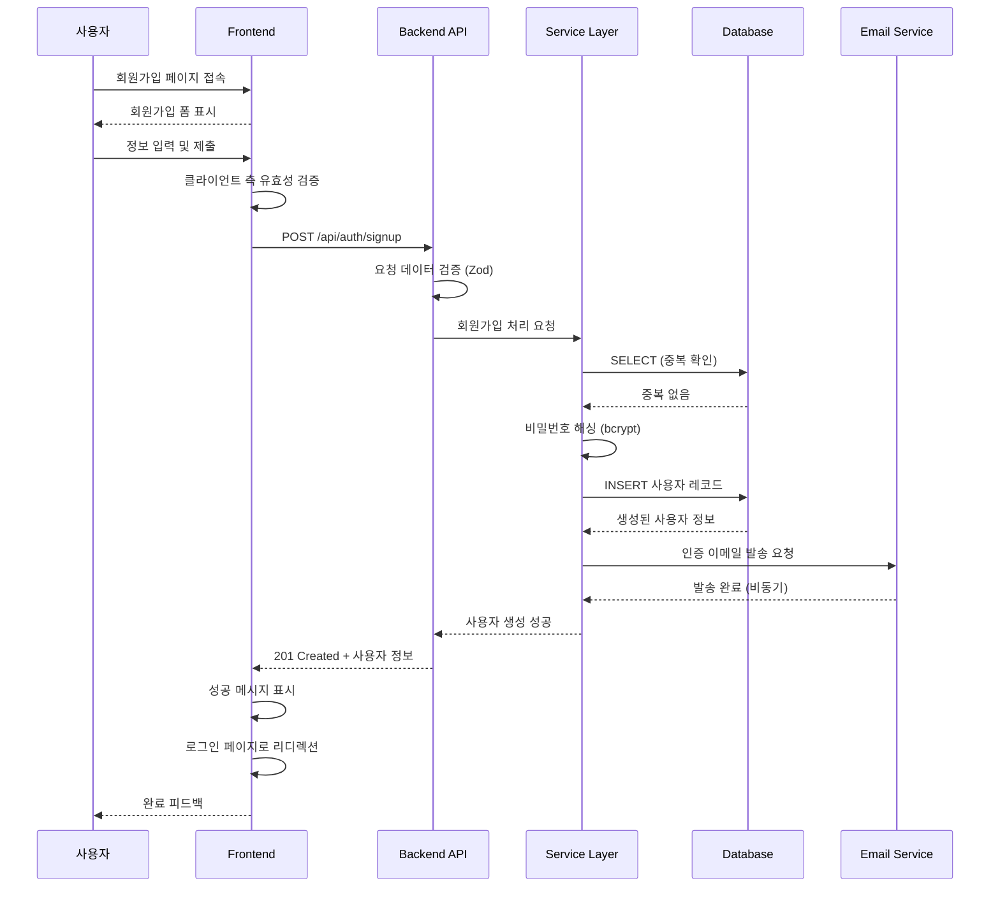

# 유스케이스 ID: UC-001

### 제목
사용자 회원가입 (User Signup)

---

## 1. 개요

### 1.1 목적
신규 사용자가 SuperChat 서비스에 가입하여 계정을 생성하고, 이메일 인증을 통해 계정을 활성화함으로써 서비스 이용 자격을 획득한다.

### 1.2 범위
- **포함 사항**:
  - 회원가입 폼을 통한 사용자 정보 입력 (닉네임, 이메일, 비밀번호)
  - 입력 데이터의 클라이언트 및 서버 측 유효성 검증
  - 중복 닉네임/이메일 검증
  - 비밀번호 해싱 및 안전한 저장
  - 이메일 인증 토큰 생성 및 발송
  - 계정 비활성 상태로 생성

- **제외 사항**:
  - 이메일 인증 링크 클릭 처리 (별도 유스케이스)
  - 소셜 로그인 (OAuth)
  - 전화번호 인증

### 1.3 액터
- **주요 액터**: 신규 가입 희망자 (미인증 사용자)
- **부 액터**:
  - SuperChat 백엔드 서버
  - 이메일 발송 시스템 (Supabase Auth 또는 외부 SMTP)
  - PostgreSQL 데이터베이스

---

## 2. 선행 조건

- 사용자가 SuperChat 서비스 회원가입 페이지(`/signup`)에 접근할 수 있어야 한다.
- 데이터베이스 `users` 테이블이 정상적으로 생성되어 있어야 한다.
- 이메일 발송 시스템이 정상 작동 중이어야 한다.
- 사용자의 브라우저에서 JavaScript가 활성화되어 있어야 한다.

---

## 3. 참여 컴포넌트

- **Frontend (React Component)**:
  - `/signup` 페이지: 회원가입 폼 UI 제공, 클라이언트 측 유효성 검증

- **Backend (Hono API)**:
  - `POST /api/auth/signup` 엔드포인트: 회원가입 요청 처리
  - `src/features/auth/backend/service.ts`: 비즈니스 로직 수행 (중복 검증, 사용자 생성)

- **Database (PostgreSQL)**:
  - `users` 테이블: 사용자 정보 저장

- **Email Service**:
  - Supabase Auth 또는 외부 SMTP: 인증 이메일 발송

---

## 4. 기본 플로우 (Basic Flow)

### 4.1 단계별 흐름

1. **사용자**: 회원가입 페이지(`/signup`)에 접속
   - 입력: 없음
   - 처리: 페이지 렌더링
   - 출력: 회원가입 폼 화면 표시

2. **사용자**: 회원가입 정보 입력
   - 입력:
     - 닉네임 (2~50자)
     - 이메일 주소 (유효한 이메일 형식)
     - 비밀번호 (최소 8자, 영문+숫자 조합 권장)
     - 비밀번호 확인 (비밀번호와 동일)
   - 처리: 입력 필드에 실시간 유효성 피드백 표시 (선택적)
   - 출력: 입력값 검증 상태 표시

3. **사용자**: '회원가입' 버튼 클릭
   - 입력: 폼 제출 이벤트
   - 처리: 클라이언트 측 유효성 검증 수행
   - 출력: 유효성 통과 시 API 요청 전송

4. **Frontend**: `POST /api/auth/signup` API 호출
   - 입력:
     ```json
     {
       "nickname": "string",
       "email": "string",
       "password": "string",
       "passwordConfirm": "string"
     }
     ```
   - 처리: HTTP 요청 생성 및 전송
   - 출력: 서버 응답 대기

5. **Backend**: 요청 데이터 수신 및 검증
   - 입력: 요청 Body (JSON)
   - 처리:
     - Zod 스키마를 통한 데이터 유효성 검증
     - 모든 필드 존재 여부 확인
     - 이메일 형식 검증 (정규식)
     - 비밀번호 최소 길이 검증 (8자 이상)
     - 비밀번호 일치 여부 확인 (`password === passwordConfirm`)
   - 출력: 검증 통과 또는 에러 반환

6. **Backend (Service Layer)**: 중복 검증
   - 입력: 닉네임, 이메일
   - 처리:
     ```sql
     SELECT id FROM users WHERE nickname = ? OR email = ?
     ```
   - 출력: 중복 존재 여부 확인

7. **Backend (Service Layer)**: 사용자 계정 생성
   - 입력: 검증된 사용자 정보
   - 처리:
     - 비밀번호 해싱 (bcrypt, cost factor: 10)
     - 데이터베이스에 사용자 레코드 INSERT
     ```sql
     INSERT INTO users (nickname, email, password_hash, status, created_at)
     VALUES (?, ?, ?, 'pending', NOW())
     RETURNING id, nickname, email, status, created_at
     ```
   - 출력: 생성된 사용자 정보 (비밀번호 제외)

8. **Backend (Service Layer)**: 이메일 인증 토큰 생성 및 발송
   - 입력: 사용자 이메일, 사용자 ID
   - 처리:
     - 고유 인증 토큰 생성 (UUID 또는 JWT)
     - 인증 링크 생성 (`https://superchat.com/verify-email?token={token}`)
     - 이메일 발송 시스템에 인증 이메일 전송 요청
   - 출력: 이메일 발송 성공 여부 (로그 기록)

9. **Backend**: 성공 응답 반환
   - 입력: 생성된 사용자 정보
   - 처리: HTTP 201 Created 응답 생성
   - 출력:
     ```json
     {
       "success": true,
       "data": {
         "message": "회원가입이 완료되었습니다. 이메일을 확인해주세요.",
         "user": {
           "id": 123,
           "nickname": "홍길동",
           "email": "user@example.com",
           "status": "pending"
         }
       }
     }
     ```

10. **Frontend**: 성공 메시지 표시 및 리디렉션
    - 입력: 서버 응답
    - 처리:
      - 성공 메시지 Toast/Alert 표시
      - 3초 후 로그인 페이지(`/login`)로 자동 리디렉션
    - 출력: 사용자 피드백 및 페이지 이동

### 4.2 시퀀스 다이어그램



---

## 5. 대안 플로우 (Alternative Flows)

### 5.1 대안 플로우 1: 이메일 발송 실패 (비차단)

**시작 조건**: 단계 8 (이메일 인증 토큰 생성 및 발송)

**단계**:
1. 이메일 발송 시스템에서 오류 발생 (SMTP 연결 실패, 할당량 초과 등)
2. 서버는 이메일 발송 실패를 로그에 기록
3. **중요**: 사용자 계정 생성은 롤백하지 않고 유지 (`status: pending`)
4. 사용자에게는 정상 응답을 반환 (사용자 경험 저해 방지)
5. 백그라운드에서 재시도 큐에 이메일 발송 작업 추가 (선택적)

**결과**:
- 사용자는 회원가입 성공 메시지를 받지만 이메일이 도착하지 않음
- 관리자는 로그를 통해 발송 실패를 인지하고 수동 처리 가능
- 사용자는 '이메일 재발송' 기능을 통해 재시도 가능 (향후 구현)

---

## 6. 예외 플로우 (Exception Flows)

### 6.1 예외 상황 1: 클라이언트 측 유효성 검증 실패

**발생 조건**: 단계 3 (클라이언트 측 유효성 검증)에서 입력값이 규칙에 맞지 않을 때

**처리 방법**:
1. API 요청을 전송하지 않음
2. 해당 필드에 빨간색 테두리 및 에러 메시지 표시
   - 예: "비밀번호는 최소 8자 이상이어야 합니다."
3. 사용자가 입력을 수정할 때까지 '회원가입' 버튼 비활성화 (선택적)

**에러 코드**: 없음 (클라이언트 측 처리)

**사용자 메시지**:
- "닉네임은 2자 이상 50자 이하여야 합니다."
- "올바른 이메일 형식을 입력해주세요."
- "비밀번호는 최소 8자 이상이어야 합니다."
- "비밀번호가 일치하지 않습니다."

---

### 6.2 예외 상황 2: 서버 측 유효성 검증 실패

**발생 조건**: 단계 5 (백엔드 데이터 검증)에서 Zod 스키마 검증 실패

**처리 방법**:
1. 백엔드는 400 Bad Request 응답 반환
2. 실패한 필드 정보와 에러 메시지를 포함한 응답 생성
3. 프론트엔드는 에러 메시지를 해당 필드 아래에 표시

**에러 코드**: `VALIDATION_ERROR` (HTTP 400)

**응답 예시**:
```json
{
  "success": false,
  "error": {
    "code": "VALIDATION_ERROR",
    "message": "입력값 검증에 실패했습니다.",
    "fields": {
      "email": "올바른 이메일 형식이 아닙니다.",
      "password": "비밀번호는 최소 8자 이상이어야 합니다."
    }
  }
}
```

**사용자 메시지**: "입력하신 정보를 다시 확인해주세요."

---

### 6.3 예외 상황 3: 닉네임 중복

**발생 조건**: 단계 6 (중복 검증)에서 동일한 닉네임이 이미 존재할 때

**처리 방법**:
1. 데이터베이스 조회 결과 `nickname` 일치하는 레코드 발견
2. 사용자 생성 작업 중단
3. 백엔드는 409 Conflict 응답 반환
4. 프론트엔드는 닉네임 필드에 에러 메시지 표시

**에러 코드**: `NICKNAME_ALREADY_EXISTS` (HTTP 409)

**응답 예시**:
```json
{
  "success": false,
  "error": {
    "code": "NICKNAME_ALREADY_EXISTS",
    "message": "이미 사용 중인 닉네임입니다.",
    "field": "nickname"
  }
}
```

**사용자 메시지**: "이미 사용 중인 닉네임입니다. 다른 닉네임을 입력해주세요."

---

### 6.4 예외 상황 4: 이메일 중복

**발생 조건**: 단계 6 (중복 검증)에서 동일한 이메일이 이미 존재할 때

**처리 방법**:
1. 데이터베이스 조회 결과 `email` 일치하는 레코드 발견
2. 사용자 생성 작업 중단
3. 백엔드는 409 Conflict 응답 반환
4. 프론트엔드는 이메일 필드에 에러 메시지 표시

**에러 코드**: `EMAIL_ALREADY_EXISTS` (HTTP 409)

**응답 예시**:
```json
{
  "success": false,
  "error": {
    "code": "EMAIL_ALREADY_EXISTS",
    "message": "이미 가입된 이메일 주소입니다.",
    "field": "email"
  }
}
```

**사용자 메시지**: "이미 가입된 이메일 주소입니다. 로그인하거나 다른 이메일을 사용해주세요."

---

### 6.5 예외 상황 5: 데이터베이스 오류

**발생 조건**: 단계 7 (사용자 생성)에서 데이터베이스 INSERT 실패

**처리 방법**:
1. PostgreSQL 연결 오류, 제약 조건 위반 등의 에러 발생
2. 트랜잭션 롤백 (있을 경우)
3. 백엔드는 500 Internal Server Error 응답 반환
4. 에러 로그 기록 (스택 트레이스, 타임스탬프 포함)
5. 프론트엔드는 일반적인 에러 메시지 표시

**에러 코드**: `DATABASE_ERROR` (HTTP 500)

**응답 예시**:
```json
{
  "success": false,
  "error": {
    "code": "DATABASE_ERROR",
    "message": "일시적인 오류가 발생했습니다. 잠시 후 다시 시도해주세요."
  }
}
```

**사용자 메시지**: "일시적인 오류가 발생했습니다. 잠시 후 다시 시도해주세요."

---

### 6.6 예외 상황 6: 네트워크 오류 (클라이언트)

**발생 조건**: 단계 4 (API 호출) 중 네트워크 연결 끊김

**처리 방법**:
1. 프론트엔드 HTTP 클라이언트에서 timeout 또는 연결 오류 발생
2. 로딩 스피너 제거
3. 사용자에게 네트워크 오류 메시지 표시
4. '다시 시도' 버튼 제공 (선택적)

**에러 코드**: 없음 (클라이언트 측 처리)

**사용자 메시지**: "네트워크 연결을 확인하고 다시 시도해주세요."

---

## 7. 후행 조건 (Post-conditions)

### 7.1 성공 시

**데이터베이스 변경**:
- `users` 테이블에 새로운 레코드 INSERT
  - `id`: 자동 생성 (SERIAL)
  - `nickname`: 사용자가 입력한 닉네임
  - `email`: 사용자가 입력한 이메일
  - `password_hash`: bcrypt로 해싱된 비밀번호
  - `status`: `'pending'` (이메일 인증 대기 상태)
  - `created_at`: 현재 타임스탬프

**시스템 상태**:
- 사용자 계정이 생성되었으나 비활성 상태 (`status: pending`)
- 로그인 불가 (이메일 인증 완료 후 가능)

**외부 시스템**:
- 사용자 이메일 주소로 인증 이메일 발송 완료 (또는 발송 큐 추가)

### 7.2 실패 시

**데이터 롤백**:
- 데이터베이스 INSERT 트랜잭션 롤백 (발생하지 않음)
- 중복 검증 실패 시 아무 데이터도 변경되지 않음

**시스템 상태**:
- 사용자 계정 생성되지 않음
- 사용자는 회원가입 페이지에 머무름
- 입력했던 데이터는 유지 (비밀번호 제외, 보안상 재입력 권장)

---

## 8. 비기능 요구사항

### 8.1 성능

- **응답 시간**:
  - 정상 플로우 기준 2초 이내 (이메일 발송 제외)
  - 중복 검증 쿼리: 100ms 이내
  - 비밀번호 해싱: 300ms 이내 (bcrypt cost factor 10 기준)

- **동시 처리**:
  - 동시 회원가입 요청 100건 처리 가능 (서버 확장성에 따라 조정)

### 8.2 보안

- **비밀번호 보안**:
  - bcrypt 알고리즘 사용 (cost factor: 10~12)
  - 평문 비밀번호는 메모리에서만 존재, 로그에 기록 금지
  - 클라이언트에서 서버로 전송 시 HTTPS 강제

- **입력값 검증**:
  - 서버 측 검증 필수 (클라이언트 검증 우회 가능)
  - SQL Injection 방지: Prepared Statement 사용
  - XSS 방지: 입력값 이스케이프 처리

- **이메일 인증**:
  - 인증 토큰: 고유성 보장 (UUID v4 또는 JWT)
  - 토큰 유효 기간: 24시간
  - 일회용 토큰 (사용 후 무효화)

- **Rate Limiting**:
  - 동일 IP에서 분당 최대 5회 회원가입 시도 허용
  - 초과 시 429 Too Many Requests 응답

### 8.3 가용성

- **서비스 가동 시간**: 99.9% (연간 최대 8.7시간 다운타임)
- **에러 복구**:
  - 이메일 발송 실패 시 회원가입 트랜잭션은 완료
  - 데이터베이스 일시 장애 시 자동 재시도 (최대 3회, 지수 백오프)

---

## 9. UI/UX 요구사항

### 9.1 화면 구성

**회원가입 페이지 (`/signup`)** 필수 요소:

1. **페이지 제목**: "회원가입" (H1)
2. **폼 필드**:
   - 닉네임 입력 필드 (type: text, maxlength: 50)
   - 이메일 입력 필드 (type: email)
   - 비밀번호 입력 필드 (type: password, minlength: 8)
   - 비밀번호 확인 입력 필드 (type: password)
3. **버튼**:
   - '회원가입' 버튼 (primary, type: submit)
   - '로그인 페이지로' 링크 (secondary)
4. **피드백 영역**:
   - 각 필드 아래 에러 메시지 표시 영역 (초기 숨김)
   - 상단 Toast/Alert (전역 성공/실패 메시지)
5. **추가 정보**:
   - "이미 계정이 있으신가요?" 문구 + 로그인 링크

**접근성 요구사항**:
- 모든 입력 필드에 `<label>` 태그 연결
- 에러 메시지는 `aria-live="polite"` 속성 사용
- 키보드 네비게이션 지원 (Tab 순서 논리적 배치)
- 색상 외에도 아이콘/텍스트로 에러 상태 표시

### 9.2 사용자 경험

**입력 검증 피드백**:
- 실시간 검증 (입력 중 또는 포커스 아웃 시)
  - 닉네임: 2자 미만 또는 50자 초과 시 즉시 표시
  - 이메일: 올바른 형식 여부 즉시 표시
  - 비밀번호: 8자 미만 시 즉시 표시
  - 비밀번호 확인: 일치 여부 즉시 표시

**로딩 상태**:
- '회원가입' 버튼 클릭 후 로딩 스피너 표시
- 버튼 텍스트 변경: "회원가입 중..." (버튼 비활성화)
- 응답 받을 때까지 중복 제출 방지

**성공 시**:
- 상단에 녹색 Toast 메시지: "회원가입이 완료되었습니다! 이메일을 확인해주세요."
- 3초 후 자동으로 로그인 페이지로 리디렉션
- 카운트다운 표시: "3초 후 로그인 페이지로 이동합니다..."

**실패 시**:
- 상단에 빨간색 Toast 메시지: 일반 에러 메시지
- 해당 필드에 인라인 에러 메시지 표시 (중복 등)
- 포커스를 첫 번째 에러 필드로 이동
- 회원가입 페이지 유지 (리디렉션 없음)

**반응형 디자인**:
- 모바일: 단일 컬럼, 전체 너비 입력 필드
- 태블릿/데스크탑: 중앙 정렬, 최대 너비 400px

---

## 10. 테스트 시나리오

### 10.1 성공 케이스

| 테스트 케이스 ID | 입력값 | 기대 결과 |
|----------------|--------|----------|
| TC-001-01      | 닉네임: "홍길동", 이메일: "hong@example.com", 비밀번호: "password123", 확인: "password123" | 201 Created, 사용자 생성, 이메일 발송, 로그인 페이지로 리디렉션 |
| TC-001-02      | 닉네임: "김", 이메일: "kim@test.com", 비밀번호: "12345678", 확인: "12345678" | 201 Created (최소 길이 닉네임) |
| TC-001-03      | 닉네임: "A".repeat(50), 이메일: "max@test.com", 비밀번호: "password123", 확인: "password123" | 201 Created (최대 길이 닉네임) |

### 10.2 실패 케이스

| 테스트 케이스 ID | 입력값 | 기대 결과 |
|----------------|--------|----------|
| TC-001-04      | 닉네임: "", 이메일: "test@example.com", 비밀번호: "password123", 확인: "password123" | 400 Bad Request, "닉네임을 입력해주세요" |
| TC-001-05      | 닉네임: "홍길동", 이메일: "invalid-email", 비밀번호: "password123", 확인: "password123" | 400 Bad Request, "올바른 이메일 형식이 아닙니다" |
| TC-001-06      | 닉네임: "홍길동", 이메일: "hong@example.com", 비밀번호: "1234", 확인: "1234" | 400 Bad Request, "비밀번호는 최소 8자 이상이어야 합니다" |
| TC-001-07      | 닉네임: "홍길동", 이메일: "hong@example.com", 비밀번호: "password123", 확인: "password456" | 400 Bad Request, "비밀번호가 일치하지 않습니다" |
| TC-001-08      | 닉네임: "기존닉네임", 이메일: "new@example.com", 비밀번호: "password123", 확인: "password123" | 409 Conflict, "이미 사용 중인 닉네임입니다" |
| TC-001-09      | 닉네임: "홍길동", 이메일: "existing@example.com", 비밀번호: "password123", 확인: "password123" | 409 Conflict, "이미 가입된 이메일 주소입니다" |
| TC-001-10      | 닉네임: "A".repeat(51), 이메일: "hong@example.com", 비밀번호: "password123", 확인: "password123" | 400 Bad Request, "닉네임은 50자 이하여야 합니다" |

### 10.3 Edge Case

| 테스트 케이스 ID | 입력값 | 기대 결과 |
|----------------|--------|----------|
| TC-001-11      | 동일한 데이터로 동시에 2개 요청 전송 | 하나는 성공(201), 하나는 중복 오류(409) |
| TC-001-12      | SQL Injection 시도: 닉네임 = "admin'; DROP TABLE users;--" | 400 Bad Request (이스케이프 처리됨) |
| TC-001-13      | 이메일 발송 시스템 오류 상황 | 201 Created (사용자 생성 완료), 로그에 이메일 발송 실패 기록 |
| TC-001-14      | 데이터베이스 연결 끊김 | 500 Internal Server Error, "일시적인 오류" 메시지 |

---

## 11. 관련 유스케이스

- **선행 유스케이스**: 없음 (회원가입은 최초 진입점)
- **후행 유스케이스**:
  - UC-002: 이메일 인증 (Email Verification)
  - UC-003: 사용자 로그인 (User Login)
- **연관 유스케이스**:
  - UC-008: 닉네임 변경 (Change Nickname) - 중복 검증 로직 공유

---

## 12. 변경 이력

| 버전 | 날짜 | 작성자 | 변경 내용 |
|------|------|--------|-----------|
| 1.0  | 2025-10-17 | Claude Code | 초기 작성 |

---

## 부록

### A. 용어 정의

- **bcrypt**: 비밀번호 해싱에 사용되는 암호화 알고리즘. cost factor를 통해 연산 비용 조절 가능.
- **Zod**: TypeScript 기반 스키마 검증 라이브러리. 런타임 타입 검증 수행.
- **UUID (Universally Unique Identifier)**: 고유 식별자 생성 표준. 이메일 인증 토큰 생성에 사용.
- **Rate Limiting**: 특정 시간 내 요청 횟수를 제한하여 시스템 남용 방지.
- **Prepared Statement**: SQL Injection 방지를 위한 파라미터화된 쿼리 방식.

### B. 참고 자료

- [PRD 문서](/docs/prd.md) - 제품 요구사항 전체 명세
- [사용자 플로우](/docs/userflow.md) - 전체 유저 플로우 상세 설명
- [데이터베이스 스키마](/docs/database.md) - `users` 테이블 구조
- [Hono Framework 공식 문서](https://hono.dev/) - API 라우팅 및 미들웨어
- [Zod 공식 문서](https://zod.dev/) - 스키마 검증 가이드
- [bcrypt 보안 가이드](https://github.com/kelektiv/node.bcrypt.js) - 비밀번호 해싱 권장사항
- [OWASP Authentication Cheat Sheet](https://cheatsheetseries.owasp.org/cheatsheets/Authentication_Cheat_Sheet.html) - 인증 보안 모범 사례
