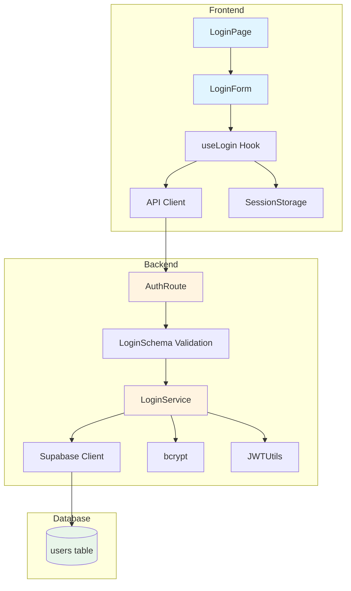

# UC-002: 사용자 로그인 구현 계획

## 개요

### 모듈 목록

| 모듈명 | 경로 | 설명 | 상태 |
|--------|------|------|------|
| **Backend Modules** |
| LoginSchema | `src/features/auth/backend/schema.ts` | 로그인 요청/응답 Zod 스키마 | ✅ 구현됨 |
| LoginService | `src/features/auth/backend/service.ts` | 로그인 비즈니스 로직 | ✅ 구현됨 |
| AuthRoute | `src/features/auth/backend/route.ts` | POST /api/auth/login 엔드포인트 | ✅ 구현됨 |
| AuthError | `src/features/auth/backend/error.ts` | 에러 코드 정의 | ✅ 구현됨 |
| **Frontend Modules** |
| LoginPage | `src/app/login/page.tsx` | 로그인 페이지 컴포넌트 | ⚠️ 확인 필요 |
| LoginForm | `src/features/auth/components/LoginForm.tsx` | 로그인 폼 UI 컴포넌트 | ✅ 구현됨 |
| useLogin | `src/features/auth/hooks/useLogin.ts` | React Query mutation 훅 | ✅ 구현됨 |
| AuthDTO | `src/features/auth/lib/dto.ts` | 스키마 타입 재노출 | ⚠️ 확인 필요 |
| **Shared Modules** |
| JWTUtils | `src/backend/auth/jwt.ts` | JWT 토큰 생성/검증 | ✅ 구현됨 |
| SessionStorage | `src/lib/auth/session.ts` | 클라이언트 세션 저장 | ❌ 미구현 |

---

## Diagram



---

## Implementation Plan

### 1. Backend Modules (이미 구현됨)

#### 1.1 LoginSchema (`src/features/auth/backend/schema.ts`)

**현재 상태:** ✅ 구현 완료

**검증 사항:**
- [x] 이메일 형식 검증
- [x] 비밀번호 최소 8자 검증
- [x] 필수 필드 검증

**Unit Test (추가 필요):**
```typescript
describe('LoginRequestSchema', () => {
  it('should validate valid login data', () => {
    const valid = {
      email: 'test@example.com',
      password: 'password123',
    };
    expect(LoginRequestSchema.parse(valid)).toEqual(valid);
  });

  it('should reject invalid email', () => {
    const invalid = {
      email: 'invalid-email',
      password: 'password123',
    };
    expect(() => LoginRequestSchema.parse(invalid)).toThrow();
  });

  it('should reject short password', () => {
    const invalid = {
      email: 'test@example.com',
      password: 'short',
    };
    expect(() => LoginRequestSchema.parse(invalid)).toThrow();
  });
});
```

---

#### 1.2 LoginService (`src/features/auth/backend/service.ts`)

**현재 상태:** ✅ 구현 완료

**구현된 기능:**
- [x] 이메일로 사용자 조회
- [x] 계정 상태 확인 (active/pending/inactive)
- [x] bcrypt 비밀번호 검증
- [x] JWT 토큰 생성
- [x] 에러 처리 및 로깅

**Unit Test (추가 필요):**
```typescript
describe('loginService', () => {
  it('should return token for valid credentials', async () => {
    const result = await loginService({
      email: 'active@example.com',
      password: 'password123',
    }, mockContext);

    expect(result.success).toBe(true);
    expect(result.data.token).toBeDefined();
    expect(result.data.redirectTo).toBe('/rooms');
  });

  it('should reject invalid email', async () => {
    const result = await loginService({
      email: 'nonexistent@example.com',
      password: 'password123',
    }, mockContext);

    expect(result.success).toBe(false);
    expect(result.error.code).toBe('AUTH_FAILED');
  });

  it('should reject invalid password', async () => {
    const result = await loginService({
      email: 'active@example.com',
      password: 'wrongpassword',
    }, mockContext);

    expect(result.success).toBe(false);
    expect(result.error.code).toBe('AUTH_FAILED');
  });

  it('should reject pending account', async () => {
    const result = await loginService({
      email: 'pending@example.com',
      password: 'password123',
    }, mockContext);

    expect(result.success).toBe(false);
    expect(result.error.code).toBe('ACCOUNT_INACTIVE');
    expect(result.error.message).toContain('이메일 인증');
  });

  it('should reject inactive account', async () => {
    const result = await loginService({
      email: 'inactive@example.com',
      password: 'password123',
    }, mockContext);

    expect(result.success).toBe(false);
    expect(result.error.code).toBe('ACCOUNT_INACTIVE');
  });
});
```

---

#### 1.3 AuthRoute (`src/features/auth/backend/route.ts`)

**현재 상태:** ✅ 구현 완료

**검증 사항:**
- [x] zValidator로 요청 검증
- [x] loginService 호출
- [x] 에러 응답 포맷

---

### 2. Frontend Modules

#### 2.1 LoginPage (`src/app/login/page.tsx`)

**현재 상태:** ⚠️ 확인 필요

**구현 필요 사항:**
```typescript
'use client';

import { LoginForm } from '@/features/auth/components/LoginForm';

export default function LoginPage() {
  return (
    <div className="min-h-screen flex items-center justify-center bg-gray-50 py-12 px-4 sm:px-6 lg:px-8">
      <div className="max-w-md w-full space-y-8">
        <div>
          <h2 className="mt-6 text-center text-3xl font-bold text-gray-900">
            로그인
          </h2>
          <p className="mt-2 text-center text-sm text-gray-600">
            SuperChat에 오신 것을 환영합니다
          </p>
        </div>
        <LoginForm />
      </div>
    </div>
  );
}
```

**QA Sheet:**
- [ ] 페이지가 정상적으로 로드되는가?
- [ ] 중앙 정렬이 적용되는가?
- [ ] 모바일/태블릿/데스크톱에서 반응형으로 표시되는가?
- [ ] 회원가입 페이지로 이동하는 링크가 있는가?
- [ ] 이미 로그인된 사용자가 접근 시 /rooms로 리디렉션되는가?

---

#### 2.2 LoginForm (`src/features/auth/components/LoginForm.tsx`)

**현재 상태:** ✅ 구현됨

**검증 필요 사항:**
```typescript
// 확인할 기능들
- [ ] 이메일, 비밀번호 입력 필드
- [ ] 클라이언트 측 유효성 검증
- [ ] 로딩 상태 표시
- [ ] 성공 시 세션 토큰 저장
- [ ] 성공 시 /rooms로 리디렉션
- [ ] 실패 시 에러 메시지 표시
- [ ] ACCOUNT_INACTIVE 에러 시 구체적인 메시지
```

**개선 사항 (필요 시):**
```typescript
'use client';

import { useState } from 'react';
import { useRouter } from 'next/navigation';
import { Button } from '@/components/ui/button';
import { Input } from '@/components/ui/input';
import { Label } from '@/components/ui/label';
import { useLogin } from '@/features/auth/hooks/useLogin';
import { useToast } from '@/hooks/use-toast';
import { saveSession } from '@/lib/auth/session';

export function LoginForm() {
  const router = useRouter();
  const { toast } = useToast();
  const { mutate: login, isPending } = useLogin();

  const [formData, setFormData] = useState({
    email: '',
    password: '',
  });

  const handleSubmit = async (e: React.FormEvent) => {
    e.preventDefault();

    login(formData, {
      onSuccess: (data) => {
        // 세션 토큰 저장
        saveSession(data.token);

        toast({
          title: '로그인 성공',
          description: '환영합니다!',
        });

        router.push(data.redirectTo);
      },
      onError: (error: any) => {
        toast({
          variant: 'destructive',
          title: '로그인 실패',
          description: error.error?.message || '알 수 없는 오류가 발생했습니다.',
        });
      },
    });
  };

  return (
    <form onSubmit={handleSubmit} className="space-y-6">
      <div>
        <Label htmlFor="email">이메일</Label>
        <Input
          id="email"
          type="email"
          value={formData.email}
          onChange={(e) => setFormData({ ...formData, email: e.target.value })}
          placeholder="example@email.com"
          required
          autoComplete="email"
        />
      </div>

      <div>
        <Label htmlFor="password">비밀번호</Label>
        <Input
          id="password"
          type="password"
          value={formData.password}
          onChange={(e) => setFormData({ ...formData, password: e.target.value })}
          placeholder="최소 8자"
          required
          autoComplete="current-password"
        />
      </div>

      <Button type="submit" className="w-full" disabled={isPending}>
        {isPending ? '로그인 중...' : '로그인'}
      </Button>

      <p className="text-center text-sm text-gray-600">
        계정이 없으신가요?{' '}
        <a href="/signup" className="text-primary hover:underline">
          회원가입
        </a>
      </p>
    </form>
  );
}
```

**QA Sheet:**
- [ ] 이메일, 비밀번호 입력이 정상 작동하는가?
- [ ] 제출 중 버튼이 비활성화되는가?
- [ ] 성공 시 Toast 메시지가 표시되는가?
- [ ] 성공 시 세션 토큰이 저장되는가?
- [ ] 성공 시 /rooms로 리디렉션되는가?
- [ ] 실패 시 에러 메시지가 표시되는가?
- [ ] ACCOUNT_INACTIVE 시 "이메일 인증 필요" 메시지가 표시되는가?
- [ ] 키보드 네비게이션이 작동하는가?
- [ ] autocomplete 속성이 적용되어 있는가?

---

#### 2.3 useLogin (`src/features/auth/hooks/useLogin.ts`)

**현재 상태:** ✅ 구현됨

**검증 필요:**
```typescript
'use client';

import { useMutation } from '@tanstack/react-query';
import { apiClient } from '@/lib/remote/api-client';
import type { LoginRequest, LoginResponse } from '@/features/auth/lib/dto';

export function useLogin() {
  return useMutation({
    mutationFn: async (data: LoginRequest) => {
      const response = await apiClient.post<LoginResponse>('/api/auth/login', data);
      return response.data;
    },
  });
}
```

**확인 사항:**
- [ ] apiClient가 정상 작동하는가?
- [ ] 에러 처리가 적절한가?
- [ ] 타입이 올바르게 정의되어 있는가?

---

#### 2.4 AuthDTO (`src/features/auth/lib/dto.ts`)

**현재 상태:** ⚠️ 확인 필요

**구현 필요:**
```typescript
// backend 스키마 타입 재노출
export type {
  LoginRequest,
  LoginResponse,
  LoginError,
} from '@/features/auth/backend/schema';
```

---

### 3. Shared Modules

#### 3.1 JWTUtils (`src/backend/auth/jwt.ts`)

**현재 상태:** ✅ 구현됨 (loginService에서 사용 중)

**검증 사항:**
- [x] 토큰 생성 (createToken)
- [ ] 토큰 검증 (verifyToken) - 향후 인증 미들웨어에서 사용

---

#### 3.2 SessionStorage (`src/lib/auth/session.ts`)

**현재 상태:** ❌ 미구현

**구현 필요:**
```typescript
const SESSION_KEY = 'superchat_session';

export function saveSession(token: string): void {
  if (typeof window !== 'undefined') {
    localStorage.setItem(SESSION_KEY, token);
  }
}

export function getSession(): string | null {
  if (typeof window !== 'undefined') {
    return localStorage.getItem(SESSION_KEY);
  }
  return null;
}

export function clearSession(): void {
  if (typeof window !== 'undefined') {
    localStorage.removeItem(SESSION_KEY);
  }
}

export function isAuthenticated(): boolean {
  return getSession() !== null;
}
```

**Unit Test:**
```typescript
describe('SessionStorage', () => {
  beforeEach(() => {
    localStorage.clear();
  });

  it('should save and retrieve session', () => {
    saveSession('test-token');
    expect(getSession()).toBe('test-token');
  });

  it('should clear session', () => {
    saveSession('test-token');
    clearSession();
    expect(getSession()).toBeNull();
  });

  it('should check authentication status', () => {
    expect(isAuthenticated()).toBe(false);
    saveSession('test-token');
    expect(isAuthenticated()).toBe(true);
  });
});
```

---

## 구현 순서

### Phase 1: 백엔드 검증 및 테스트 추가
1. LoginSchema Unit Test 작성
2. LoginService Unit Test 작성
3. API 엔드포인트 테스트 (Postman/curl)

### Phase 2: 프론트엔드 구현
1. SessionStorage 유틸리티 작성
2. AuthDTO 타입 재노출 확인
3. LoginPage 작성/확인
4. LoginForm 개선 (세션 저장 로직 추가)
5. useLogin 훅 검증

### Phase 3: 통합 테스트
1. E2E 테스트 (Playwright)
2. QA Sheet 체크
3. 접근성 테스트

---

## 완료 조건

### Backend
- [x] LoginSchema 정의
- [x] LoginService 구현
- [x] AuthRoute 엔드포인트
- [ ] Unit Test 작성
- [ ] API 테스트 (Postman/curl)

### Frontend
- [ ] LoginPage 구현/확인
- [ ] LoginForm 세션 저장 로직
- [ ] SessionStorage 유틸리티
- [ ] AuthDTO 타입 재노출
- [ ] QA Sheet 모두 체크

### Integration
- [ ] 성공 시 세션 토큰 저장 확인
- [ ] 성공 시 /rooms로 리디렉션 확인
- [ ] ACCOUNT_INACTIVE 에러 메시지 확인
- [ ] 인증 실패 에러 메시지 확인
- [ ] 접근성 (WCAG AA) 준수

---

## 참고 문서

- [UC-002 유스케이스 문서](./002-user-login.md)
- [데이터베이스 스키마](../database.md)
- [PRD](../prd.md)
- [UC-001 회원가입 plan](./001-user-signup-plan.md)
