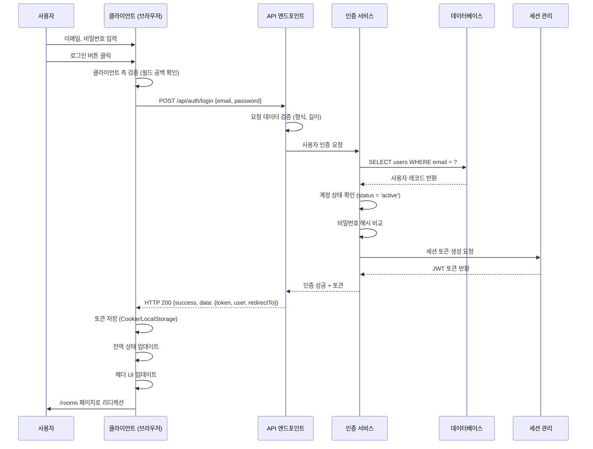

# 유스케이스 작성 문서

## 유스케이스 ID: UC-002

### 제목
사용자 로그인 (User Login)

---

## 1. 개요

### 1.1 목적
등록된 사용자가 이메일과 비밀번호를 사용하여 SuperChat 서비스에 인증하고, 세션을 생성하여 서비스의 보호된 기능(채팅방 목록, 메시지 전송 등)에 접근할 수 있도록 합니다.

### 1.2 범위
- 이메일과 비밀번호를 통한 로그인 인증
- 계정 상태 확인 (이메일 인증 완료 여부)
- 세션 토큰 발급 및 저장
- 로그인 성공 후 채팅방 목록 페이지로 리디렉션
- 로그인 실패 시 적절한 오류 메시지 제공

**제외 사항**:
- 소셜 로그인 (Google, Kakao 등)
- 비밀번호 찾기 / 재설정 기능
- 다중 기기 세션 관리
- 2단계 인증 (2FA)

### 1.3 액터
- **주요 액터**: 등록된 사용자 (Registered User)
- **부 액터**:
  - 인증 시스템 (Supabase Auth)
  - 세션 관리 시스템

---

## 2. 선행 조건

- 사용자가 이미 회원가입을 완료한 상태여야 함
- 사용자 계정이 이메일 인증을 완료하여 `active` 상태여야 함
- 사용자가 로그인 페이지(`/login`)에 접근 가능해야 함
- 클라이언트와 서버 간 네트워크 연결이 정상이어야 함
- 사용자가 로그인되어 있지 않은 상태여야 함 (비인증 상태)

---

## 3. 참여 컴포넌트

- **로그인 페이지 (`/login`)**: 사용자 인터페이스 제공, 입력값 수집 및 클라이언트 측 검증
- **API 엔드포인트 (`POST /api/auth/login`)**: 로그인 요청 처리, 인증 로직 실행
- **인증 서비스 (Auth Service)**: 사용자 조회, 비밀번호 검증, 계정 상태 확인
- **데이터베이스 (`users` 테이블)**: 사용자 정보 저장 및 조회
- **세션 관리 시스템**: 세션 토큰 생성, 저장 및 관리
- **클라이언트 상태 관리**: 세션 토큰 브라우저 저장, 헤더 UI 업데이트

---

## 4. 기본 플로우 (Basic Flow)

### 4.1 단계별 흐름

1. **[사용자]**: 로그인 페이지에 접속
   - 입력: URL `/login` 접근
   - 처리: 로그인 폼 렌더링
   - 출력: 이메일, 비밀번호 입력 필드 및 '로그인' 버튼 표시

2. **[사용자]**: 이메일과 비밀번호 입력
   - 입력:
     - 이메일 주소 (예: `user@example.com`)
     - 비밀번호 (평문, 최소 8자 이상)
   - 처리: 클라이언트 측 기본 검증 (필드 공백 확인)
   - 출력: 입력 필드에 값 표시

3. **[사용자]**: '로그인' 버튼 클릭
   - 입력: 버튼 클릭 이벤트
   - 처리: 폼 제출, API 요청 준비
   - 출력: 로딩 상태 UI 표시

4. **[클라이언트]**: API 요청 전송
   - 입력: 이메일, 비밀번호
   - 처리: `POST /api/auth/login` 엔드포인트 호출
   - 출력: HTTP 요청 전송

5. **[API 엔드포인트]**: 요청 수신 및 기본 검증
   - 입력: 요청 본문 (email, password)
   - 처리:
     - 필드 존재 여부 확인
     - 이메일 형식 검증 (정규식)
     - 비밀번호 길이 검증 (최소 8자)
   - 출력: 검증 통과 또는 유효성 오류

6. **[인증 서비스]**: 사용자 조회
   - 입력: 이메일 주소
   - 처리: `users` 테이블에서 `SELECT * FROM users WHERE email = $1` 실행
   - 출력: 사용자 레코드 또는 NULL

7. **[인증 서비스]**: 계정 상태 확인
   - 입력: 조회된 사용자 레코드
   - 처리: `status` 필드 값 확인 (`active` 여부)
   - 출력: 상태 확인 결과

8. **[인증 서비스]**: 비밀번호 검증
   - 입력:
     - 입력된 비밀번호 (평문)
     - 저장된 `password_hash`
   - 처리: bcrypt/argon2를 사용한 해시 비교
   - 출력: 비밀번호 일치 여부

9. **[세션 관리 시스템]**: 세션 토큰 생성
   - 입력: 사용자 ID, 이메일
   - 처리: JWT 토큰 생성 (만료 시간 포함)
   - 출력: 세션 토큰 (JWT)

10. **[API 엔드포인트]**: 성공 응답 반환
    - 입력: 세션 토큰
    - 처리: HTTP 200 응답 생성
    - 출력:
      ```json
      {
        "success": true,
        "data": {
          "token": "eyJhbGciOiJIUzI1NiIsInR5cCI6IkpXVCJ9...",
          "user": {
            "id": 1,
            "email": "user@example.com",
            "nickname": "사용자닉네임"
          },
          "redirectTo": "/rooms"
        }
      }
      ```

11. **[클라이언트]**: 세션 토큰 저장 및 리디렉션
    - 입력: API 응답
    - 처리:
      - 세션 토큰을 브라우저 저장소 (HttpOnly Cookie 또는 LocalStorage)에 저장
      - 전역 상태 업데이트 (로그인 상태, 사용자 정보)
      - 헤더 UI 업데이트 (닉네임 표시, 마이페이지 버튼 활성화)
    - 출력: 채팅방 목록 페이지(`/rooms`)로 자동 리디렉션

### 4.2 시퀀스 다이어그램



---

## 5. 대안 플로우 (Alternative Flows)

### 5.1 대안 플로우 1: 자동 로그인 (세션 유지)

**시작 조건**: 사용자가 이전에 로그인하여 유효한 세션 토큰이 브라우저에 저장되어 있음

**단계**:
1. 사용자가 로그인 페이지(`/login`)에 접근
2. 클라이언트가 저장된 세션 토큰 확인
3. 토큰 유효성 검증 API 호출 (`POST /api/auth/verify`)
4. 토큰이 유효하면 자동으로 채팅방 목록 페이지(`/rooms`)로 리디렉션
5. 토큰이 만료되었거나 유효하지 않으면 기본 플로우 진행

**결과**: 사용자는 재로그인 없이 서비스 이용 가능

---

## 6. 예외 플로우 (Exception Flows)

### 6.1 예외 상황 1: 필드 누락 또는 형식 오류

**발생 조건**:
- 이메일 또는 비밀번호 필드가 비어있음
- 이메일 형식이 올바르지 않음 (예: `invalid-email`)
- 비밀번호가 최소 길이(8자)를 충족하지 못함

**처리 방법**:
1. API 엔드포인트에서 요청 데이터 검증 실패
2. HTTP 400 Bad Request 응답 반환
3. 클라이언트가 오류 메시지를 폼 하단에 표시
4. 사용자는 로그인 페이지에 머물며 입력 수정 가능

**에러 코드**: `VALIDATION_ERROR` (HTTP 400)

**사용자 메시지**:
- "이메일 주소를 입력해주세요."
- "올바른 이메일 형식이 아닙니다."
- "비밀번호를 입력해주세요."
- "비밀번호는 최소 8자 이상이어야 합니다."

---

### 6.2 예외 상황 2: 사용자 없음 (잘못된 이메일)

**발생 조건**: 입력된 이메일 주소로 등록된 사용자가 데이터베이스에 존재하지 않음

**처리 방법**:
1. 인증 서비스가 데이터베이스 조회 결과 NULL 확인
2. 인증 실패 처리
3. HTTP 401 Unauthorized 응답 반환
4. 클라이언트가 일반적인 인증 실패 메시지 표시

**에러 코드**: `AUTH_FAILED` (HTTP 401)

**사용자 메시지**: "이메일 또는 비밀번호가 잘못되었습니다."

**보안 고려사항**: 보안상 이메일이 존재하지 않는다는 정보를 노출하지 않고, 비밀번호 불일치와 동일한 메시지 표시

---

### 6.3 예외 상황 3: 비밀번호 불일치

**발생 조건**: 입력된 비밀번호의 해시값이 데이터베이스에 저장된 `password_hash`와 일치하지 않음

**처리 방법**:
1. 인증 서비스가 bcrypt/argon2 해시 비교 실패 확인
2. 인증 실패 처리
3. HTTP 401 Unauthorized 응답 반환
4. 클라이언트가 일반적인 인증 실패 메시지 표시

**에러 코드**: `AUTH_FAILED` (HTTP 401)

**사용자 메시지**: "이메일 또는 비밀번호가 잘못되었습니다."

---

### 6.4 예외 상황 4: 계정 비활성 (이메일 인증 미완료)

**발생 조건**: 사용자 계정이 존재하지만 `status` 필드가 `pending` 또는 `inactive` 상태임

**처리 방법**:
1. 인증 서비스가 계정 상태 확인
2. `status`가 `active`가 아니면 인증 거부
3. HTTP 403 Forbidden 응답 반환
4. 클라이언트가 계정 활성화 필요 메시지 표시

**에러 코드**: `ACCOUNT_INACTIVE` (HTTP 403)

**사용자 메시지**:
- `status = 'pending'`: "이메일 인증이 필요합니다. 이메일을 확인해주세요."
- `status = 'inactive'`: "비활성화된 계정입니다. 고객센터에 문의해주세요."

---

### 6.5 예외 상황 5: 네트워크 오류

**발생 조건**: 클라이언트와 서버 간 네트워크 연결 실패 (타임아웃, 서버 다운 등)

**처리 방법**:
1. API 요청이 타임아웃 또는 네트워크 오류 발생
2. 클라이언트가 오류 감지
3. 재시도 옵션과 함께 오류 메시지 표시

**에러 코드**: `NETWORK_ERROR` (클라이언트 측 처리)

**사용자 메시지**: "서버에 연결할 수 없습니다. 네트워크 연결을 확인하고 다시 시도해주세요."

---

### 6.6 예외 상황 6: 서버 내부 오류

**발생 조건**: 데이터베이스 오류, 세션 생성 실패 등 서버 측 예외 발생

**처리 방법**:
1. API 엔드포인트에서 예외 catch
2. 오류 로그 기록
3. HTTP 500 Internal Server Error 응답 반환
4. 클라이언트가 일반적인 서버 오류 메시지 표시

**에러 코드**: `SERVER_ERROR` (HTTP 500)

**사용자 메시지**: "일시적인 오류가 발생했습니다. 잠시 후 다시 시도해주세요."

---

## 7. 후행 조건 (Post-conditions)

### 7.1 성공 시

- **데이터베이스 변경**: 없음 (로그인은 읽기 전용 작업)
  - 선택적: `users` 테이블의 `last_login_at` 필드 업데이트 (구현 시)

- **시스템 상태**:
  - 세션 토큰이 생성되어 브라우저에 저장됨
  - 클라이언트의 전역 상태가 로그인 상태로 변경됨
  - 사용자 정보(ID, 이메일, 닉네임)가 클라이언트 상태에 저장됨

- **UI 상태**:
  - 헤더에 사용자 닉네임 및 마이페이지 버튼 표시
  - 로그인/회원가입 버튼 숨김
  - 채팅방 목록 페이지(`/rooms`)로 자동 리디렉션

### 7.2 실패 시

- **데이터베이스 변경**: 없음

- **시스템 상태**:
  - 세션 토큰 생성되지 않음
  - 클라이언트는 비인증 상태 유지

- **UI 상태**:
  - 사용자는 로그인 페이지에 머무름
  - 오류 메시지가 폼 하단 또는 필드 근처에 표시됨
  - 입력 필드는 초기화되지 않음 (사용자가 수정 가능)

---

## 8. 비기능 요구사항

### 8.1 성능
- **응답 시간**: API 엔드포인트는 정상 조건에서 200ms 이내 응답
- **동시 접속**: 최소 100명의 동시 로그인 요청 처리 가능
- **데이터베이스 쿼리**: 이메일 인덱스를 활용하여 사용자 조회 최적화 (<10ms)

### 8.2 보안
- **비밀번호 해싱**: bcrypt (최소 10 rounds) 또는 argon2 사용
- **세션 토큰**:
  - JWT 사용, HMAC-SHA256 서명
  - 만료 시간: 7일 (선택적: Refresh Token 사용)
  - HttpOnly Cookie로 저장하여 XSS 공격 방지
- **HTTPS**: 모든 API 요청은 HTTPS를 통해서만 허용
- **Rate Limiting**: 동일 IP에서 1분에 최대 5회 로그인 시도 제한 (Brute Force 공격 방지)
- **입력 검증**: SQL Injection, XSS 공격 방지를 위한 입력값 sanitization
- **오류 메시지**: 보안상 이메일 존재 여부를 노출하지 않음 (일반적인 인증 실패 메시지 사용)

### 8.3 가용성
- **시스템 가동률**: 99.9% 이상 (월 약 43분 다운타임 허용)
- **복구 시간**: 데이터베이스 장애 시 5분 이내 복구
- **백업**: 사용자 데이터 일일 백업, 로그 데이터 실시간 백업

---

## 9. UI/UX 요구사항

### 9.1 화면 구성

**로그인 페이지 (`/login`)**:
- **레이아웃**: 중앙 정렬된 단일 폼
- **요소**:
  - 로고 및 서비스 이름 (상단)
  - 이메일 입력 필드 (type="email", required)
  - 비밀번호 입력 필드 (type="password", required, 보기/숨기기 토글)
  - 로그인 버튼 (Primary CTA)
  - 회원가입 링크 ("계정이 없으신가요? 회원가입")
  - 오류 메시지 영역 (폼 하단, 조건부 표시)
- **색상**: Purple 브랜드 컬러 기반 (Primary: `hsl(270 60% 50%)`)
- **반응형**: 모바일, 태블릿, 데스크톱 대응

**오류 메시지 스타일**:
- 배경: 연한 빨강 (`hsl(350 85% 95%)`)
- 텍스트: 진한 빨강 (`hsl(350 85% 40%)`)
- 아이콘: 경고 아이콘 표시
- 애니메이션: fade-in 효과

### 9.2 사용자 경험

**입력 피드백**:
- 필드 포커스 시 테두리 색상 변경 (Primary 컬러)
- 유효성 검증 실패 시 필드 테두리 빨간색 표시 및 에러 메시지 필드 하단 표시

**로딩 상태**:
- 로그인 버튼 클릭 시 버튼 비활성화 및 로딩 스피너 표시
- "로그인 중..." 텍스트 표시

**성공 피드백**:
- 로그인 성공 시 간단한 토스트 메시지 표시 ("로그인 성공!")
- 0.5초 후 자동으로 `/rooms` 페이지로 리디렉션

**실패 피드백**:
- 오류 메시지를 폼 하단에 명확히 표시
- 입력 필드는 유지하여 사용자가 즉시 수정 가능
- 비밀번호 필드만 초기화 (보안 목적)

**접근성 (Accessibility)**:
- 모든 입력 필드에 `<label>` 태그 연결
- 키보드 내비게이션 지원 (Tab, Enter)
- 스크린 리더 호환 (ARIA 속성 사용)
- 색상 대비 WCAG AA 기준 충족 (4.5:1)

---

## 10. 테스트 시나리오

### 10.1 성공 케이스

| 테스트 케이스 ID | 입력값 | 기대 결과 |
|-----------------|--------|----------|
| TC-002-01 | 유효한 이메일, 올바른 비밀번호 | HTTP 200, 세션 토큰 발급, `/rooms`로 리디렉션 |
| TC-002-02 | 이전 로그인 세션 유효 | 자동 로그인, 즉시 `/rooms`로 리디렉션 |

### 10.2 실패 케이스

| 테스트 케이스 ID | 입력값 | 기대 결과 |
|-----------------|--------|----------|
| TC-002-03 | 이메일 필드 공백 | HTTP 400, "이메일 주소를 입력해주세요" |
| TC-002-04 | 비밀번호 필드 공백 | HTTP 400, "비밀번호를 입력해주세요" |
| TC-002-05 | 잘못된 이메일 형식 (예: `invalid-email`) | HTTP 400, "올바른 이메일 형식이 아닙니다" |
| TC-002-06 | 비밀번호 7자 이하 | HTTP 400, "비밀번호는 최소 8자 이상이어야 합니다" |
| TC-002-07 | 존재하지 않는 이메일 | HTTP 401, "이메일 또는 비밀번호가 잘못되었습니다" |
| TC-002-08 | 잘못된 비밀번호 | HTTP 401, "이메일 또는 비밀번호가 잘못되었습니다" |
| TC-002-09 | 계정 상태 `pending` | HTTP 403, "이메일 인증이 필요합니다" |
| TC-002-10 | 계정 상태 `inactive` | HTTP 403, "비활성화된 계정입니다" |
| TC-002-11 | 네트워크 타임아웃 | 클라이언트 오류, "서버에 연결할 수 없습니다" |
| TC-002-12 | Rate Limit 초과 (5회 이상 시도) | HTTP 429, "너무 많은 시도입니다. 잠시 후 다시 시도해주세요" |

### 10.3 보안 테스트 케이스

| 테스트 케이스 ID | 공격 시나리오 | 기대 결과 |
|-----------------|-------------|----------|
| TC-002-SEC-01 | SQL Injection 시도 (`' OR '1'='1`) | 입력값 sanitize, 인증 실패 |
| TC-002-SEC-02 | XSS 스크립트 입력 (`<script>alert()</script>`) | 입력값 escape, 인증 실패 |
| TC-002-SEC-03 | Brute Force 공격 (동일 IP에서 연속 시도) | 5회 이후 Rate Limit 적용 |
| TC-002-SEC-04 | 중간자 공격 (MITM) | HTTPS 강제, 비암호화 요청 거부 |

---

## 11. 관련 유스케이스

- **선행 유스케이스**:
  - UC-001: 사용자 회원가입 (User Signup) - 로그인 전에 계정 생성 필요

- **후행 유스케이스**:
  - UC-003: 채팅방 목록 조회 - 로그인 후 기본 진입 페이지
  - UC-004: 새로운 채팅방 생성 - 인증된 사용자만 접근 가능
  - UC-005: 기존 채팅방 입장 - 인증된 사용자만 접근 가능
  - UC-009: 닉네임 변경 - 마이페이지 접근을 위해 로그인 필요

- **연관 유스케이스**:
  - UC-010: 로그아웃 (User Logout) - 세션 종료
  - UC-011: 비밀번호 재설정 (Password Reset) - 로그인 실패 시 대안

---

## 12. 변경 이력

| 버전 | 날짜 | 작성자 | 변경 내용 |
|------|------|--------|-----------|
| 1.0  | 2025-10-17 | AI Assistant | 초기 작성 |

---

## 부록

### A. 용어 정의

- **세션 토큰 (Session Token)**: 사용자 인증 후 발급되는 고유 식별자로, 이후 API 요청 시 사용자 신원 확인에 사용
- **JWT (JSON Web Token)**: JSON 형식의 자가 서명된 토큰으로, 세션 정보를 안전하게 전달
- **bcrypt / argon2**: 비밀번호 해싱 알고리즘으로, 안전한 비밀번호 저장을 위해 사용
- **HttpOnly Cookie**: JavaScript로 접근할 수 없는 쿠키로, XSS 공격 방지에 효과적
- **Rate Limiting**: 특정 시간 내 요청 횟수를 제한하여 Brute Force 공격 방지
- **Brute Force 공격**: 모든 가능한 비밀번호 조합을 시도하여 인증을 뚫는 공격 방법

### B. 참고 자료

- **PRD (Product Requirements Document)**: `/docs/prd.md`
- **User Flow 문서**: `/docs/userflow.md` - "2. 사용자 로그인" 섹션
- **데이터베이스 설계**: `/docs/database.md` - `users` 테이블 스키마
- **API 명세**: `/docs/api-spec.md` (작성 예정) - `POST /api/auth/login` 엔드포인트
- **디자인 시스템**: `/.ruler/design.md` - UI 컴포넌트 및 색상 가이드

### C. API 요청/응답 예시

**요청 (Request)**:
```http
POST /api/auth/login HTTP/1.1
Host: superchat.example.com
Content-Type: application/json

{
  "email": "user@example.com",
  "password": "securePassword123!"
}
```

**성공 응답 (Response - 200 OK)**:
```json
{
  "success": true,
  "data": {
    "token": "eyJhbGciOiJIUzI1NiIsInR5cCI6IkpXVCJ9.eyJ1c2VySWQiOjEsImVtYWlsIjoidXNlckBleGFtcGxlLmNvbSIsImlhdCI6MTcwMDAwMDAwMCwiZXhwIjoxNzAwNjA0ODAwfQ.signature",
    "user": {
      "id": 1,
      "email": "user@example.com",
      "nickname": "사용자닉네임",
      "createdAt": "2025-10-15T12:00:00Z"
    },
    "redirectTo": "/rooms"
  }
}
```

**실패 응답 (Response - 401 Unauthorized)**:
```json
{
  "success": false,
  "error": {
    "code": "AUTH_FAILED",
    "message": "이메일 또는 비밀번호가 잘못되었습니다"
  }
}
```

**실패 응답 (Response - 403 Forbidden)**:
```json
{
  "success": false,
  "error": {
    "code": "ACCOUNT_INACTIVE",
    "message": "이메일 인증이 필요합니다. 이메일을 확인해주세요"
  }
}
```
