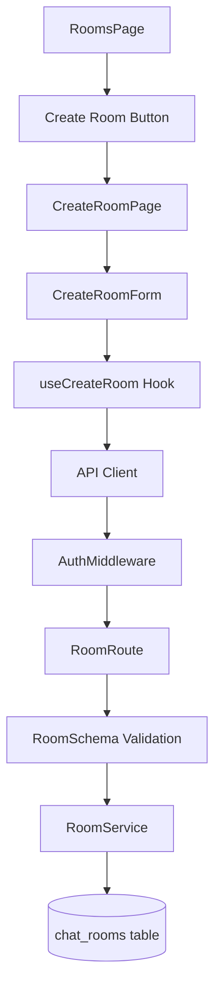

# UC-003: 새로운 채팅방 생성 구현 계획

## 개요

### 모듈 목록

| 모듈명 | 경로 | 설명 |
|--------|------|------|
| **Backend Modules** |
| RoomSchema | `src/features/chat-rooms/backend/schema.ts` | 채팅방 생성 요청/응답 Zod 스키마 |
| RoomService | `src/features/chat-rooms/backend/service.ts` | 채팅방 생성 비즈니스 로직 |
| RoomRoute | `src/features/chat-rooms/backend/route.ts` | POST /api/rooms 엔드포인트 |
| RoomError | `src/features/chat-rooms/backend/error.ts` | 에러 코드 정의 |
| **Frontend Modules** |
| RoomsPage | `src/app/rooms/page.tsx` | 채팅방 목록 페이지 |
| CreateRoomPage | `src/app/rooms/new/page.tsx` | 채팅방 생성 페이지 |
| CreateRoomForm | `src/features/chat-rooms/components/CreateRoomForm.tsx` | 채팅방 생성 폼 |
| useCreateRoom | `src/features/chat-rooms/hooks/useCreateRoom.ts` | React Query mutation 훅 |
| **Shared Modules** |
| AuthMiddleware | `src/backend/middleware/auth.ts` | 인증 미들웨어 |

## Diagram



## Implementation Plan

### Backend

#### RoomSchema
```typescript
export const CreateRoomRequestSchema = z.object({
  name: z.string().min(1).max(100),
});

export const CreateRoomResponseSchema = z.object({
  id: z.number(),
  name: z.string(),
  creatorId: z.number(),
  createdAt: z.string(),
});
```

#### RoomService
```typescript
export async function createRoomService(
  name: string,
  userId: number,
  c: AppEnv
): Promise<HandlerResult<Room, string>> {
  // 1. 중복 검증
  // 2. 채팅방 생성
  // 3. 응답 반환
}
```

#### RoomRoute
```typescript
export const roomRoute = new Hono()
  .post('/api/rooms', authMiddleware, zValidator('json', CreateRoomRequestSchema), async (c) => {
    const { name } = await c.req.json();
    const userId = c.get('userId');
    const result = await createRoomService(name, userId, c);
    return respond(c, result);
  });
```

### Frontend

#### CreateRoomForm
- 채팅방 이름 입력 (1-100자)
- 생성 버튼
- 로딩 상태
- 에러 메시지

### QA Sheet
- [ ] 채팅방 이름 입력 작동
- [ ] 중복 검증 작동
- [ ] 성공 시 /rooms로 리디렉션
- [ ] 실패 시 에러 메시지 표시

## 완료 조건
- [ ] API 엔드포인트 정상 작동
- [ ] 중복 채팅방 이름 거부
- [ ] 인증 필수
- [ ] QA Sheet 완료
