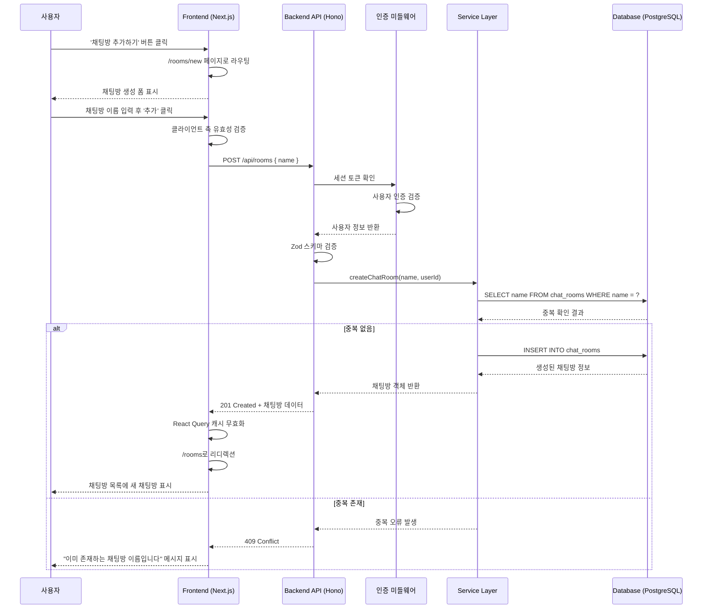

# 유스케이스 ID: UC-003

### 제목
새로운 채팅방 생성 (Create a New Chat Room)

---

## 1. 개요

### 1.1 목적
로그인한 사용자가 새로운 주제의 채팅방을 생성하여 다른 사용자들과 대화할 수 있는 공간을 만들 수 있도록 합니다. 이를 통해 사용자들은 자신의 관심사나 특정 주제에 대한 전용 커뮤니케이션 채널을 자유롭게 개설할 수 있습니다.

### 1.2 범위
- **포함**: 채팅방 이름 입력, 유효성 검증, 중복 확인, 채팅방 생성, 채팅방 목록으로의 리디렉션
- **제외**: 채팅방 설정(공개/비공개, 멤버 초대, 권한 설정 등), 채팅방 삭제 또는 수정 기능

### 1.3 액터
- **주요 액터**: 로그인된 사용자 (Authenticated User)
- **부 액터**:
  - 백엔드 API 서버
  - 데이터베이스 (PostgreSQL)

---

## 2. 선행 조건

- 사용자가 유효한 세션으로 로그인되어 있어야 함
- 사용자의 계정 상태가 `active`여야 함
- 사용자가 채팅방 목록 페이지(`/rooms`)에 접근 가능해야 함
- 데이터베이스 연결이 정상적으로 작동하고 있어야 함

---

## 3. 참여 컴포넌트

- **Frontend (Next.js)**:
  - `/rooms` 페이지: 채팅방 목록 및 '채팅방 추가하기' 버튼 제공
  - `/rooms/new` 페이지: 채팅방 생성 폼 제공
  - React Query: API 요청 및 상태 관리
  - Form Validation: 클라이언트 측 유효성 검증

- **Backend (Hono)**:
  - 채팅방 생성 API 엔드포인트 (`POST /api/rooms`)
  - 입력 데이터 유효성 검증 (Zod 스키마)
  - 채팅방 중복 검증 로직
  - 채팅방 생성 서비스 로직

- **Database (PostgreSQL + Supabase)**:
  - `chat_rooms` 테이블: 채팅방 정보 저장
  - `users` 테이블: 생성자 정보 참조

- **Middleware**:
  - 인증 미들웨어: 로그인 세션 확인
  - 에러 핸들링 미들웨어: 오류 응답 정규화

---

## 4. 기본 플로우 (Basic Flow)

### 4.1 단계별 흐름

1. **사용자**: 채팅방 목록 페이지에서 '채팅방 추가하기' 버튼 클릭
   - 입력: 버튼 클릭 이벤트
   - 처리: 클라이언트 라우팅
   - 출력: `/rooms/new` 페이지로 이동

2. **Frontend**: 채팅방 생성 폼 렌더링
   - 입력: 없음
   - 처리: 채팅방 이름 입력 필드와 '추가' 버튼 표시
   - 출력: 빈 폼 화면

3. **사용자**: 채팅방 이름 입력 후 '추가' 버튼 클릭
   - 입력:
     - `roomName`: string (1~100자)
   - 처리: 클라이언트 측 폼 유효성 검증
   - 출력: 검증 통과 시 API 요청 전송

4. **Frontend**: `POST /api/rooms` API 요청 전송
   - 입력:
     ```json
     {
       "name": "채팅방 이름"
     }
     ```
   - 처리: React Query를 통한 비동기 API 호출
   - 출력: 로딩 상태 표시

5. **Backend (Middleware)**: 인증 확인
   - 입력: 요청 헤더의 세션 토큰
   - 처리: 세션 유효성 검증 및 사용자 정보 추출
   - 출력: 유효한 사용자 정보 컨텍스트에 저장

6. **Backend (Route Handler)**: 요청 데이터 파싱 및 유효성 검증
   - 입력: 요청 본문 (JSON)
   - 처리: Zod 스키마를 이용한 데이터 검증
     - `name`: 비어있지 않음, 최대 100자
   - 출력: 파싱된 데이터 객체

7. **Backend (Service Layer)**: 채팅방 중복 확인
   - 입력: `roomName`
   - 처리: 데이터베이스 쿼리
     ```sql
     SELECT id FROM chat_rooms WHERE name = $1
     ```
   - 출력:
     - 중복 없음: 다음 단계 진행
     - 중복 존재: 예외 플로우 6.1로 분기

8. **Backend (Service Layer)**: 채팅방 생성
   - 입력:
     - `roomName`: string
     - `creatorId`: number (세션 사용자 ID)
   - 처리: 데이터베이스 INSERT
     ```sql
     INSERT INTO chat_rooms (name, creator_id, created_at)
     VALUES ($1, $2, NOW())
     RETURNING id, name, creator_id, created_at
     ```
   - 출력: 생성된 채팅방 정보 객체

9. **Backend**: 성공 응답 반환
   - 입력: 생성된 채팅방 객체
   - 처리: 표준 성공 응답 포맷 생성
   - 출력:
     ```json
     {
       "success": true,
       "data": {
         "id": 123,
         "name": "채팅방 이름",
         "creatorId": 456,
         "createdAt": "2025-10-17T12:00:00Z"
       }
     }
     ```
   - HTTP 상태: `201 Created`

10. **Frontend**: 성공 응답 처리
    - 입력: API 응답 데이터
    - 처리:
      - React Query 캐시 무효화 (채팅방 목록)
      - 클라이언트 라우팅
    - 출력: `/rooms` 페이지로 리디렉션

11. **Frontend**: 채팅방 목록 페이지에서 새 채팅방 표시
    - 입력: 갱신된 채팅방 목록 데이터
    - 처리: 목록 재렌더링
    - 출력: 새로 생성된 채팅방이 목록 상단에 표시됨

### 4.2 시퀀스 다이어그램



---

## 5. 대안 플로우 (Alternative Flows)

### 5.1 대안 플로우 1: 클라이언트 측 유효성 검증 실패

**시작 조건**: 사용자가 채팅방 이름을 입력하지 않거나 100자를 초과한 상태에서 '추가' 버튼 클릭

**단계**:
1. Frontend에서 폼 유효성 검증 수행
2. 검증 실패 시 API 요청 전송 차단
3. 입력 필드 아래에 즉각적인 오류 메시지 표시
   - 빈 값: "채팅방 이름을 입력해주세요"
   - 100자 초과: "채팅방 이름은 100자 이하여야 합니다"

**결과**: 사용자는 채팅방 생성 페이지에 머물며, 유효한 입력을 다시 시도할 수 있음

---

## 6. 예외 플로우 (Exception Flows)

### 6.1 예외 상황 1: 채팅방 이름 중복

**발생 조건**: 사용자가 입력한 채팅방 이름이 이미 데이터베이스에 존재하는 경우

**처리 방법**:
1. Service Layer에서 중복 검증 시 중복 발견
2. 커스텀 예외 발생: `RoomNameDuplicateError`
3. Backend는 표준 실패 응답 반환
4. Frontend는 오류 메시지를 폼 아래에 표시

**에러 코드**: `ROOM_NAME_DUPLICATE` (HTTP 409 Conflict)

**API 응답**:
```json
{
  "success": false,
  "error": {
    "code": "ROOM_NAME_DUPLICATE",
    "message": "이미 존재하는 채팅방 이름입니다"
  }
}
```

**사용자 메시지**: "이미 존재하는 채팅방 이름입니다. 다른 이름을 입력해주세요."

---

### 6.2 예외 상황 2: 서버 측 유효성 검증 실패

**발생 조건**: 클라이언트 측 검증을 우회하여 잘못된 데이터가 전송된 경우

**처리 방법**:
1. Backend의 Zod 스키마 검증에서 실패
2. 자동으로 400 Bad Request 응답 생성
3. Frontend는 일반 오류 메시지 표시

**에러 코드**: `VALIDATION_ERROR` (HTTP 400 Bad Request)

**API 응답**:
```json
{
  "success": false,
  "error": {
    "code": "VALIDATION_ERROR",
    "message": "입력 데이터가 유효하지 않습니다",
    "details": {
      "name": "채팅방 이름은 1자 이상 100자 이하여야 합니다"
    }
  }
}
```

**사용자 메시지**: "입력한 정보가 올바르지 않습니다. 다시 확인해주세요."

---

### 6.3 예외 상황 3: 인증 실패 (세션 만료)

**발생 조건**: 사용자의 세션이 만료되었거나 유효하지 않은 경우

**처리 방법**:
1. 인증 미들웨어에서 세션 검증 실패
2. 401 Unauthorized 응답 반환
3. Frontend는 자동으로 로그인 페이지로 리디렉션

**에러 코드**: `UNAUTHORIZED` (HTTP 401 Unauthorized)

**API 응답**:
```json
{
  "success": false,
  "error": {
    "code": "UNAUTHORIZED",
    "message": "인증이 필요합니다"
  }
}
```

**사용자 메시지**: "세션이 만료되었습니다. 다시 로그인해주세요."

---

### 6.4 예외 상황 4: 데이터베이스 연결 오류

**발생 조건**: 데이터베이스 연결 실패 또는 쿼리 실행 중 오류 발생

**처리 방법**:
1. Service Layer에서 데이터베이스 오류 발생
2. 에러 핸들링 미들웨어에서 오류 로깅
3. 500 Internal Server Error 응답 반환
4. Frontend는 일반 오류 메시지 표시 및 재시도 옵션 제공

**에러 코드**: `INTERNAL_SERVER_ERROR` (HTTP 500 Internal Server Error)

**API 응답**:
```json
{
  "success": false,
  "error": {
    "code": "INTERNAL_SERVER_ERROR",
    "message": "서버 오류가 발생했습니다. 잠시 후 다시 시도해주세요."
  }
}
```

**사용자 메시지**: "일시적인 오류가 발생했습니다. 잠시 후 다시 시도해주세요."

---

### 6.5 예외 상황 5: 계정 상태 비활성

**발생 조건**: 로그인은 되어 있지만 계정 상태가 `active`가 아닌 경우

**처리 방법**:
1. 인증 미들웨어에서 사용자 상태 확인
2. `status`가 `pending` 또는 `inactive`인 경우 접근 거부
3. 403 Forbidden 응답 반환

**에러 코드**: `ACCOUNT_INACTIVE` (HTTP 403 Forbidden)

**API 응답**:
```json
{
  "success": false,
  "error": {
    "code": "ACCOUNT_INACTIVE",
    "message": "계정이 활성화되지 않았습니다"
  }
}
```

**사용자 메시지**: "이메일 인증이 필요합니다. 인증 메일을 확인해주세요."

---

## 7. 후행 조건 (Post-conditions)

### 7.1 성공 시

- **데이터베이스 변경**:
  - `chat_rooms` 테이블에 새로운 레코드 1개 추가
    - `id`: 자동 생성된 시퀀스 값
    - `name`: 사용자가 입력한 채팅방 이름 (UNIQUE)
    - `creator_id`: 생성자의 사용자 ID (외래 키)
    - `created_at`: 현재 타임스탬프

- **시스템 상태**:
  - 채팅방 목록 캐시 무효화 (React Query)
  - 사용자가 채팅방 목록 페이지에 위치
  - 새로 생성된 채팅방이 목록에 표시됨
  - 사용자는 새 채팅방에 즉시 입장 가능

- **외부 시스템**:
  - 없음 (현재 외부 시스템 연동 없음)

### 7.2 실패 시

- **데이터 롤백**:
  - 데이터베이스에 변경사항 없음 (트랜잭션 롤백)
  - 채팅방이 생성되지 않음

- **시스템 상태**:
  - 사용자는 채팅방 생성 페이지에 머무름
  - 입력한 데이터는 유지됨 (사용자 편의)
  - 오류 메시지가 UI에 표시됨
  - 사용자는 수정 후 재시도 가능

---

## 8. 비기능 요구사항

### 8.1 성능
- **응답 시간**: API 요청부터 응답까지 500ms 이내
- **동시성**: 최소 100명의 사용자가 동시에 채팅방을 생성할 수 있어야 함
- **데이터베이스 쿼리**: 중복 확인 쿼리는 인덱스를 활용하여 10ms 이내 완료

### 8.2 보안
- **인증**:
  - 모든 API 요청은 유효한 세션 토큰 필요
  - 세션 만료 시 자동 로그아웃 처리
- **권한**:
  - `active` 상태의 사용자만 채팅방 생성 가능
- **입력 검증**:
  - 클라이언트 및 서버 측 이중 검증
  - SQL Injection 방지: 파라미터화된 쿼리 사용
  - XSS 방지: 채팅방 이름 이스케이프 처리
- **데이터 무결성**:
  - 채팅방 이름 UNIQUE 제약조건
  - 외래 키 제약조건으로 참조 무결성 보장

### 8.3 가용성
- **시스템 가동 시간**: 99.9% 이상
- **오류 복구**: 데이터베이스 오류 시 자동 재시도 (최대 3회)
- **장애 격리**: 채팅방 생성 실패가 다른 기능에 영향을 주지 않음

---

## 9. UI/UX 요구사항

### 9.1 화면 구성

**채팅방 목록 페이지 (`/rooms`)**:
- '채팅방 추가하기' 버튼
  - 위치: 우측 상단 또는 채팅방 목록 상단
  - 스타일: Primary 버튼 (보라색 배경)
  - 아이콘: 플러스(+) 아이콘 포함

**채팅방 생성 페이지 (`/rooms/new`)**:
- 페이지 제목: "새로운 채팅방 만들기"
- 입력 필드:
  - 라벨: "채팅방 이름"
  - 플레이스홀더: "채팅방 이름을 입력하세요"
  - 최대 길이 표시: "0/100"
  - 포커스 시 보라색 테두리 강조
- 버튼:
  - '추가' 버튼: Primary 버튼 (우측)
  - '취소' 버튼: Secondary 버튼 (좌측, 목록으로 돌아가기)
- 오류 메시지 영역:
  - 위치: 입력 필드 아래
  - 색상: 빨간색 텍스트
  - 아이콘: 경고 아이콘

### 9.2 사용자 경험

**입력 중 피드백**:
- 실시간 글자 수 카운터 표시 (0/100)
- 100자 초과 시 빨간색 표시 및 입력 차단
- 엔터 키 입력 시 폼 제출 (선택적)

**로딩 상태**:
- '추가' 버튼 클릭 시 버튼 비활성화
- 로딩 스피너 표시
- 중복 제출 방지

**성공 피드백**:
- 채팅방 생성 성공 시 토스트 메시지 (선택적)
  - "채팅방이 생성되었습니다"
  - 3초 후 자동 사라짐
- 즉시 채팅방 목록으로 리디렉션
- 새로운 채팅방 하이라이트 (1초간 배경색 강조)

**오류 피드백**:
- 오류 메시지는 입력 필드 아래 즉시 표시
- 사용자가 입력을 수정하면 오류 메시지 자동 제거
- 명확하고 구체적인 오류 메시지 제공

**접근성**:
- 키보드 네비게이션 지원 (Tab, Enter)
- 스크린 리더를 위한 aria-label 제공
- 오류 발생 시 포커스 자동 이동

---

## 10. 테스트 시나리오

### 10.1 성공 케이스

| 테스트 케이스 ID | 입력값 | 기대 결과 |
|-----------------|--------|----------|
| TC-003-01 | 채팅방 이름: "일상 이야기" | 201 Created, 채팅방 생성 성공, /rooms로 리디렉션 |
| TC-003-02 | 채팅방 이름: "개발자 모임" (영문/한글 혼합) | 201 Created, 채팅방 생성 성공 |
| TC-003-03 | 채팅방 이름: "A" (최소 1자) | 201 Created, 채팅방 생성 성공 |
| TC-003-04 | 채팅방 이름: 100자 정확히 | 201 Created, 채팅방 생성 성공 |
| TC-003-05 | 채팅방 이름에 특수문자 포함 ("테스트!@#") | 201 Created, 특수문자 허용 및 생성 성공 |

### 10.2 실패 케이스

| 테스트 케이스 ID | 입력값 | 기대 결과 |
|-----------------|--------|----------|
| TC-003-06 | 채팅방 이름: "" (빈 문자열) | 400 Bad Request, "채팅방 이름을 입력해주세요" |
| TC-003-07 | 채팅방 이름: 101자 | 400 Bad Request, "채팅방 이름은 100자 이하여야 합니다" |
| TC-003-08 | 채팅방 이름: "일상 이야기" (이미 존재) | 409 Conflict, "이미 존재하는 채팅방 이름입니다" |
| TC-003-09 | 세션 만료 상태에서 요청 | 401 Unauthorized, 로그인 페이지로 리디렉션 |
| TC-003-10 | 계정 상태 pending인 사용자 요청 | 403 Forbidden, "이메일 인증이 필요합니다" |
| TC-003-11 | 로그인하지 않은 상태에서 요청 | 401 Unauthorized, 로그인 페이지로 리디렉션 |
| TC-003-12 | 데이터베이스 연결 실패 상황 | 500 Internal Server Error, "서버 오류 발생" 메시지 |

---

## 11. 관련 유스케이스

- **선행 유스케이스**:
  - UC-001: 사용자 회원가입
  - UC-002: 사용자 로그인

- **후행 유스케이스**:
  - UC-004: 기존 채팅방 입장
  - UC-005: 메시지 전송

- **연관 유스케이스**:
  - UC-006: 채팅방 목록 조회
  - UC-007: 채팅방 검색 (향후 구현)

---

## 12. 변경 이력

| 버전 | 날짜 | 작성자 | 변경 내용 |
|------|------|--------|-----------|
| 1.0  | 2025-10-17 | Claude Code | 초기 작성 |

---

## 부록

### A. 용어 정의

- **채팅방 (Chat Room)**: 사용자들이 실시간으로 메시지를 주고받을 수 있는 가상 공간
- **생성자 (Creator)**: 채팅방을 만든 사용자
- **세션 토큰 (Session Token)**: 로그인 시 발급되는 인증 토큰
- **React Query**: 서버 상태 관리를 위한 React 라이브러리
- **Zod**: TypeScript 기반 스키마 검증 라이브러리

### B. 참고 자료

- **PRD (제품 요구사항 문서)**: `/docs/prd.md`
- **유저플로우 문서**: `/docs/userflow.md`
- **데이터베이스 설계**: `/docs/database.md`
- **API 명세**:
  - 엔드포인트: `POST /api/rooms`
  - 요청 스키마: `src/features/chat-room/backend/schema.ts`
  - 라우터 정의: `src/features/chat-room/backend/route.ts`
- **디자인 시스템**: `.ruler/design.md`
