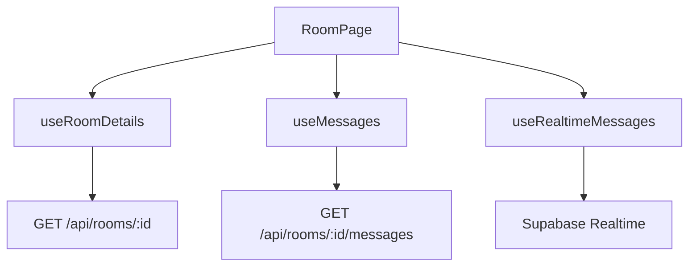

# UC-004: 기존 채팅방 입장 구현 계획

## 개요

### 모듈 목록

| 모듈명 | 경로 | 설명 |
|--------|------|------|
| **Backend Modules** |
| RoomRoute | `src/features/chat-rooms/backend/route.ts` | GET /api/rooms/:id 엔드포인트 |
| MessageRoute | `src/features/messages/backend/route.ts` | GET /api/rooms/:id/messages 엔드포인트 |
| **Frontend Modules** |
| RoomPage | `src/app/rooms/[id]/page.tsx` | 채팅방 페이지 |
| MessageList | `src/features/messages/components/MessageList.tsx` | 메시지 목록 |
| useRoomDetails | `src/features/chat-rooms/hooks/useRoomDetails.ts` | 채팅방 정보 조회 훅 |
| useMessages | `src/features/messages/hooks/useMessages.ts` | 메시지 목록 조회 훅 |
| useRealtimeMessages | `src/features/messages/hooks/useRealtimeMessages.ts` | Realtime 구독 훅 |

## Diagram

## Implementation Plan

### Backend
- GET /api/rooms/:id - 채팅방 정보 조회
- GET /api/rooms/:id/messages - 메시지 목록 조회 (페이지네이션)

### Frontend
- RoomPage: 채팅방 UI 렌더링
- MessageList: 메시지 목록 표시
- useRealtimeMessages: Supabase Realtime 구독

### Realtime
- Supabase Realtime Channels 사용
- messages 테이블 INSERT 이벤트 구독

## 완료 조건
- [ ] 채팅방 정보 로드
- [ ] 메시지 목록 로드
- [ ] Realtime 구독 작동
- [ ] 새 메시지 실시간 수신
