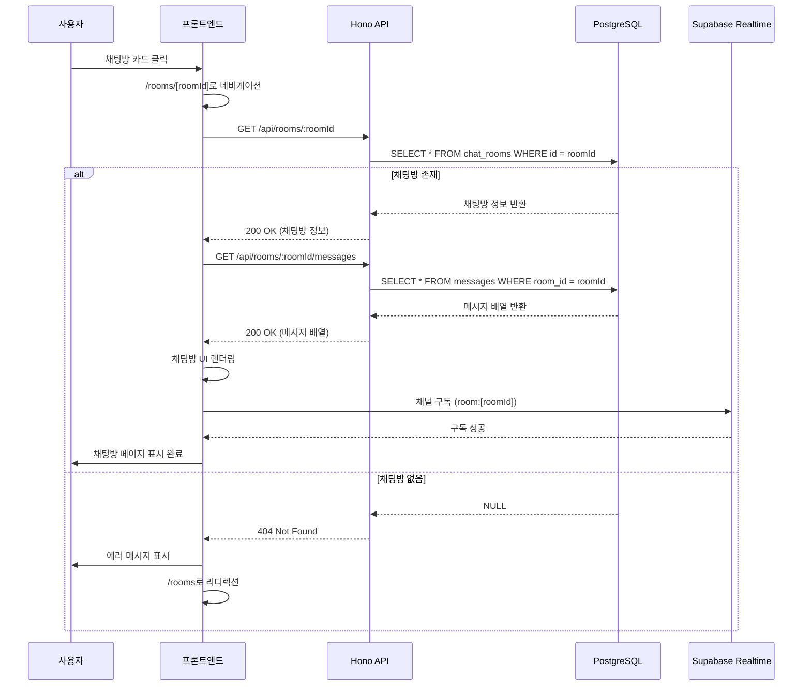

# 유스케이스 문서: 기존 채팅방 입장

## 유스케이스 ID: UC-004

### 제목
로그인한 사용자가 채팅방 목록에서 특정 채팅방을 선택하여 입장하고 실시간 채팅에 참여하는 기능

---

## 1. 개요

### 1.1 목적
사용자가 채팅방 목록에서 원하는 채팅방을 선택하여 입장함으로써, 해당 채팅방의 이전 대화 내역을 확인하고 실시간으로 메시지를 주고받을 수 있도록 합니다.

### 1.2 범위
- 채팅방 목록 페이지에서 특정 채팅방 카드 클릭
- 채팅방 유효성 검증 및 데이터 로딩
- 채팅방 페이지로 리디렉션 및 실시간 연결 설정
- **제외**: 채팅방 생성, 메시지 전송, 닉네임 변경 등 다른 기능

### 1.3 액터
- **주요 액터**: 로그인한 사용자 (인증된 사용자)
- **부 액터**:
  - Supabase Realtime (실시간 메시지 구독)
  - PostgreSQL 데이터베이스 (채팅방 및 메시지 데이터 조회)

---

## 2. 선행 조건

- 사용자가 로그인되어 있어야 함 (유효한 세션 토큰 보유)
- 사용자가 채팅방 목록 페이지(`/rooms`)에 접근 가능한 상태
- 선택할 채팅방이 데이터베이스에 존재해야 함
- 사용자의 브라우저에서 WebSocket 연결이 가능해야 함

---

## 3. 참여 컴포넌트

- **프론트엔드 (Client Component)**
  - `/rooms` - 채팅방 목록 페이지 컴포넌트
  - `/rooms/[roomId]` - 채팅방 페이지 컴포넌트
  - `@/lib/remote/api-client` - HTTP 요청 클라이언트
  - React Query - 서버 상태 관리

- **백엔드 (Hono API + Supabase)**
  - `GET /api/rooms/:roomId` - 채팅방 정보 조회 API
  - `GET /api/rooms/:roomId/messages` - 메시지 내역 조회 API
  - Supabase Realtime Channel - 실시간 메시지 구독
  - PostgreSQL (`chat_rooms`, `messages` 테이블)

---

## 4. 기본 플로우 (Basic Flow)

### 4.1 단계별 흐름

1. **사용자**: 채팅방 목록 페이지에서 특정 채팅방 카드를 클릭
   - 입력: `roomId` (채팅방 고유 ID)
   - 처리: 프론트엔드 라우터가 `/rooms/[roomId]` 경로로 네비게이션
   - 출력: 채팅방 페이지 로딩 시작

2. **프론트엔드**: 채팅방 페이지 컴포넌트 마운트
   - 입력: URL 파라미터에서 `roomId` 추출
   - 처리: React Query를 통해 채팅방 정보 및 메시지 내역 요청
   - 출력: 로딩 상태 UI 표시

3. **백엔드**: 채팅방 유효성 검증
   - 입력: `GET /api/rooms/:roomId` 요청 수신
   - 처리:
     1. 사용자 세션 토큰 검증 (미들웨어)
     2. `chat_rooms` 테이블에서 `roomId`로 채팅방 조회
     3. 채팅방 존재 여부 확인
   - 출력: 채팅방 정보 (이름, 생성자, 생성일) 또는 404 에러

4. **백엔드**: 메시지 내역 조회
   - 입력: `GET /api/rooms/:roomId/messages` 요청 수신
   - 처리:
     1. `messages` 테이블에서 `room_id = roomId`인 메시지 조회
     2. 최신 메시지부터 100개 제한으로 정렬 (무한 스크롤 대비)
     3. 사용자 정보 조인 (닉네임 등)
   - 출력: 메시지 배열 (각 메시지에 작성자, 내용, 시간, 답장 정보 포함)

5. **프론트엔드**: 채팅방 데이터 렌더링
   - 입력: API 응답 데이터 (채팅방 정보, 메시지 배열)
   - 처리:
     1. 채팅방 제목 표시
     2. 메시지 리스트 렌더링 (시간순 정렬)
     3. 스크롤을 최하단으로 이동
   - 출력: 채팅방 UI 표시 완료

6. **프론트엔드**: Supabase Realtime 채널 구독
   - 입력: `roomId`
   - 처리:
     1. Supabase 클라이언트를 통해 `room:[roomId]` 채널 생성
     2. `INSERT` 이벤트 구독 (새 메시지)
     3. `UPDATE` 이벤트 구독 (메시지 반응 등)
     4. 연결 성공 시 리스너 등록
   - 출력: 실시간 메시지 수신 준비 완료

7. **시스템**: 사용자가 채팅방에 성공적으로 입장
   - 출력:
     - 채팅방 페이지 표시
     - 기존 대화 내역 표시
     - 실시간 메시지 수신 가능 상태
     - 메시지 입력 필드 활성화

### 4.2 시퀀스 다이어그램



---

## 5. 대안 플로우 (Alternative Flows)

### 5.1 대안 플로우 1: 메시지가 없는 새 채팅방 입장

채팅방은 존재하지만 아직 메시지가 하나도 없는 경우

**시작 조건**: 기본 플로우 4단계 이후 (채팅방 존재 확인 후)

**단계**:
1. `GET /api/rooms/:roomId/messages` 요청 시 빈 배열 반환
2. 프론트엔드에서 "아직 메시지가 없습니다. 첫 메시지를 남겨보세요!" 안내 문구 표시
3. 메시지 입력 필드는 활성화 상태 유지
4. 실시간 구독은 정상적으로 설정

**결과**: 사용자가 첫 메시지를 작성할 수 있는 상태

### 5.2 대안 플로우 2: 느린 네트워크 환경

네트워크 속도가 느려 API 응답이 지연되는 경우

**시작 조건**: 기본 플로우 2단계 (페이지 로딩 시작)

**단계**:
1. 프론트엔드에서 3초 타임아웃 설정
2. 로딩 스피너 및 "채팅방을 불러오는 중..." 메시지 표시
3. 타임아웃 초과 시 "네트워크가 불안정합니다. 다시 시도해주세요" 안내
4. 재시도 버튼 제공

**결과**: 사용자에게 명확한 피드백 제공

---

## 6. 예외 플로우 (Exception Flows)

### 6.1 예외 상황 1: 채팅방이 존재하지 않음

**발생 조건**:
- 잘못된 `roomId`로 직접 URL 접근
- 채팅방이 삭제된 후 URL 재접근

**처리 방법**:
1. 백엔드에서 `chat_rooms` 테이블 조회 결과가 NULL
2. `404 Not Found` 응답 반환
3. 프론트엔드에서 에러 감지
4. Toast 알림: "채팅방을 찾을 수 없습니다"
5. 3초 후 자동으로 `/rooms` (채팅방 목록)으로 리디렉션

**에러 코드**: `ROOM_NOT_FOUND` (HTTP 404)

**사용자 메시지**: "요청하신 채팅방을 찾을 수 없습니다. 채팅방 목록으로 이동합니다."

### 6.2 예외 상황 2: 인증 실패 (로그인 세션 만료)

**발생 조건**:
- 세션 토큰이 만료된 상태에서 채팅방 접근
- 토큰이 유효하지 않음

**처리 방법**:
1. 백엔드 미들웨어에서 세션 검증 실패
2. `401 Unauthorized` 응답 반환
3. 프론트엔드에서 인증 에러 감지
4. 세션 스토리지 초기화
5. Toast 알림: "로그인이 필요합니다"
6. `/login` 페이지로 리디렉션 (현재 URL을 `redirectTo` 파라미터로 전달)

**에러 코드**: `UNAUTHORIZED` (HTTP 401)

**사용자 메시지**: "로그인이 필요합니다. 로그인 후 다시 시도해주세요."

### 6.3 예외 상황 3: 실시간 연결 실패

**발생 조건**:
- WebSocket 연결 불가 (방화벽, 네트워크 제한)
- Supabase Realtime 서버 장애

**처리 방법**:
1. Realtime 채널 구독 시도 후 5초 타임아웃
2. 연결 실패 감지
3. 경고 배너 표시: "실시간 연결에 실패했습니다. 새 메시지를 받으려면 페이지를 새로고침하세요"
4. 폴링(Polling) 대체 방식으로 전환 (10초마다 메시지 조회 API 호출)

**에러 코드**: `REALTIME_CONNECTION_FAILED` (클라이언트 처리)

**사용자 메시지**: "실시간 연결에 실패했습니다. 메시지는 새로고침 시 업데이트됩니다."

### 6.4 예외 상황 4: 메시지 내역 조회 실패

**발생 조건**:
- 데이터베이스 연결 오류
- 쿼리 실행 실패

**처리 방법**:
1. 백엔드에서 데이터베이스 오류 발생
2. `500 Internal Server Error` 응답 반환
3. 프론트엔드에서 에러 감지
4. 에러 UI 표시: "메시지를 불러오는 중 오류가 발생했습니다"
5. "다시 시도" 버튼 제공

**에러 코드**: `MESSAGE_FETCH_FAILED` (HTTP 500)

**사용자 메시지**: "메시지를 불러올 수 없습니다. 잠시 후 다시 시도해주세요."

### 6.5 예외 상황 5: roomId 파라미터 누락 또는 유효하지 않음

**발생 조건**:
- URL에 `roomId`가 없거나 숫자가 아님

**처리 방법**:
1. 프론트엔드에서 `roomId` 유효성 검사 (숫자인지 확인)
2. 유효하지 않으면 즉시 `/rooms`로 리디렉션
3. Toast 알림: "유효하지 않은 채팅방입니다"

**에러 코드**: `INVALID_ROOM_ID` (클라이언트 처리)

**사용자 메시지**: "유효하지 않은 채팅방 주소입니다."

---

## 7. 후행 조건 (Post-conditions)

### 7.1 성공 시

- **데이터베이스 변경**: 없음 (조회만 수행)
- **시스템 상태**:
  - 사용자가 채팅방 페이지에 접근한 상태
  - Supabase Realtime 채널에 구독 연결 유지
  - 메시지 입력 가능 상태
- **외부 시스템**:
  - Supabase Realtime 서버와 WebSocket 연결 활성화

### 7.2 실패 시

- **데이터 롤백**: 없음 (데이터 변경 없음)
- **시스템 상태**:
  - 사용자가 채팅방 목록 페이지 또는 로그인 페이지로 리디렉션됨
  - WebSocket 연결 해제
  - 에러 메시지 표시 후 상태 초기화

---

## 8. 비기능 요구사항

### 8.1 성능
- **응답 시간**:
  - 채팅방 정보 조회 API: 200ms 이내
  - 메시지 내역 조회 API: 500ms 이내 (최대 100개 메시지 기준)
  - 페이지 로딩 완료: 1초 이내 (네트워크 정상 상태)
- **동시 사용자**:
  - 한 채팅방당 최대 100명 동시 접속 지원
  - Realtime 연결당 1초에 최대 100개 메시지 처리

### 8.2 보안
- **인증**:
  - 모든 API 요청에 유효한 세션 토큰 필수
  - Supabase Auth JWT 검증
- **권한**:
  - 로그인한 사용자만 채팅방 접근 가능
  - 삭제된 채팅방 접근 차단
- **데이터 보호**:
  - XSS 방지를 위한 메시지 콘텐츠 이스케이프 처리
  - SQL Injection 방지를 위한 파라미터화된 쿼리 사용

### 8.3 가용성
- **시스템 가동 시간**: 99.9% 이상
- **실시간 연결 복구**:
  - WebSocket 연결 끊김 시 3회까지 자동 재연결 시도
  - 재연결 간격: 1초, 3초, 5초 (지수 백오프)
- **폴백 전략**:
  - Realtime 연결 실패 시 폴링 방식으로 대체

---

## 9. UI/UX 요구사항

### 9.1 화면 구성

**채팅방 목록 페이지 (`/rooms`)**
- 채팅방 카드 리스트 (그리드 레이아웃)
- 각 카드에 채팅방 이름, 최근 메시지 미리보기, 시간 표시
- 카드 호버 시 배경색 변경 (인터랙션 피드백)

**채팅방 페이지 (`/rooms/[roomId]`)**
- **헤더**:
  - 채팅방 이름
  - 뒤로가기 버튼 (채팅방 목록으로 이동)
  - 현재 접속자 수 (선택사항)
- **메시지 영역**:
  - 메시지 리스트 (스크롤 가능)
  - 각 메시지에 작성자 닉네임, 내용, 시간 표시
  - 내 메시지는 오른쪽 정렬, 타인 메시지는 왼쪽 정렬
  - 답장된 메시지는 원본 메시지와 시각적 연결 (인용 박스)
- **입력 영역**:
  - 메시지 입력 필드 (텍스트 에리어)
  - 전송 버튼
- **로딩 상태**:
  - 스켈레톤 UI (메시지 로딩 중)
  - 로딩 스피너 (채팅방 정보 로딩 중)

### 9.2 사용자 경험

**로딩 상태**
- 채팅방 입장 시 스켈레톤 UI로 즉각적인 피드백
- 3초 이상 로딩 시 "조금만 기다려주세요..." 안내 문구

**에러 처리**
- 에러 발생 시 Toast 알림으로 명확한 메시지 제공
- 재시도 가능한 오류는 "다시 시도" 버튼 제공
- 자동 리디렉션 전 3초 카운트다운 표시

**실시간 피드백**
- 새 메시지 수신 시 부드러운 애니메이션 (페이드인)
- 타인이 메시지 입력 중일 때 "닉네임이 입력 중입니다..." 표시 (선택사항)
- Realtime 연결 상태 표시 (연결됨/연결 끊김)

**접근성**
- 키보드 네비게이션 지원 (Enter로 전송, Esc로 취소)
- 스크린 리더 호환성 (ARIA 레이블)
- 고대비 모드 지원

---

## 10. 테스트 시나리오

### 10.1 성공 케이스

| 테스트 케이스 ID | 입력값 | 기대 결과 |
|----------------|--------|----------|
| TC-004-01 | 유효한 roomId로 채팅방 카드 클릭 | 채팅방 페이지로 이동, 메시지 내역 표시 |
| TC-004-02 | 메시지가 있는 채팅방 입장 | 기존 메시지 100개 로딩 및 표시 |
| TC-004-03 | 새로 생성된 빈 채팅방 입장 | "첫 메시지를 남겨보세요" 안내 문구 표시 |
| TC-004-04 | Realtime 연결 성공 | "연결됨" 상태 표시, 실시간 메시지 수신 가능 |

### 10.2 실패 케이스

| 테스트 케이스 ID | 입력값 | 기대 결과 |
|----------------|--------|----------|
| TC-004-05 | 존재하지 않는 roomId (예: 99999) | 404 에러, "채팅방을 찾을 수 없습니다" Toast 표시 후 `/rooms`로 리디렉션 |
| TC-004-06 | 세션 만료 상태에서 접근 | 401 에러, "로그인이 필요합니다" Toast 표시 후 `/login`으로 리디렉션 |
| TC-004-07 | 유효하지 않은 roomId (예: "abc") | 클라이언트에서 즉시 `/rooms`로 리디렉션 |
| TC-004-08 | Realtime 연결 실패 | 경고 배너 표시, 폴링 모드로 전환 |
| TC-004-09 | 메시지 조회 API 타임아웃 | "메시지를 불러올 수 없습니다" 에러 UI, "다시 시도" 버튼 표시 |

---

## 11. API 엔드포인트 명세

### 11.1 채팅방 정보 조회

**엔드포인트**: `GET /api/rooms/:roomId`

**요청 헤더**:
```
Authorization: Bearer {세션 토큰}
```

**경로 파라미터**:
- `roomId` (number, required): 채팅방 고유 ID

**응답 (성공)**:
```json
{
  "success": true,
  "data": {
    "id": 1,
    "name": "자유 수다방",
    "creator_id": 5,
    "created_at": "2025-10-17T10:30:00Z"
  }
}
```

**응답 (실패 - 채팅방 없음)**:
```json
{
  "success": false,
  "error": {
    "code": "ROOM_NOT_FOUND",
    "message": "채팅방을 찾을 수 없습니다"
  }
}
```

### 11.2 메시지 내역 조회

**엔드포인트**: `GET /api/rooms/:roomId/messages`

**요청 헤더**:
```
Authorization: Bearer {세션 토큰}
```

**경로 파라미터**:
- `roomId` (number, required): 채팅방 고유 ID

**쿼리 파라미터**:
- `limit` (number, optional, default: 100): 조회할 메시지 개수
- `before` (number, optional): 특정 메시지 ID 이전의 메시지만 조회 (무한 스크롤용)

**응답 (성공)**:
```json
{
  "success": true,
  "data": [
    {
      "id": 101,
      "room_id": 1,
      "user_id": 5,
      "user": {
        "id": 5,
        "nickname": "홍길동"
      },
      "content": "안녕하세요!",
      "parent_message_id": null,
      "created_at": "2025-10-17T11:00:00Z"
    },
    {
      "id": 102,
      "room_id": 1,
      "user_id": 7,
      "user": {
        "id": 7,
        "nickname": "김철수"
      },
      "content": "반갑습니다",
      "parent_message_id": 101,
      "created_at": "2025-10-17T11:05:00Z"
    }
  ],
  "pagination": {
    "total": 2,
    "has_more": false
  }
}
```

**응답 (실패 - 서버 오류)**:
```json
{
  "success": false,
  "error": {
    "code": "MESSAGE_FETCH_FAILED",
    "message": "메시지를 불러올 수 없습니다"
  }
}
```

---

## 12. 실시간 통신 요구사항 (WebSocket)

### 12.1 Supabase Realtime 채널 구독

**채널 이름**: `room:{roomId}`

**구독 이벤트**:
- `INSERT`: 새 메시지 추가
- `UPDATE`: 메시지 수정 (반응 추가/제거 등)
- `DELETE`: 메시지 삭제 (선택사항)

**구독 설정 예시 (TypeScript)**:
```typescript
const channel = supabase
  .channel(`room:${roomId}`)
  .on('postgres_changes', {
    event: 'INSERT',
    schema: 'public',
    table: 'messages',
    filter: `room_id=eq.${roomId}`
  }, (payload) => {
    // 새 메시지 UI에 추가
    addMessageToUI(payload.new);
  })
  .on('postgres_changes', {
    event: 'UPDATE',
    schema: 'public',
    table: 'messages',
    filter: `room_id=eq.${roomId}`
  }, (payload) => {
    // 메시지 업데이트 (반응 등)
    updateMessageInUI(payload.new);
  })
  .subscribe((status) => {
    if (status === 'SUBSCRIBED') {
      console.log('Realtime 연결 성공');
    }
  });
```

### 12.2 연결 관리

**자동 재연결**:
- 연결 끊김 감지 시 3회까지 재연결 시도
- 재연결 간격: 1초, 3초, 5초 (지수 백오프)

**연결 해제**:
- 컴포넌트 언마운트 시 `channel.unsubscribe()` 호출
- 페이지 이탈 시 자동 해제

**폴링 폴백**:
- Realtime 연결 실패 시 10초마다 메시지 조회 API 호출
- 새 메시지 발견 시 UI 업데이트

---

## 13. 검증 규칙

### 13.1 클라이언트 검증

- `roomId`가 숫자인지 확인 (`Number.isInteger(roomId)`)
- `roomId`가 양수인지 확인 (`roomId > 0`)

### 13.2 서버 검증

- 세션 토큰 유효성 검증 (Supabase Auth)
- `roomId`에 해당하는 채팅방 존재 여부 확인
- 사용자가 채팅방 접근 권한이 있는지 확인 (현재는 모든 로그인 사용자 허용)

---

## 14. 관련 유스케이스

- **선행 유스케이스**:
  - UC-002: 사용자 로그인 (로그인 세션 필요)
- **후행 유스케이스**:
  - UC-005: 메시지 전송
  - UC-006: 메시지에 답장하기
  - UC-007: 메시지에 반응하기
- **연관 유스케이스**:
  - UC-003: 새로운 채팅방 생성 (채팅방 목록 페이지 공유)

---

## 15. 변경 이력

| 버전 | 날짜 | 작성자 | 변경 내용 |
|------|------|--------|-----------|
| 1.0  | 2025-10-17 | SuperClaude | 초기 작성 |

---

## 부록

### A. 용어 정의

- **roomId**: 채팅방의 고유 식별자 (정수형)
- **Supabase Realtime**: Supabase에서 제공하는 실시간 데이터 구독 서비스 (WebSocket 기반)
- **폴링 (Polling)**: 일정 주기마다 서버에 데이터를 요청하는 방식
- **스켈레톤 UI**: 콘텐츠 로딩 중 표시하는 회색 박스 형태의 플레이스홀더

### B. 참고 자료

- [Supabase Realtime 공식 문서](https://supabase.com/docs/guides/realtime)
- [Next.js App Router 문서](https://nextjs.org/docs/app)
- [React Query 공식 문서](https://tanstack.com/query/latest)
- SuperChat PRD 문서 (`/docs/prd.md`)
- SuperChat 유저플로우 문서 (`/docs/userflow.md`)
- SuperChat 데이터베이스 설계 문서 (`/docs/database.md`)
