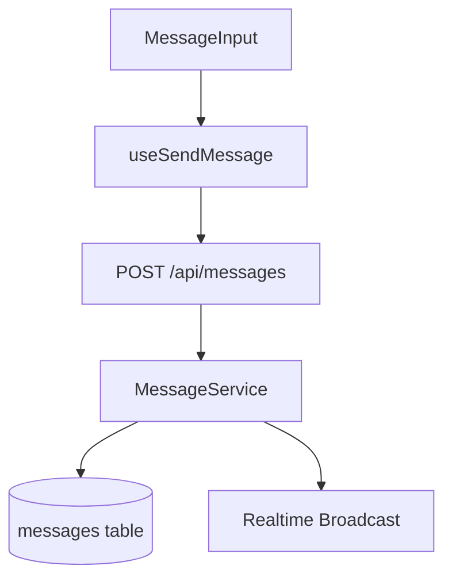

# UC-005: 메시지 전송 구현 계획

## 개요

### 모듈 목록

| 모듈명 | 경로 | 설명 |
|--------|------|------|
| **Backend Modules** |
| MessageRoute | `src/features/messages/backend/route.ts` | POST /api/messages 엔드포인트 |
| MessageService | `src/features/messages/backend/service.ts` | 메시지 생성 로직 |
| MessageSchema | `src/features/messages/backend/schema.ts` | 메시지 요청/응답 스키마 |
| **Frontend Modules** |
| MessageInput | `src/features/messages/components/MessageInput.tsx` | 메시지 입력 컴포넌트 |
| useSendMessage | `src/features/messages/hooks/useSendMessage.ts` | 메시지 전송 훅 |

## Diagram



## Implementation Plan

### Backend
```typescript
export const messageRoute = new Hono()
  .post('/api/messages', authMiddleware, async (c) => {
    const { roomId, content } = await c.req.json();
    const userId = c.get('userId');

    // 1. 메시지 DB 저장
    // 2. Realtime broadcast (선택적)
    // 3. 응답 반환
  });
```

### Frontend
- MessageInput: textarea + 전송 버튼
- Enter 키로 전송
- Optimistic Update 패턴
- 전송 실패 시 재시도

## 완료 조건
- [ ] 메시지 DB 저장
- [ ] Optimistic Update 작동
- [ ] 실시간 브로드캐스트
- [ ] 에러 처리
