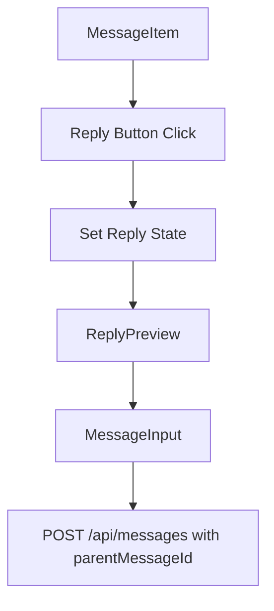

# UC-006: 메시지에 답장하기 구현 계획

## 개요

### 모듈 목록

| 모듈명 | 경로 | 설명 |
|--------|------|------|
| **Backend Modules** |
| MessageRoute | `src/features/messages/backend/route.ts` | POST /api/messages (parent_message_id 추가) |
| MessageService | `src/features/messages/backend/service.ts` | 답장 메시지 생성 로직 |
| **Frontend Modules** |
| MessageItem | `src/features/messages/components/MessageItem.tsx` | 메시지 아이템 (답장 버튼) |
| ReplyPreview | `src/features/messages/components/ReplyPreview.tsx` | 답장 중 원본 메시지 미리보기 |

## Diagram

## Implementation Plan

### Backend
- POST /api/messages에 parent_message_id 파라미터 추가
- 원본 메시지 존재 여부 검증
- messages 테이블에 parent_message_id 저장

### Frontend
- Reply 상태 관리 (Zustand 또는 useState)
- ReplyPreview 컴포넌트: 원본 메시지 표시 + 취소 버튼
- MessageItem: 답장 UI (인용 스타일 또는 연결선)

## 완료 조건
- [ ] parent_message_id 저장
- [ ] 원본 메시지 검증
- [ ] 답장 UI 표시
- [ ] 취소 기능
