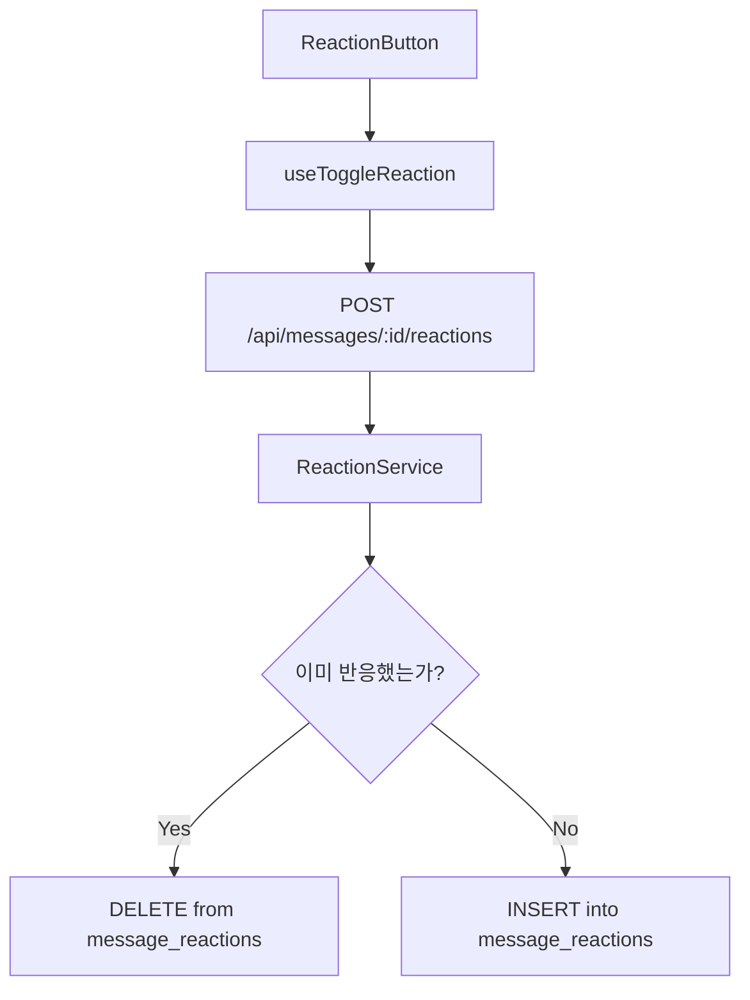

# UC-007: 메시지에 반응하기 구현 계획

## 개요

### 모듈 목록

| 모듈명 | 경로 | 설명 |
|--------|------|------|
| **Backend Modules** |
| ReactionRoute | `src/features/messages/backend/route.ts` | POST /api/messages/:id/reactions |
| ReactionService | `src/features/messages/backend/service.ts` | 반응 토글 로직 |
| **Frontend Modules** |
| ReactionButton | `src/features/messages/components/ReactionButton.tsx` | 좋아요 버튼 |
| useToggleReaction | `src/features/messages/hooks/useToggleReaction.ts` | 반응 토글 훅 |

## Diagram



## Implementation Plan

### Backend
```typescript
export const reactionRoute = new Hono()
  .post('/api/messages/:messageId/reactions', authMiddleware, async (c) => {
    const messageId = c.req.param('messageId');
    const userId = c.get('userId');

    // 1. 기존 반응 확인
    // 2. 있으면 DELETE, 없으면 INSERT
    // 3. 반응 개수 반환
  });
```

### Frontend
- ReactionButton: 하트 아이콘 + 개수
- 클릭 시 Optimistic Update
- 애니메이션 (scale effect)

## 완료 조건
- [ ] 토글 로직 작동
- [ ] Optimistic Update
- [ ] 반응 개수 실시간 업데이트
- [ ] 애니메이션
