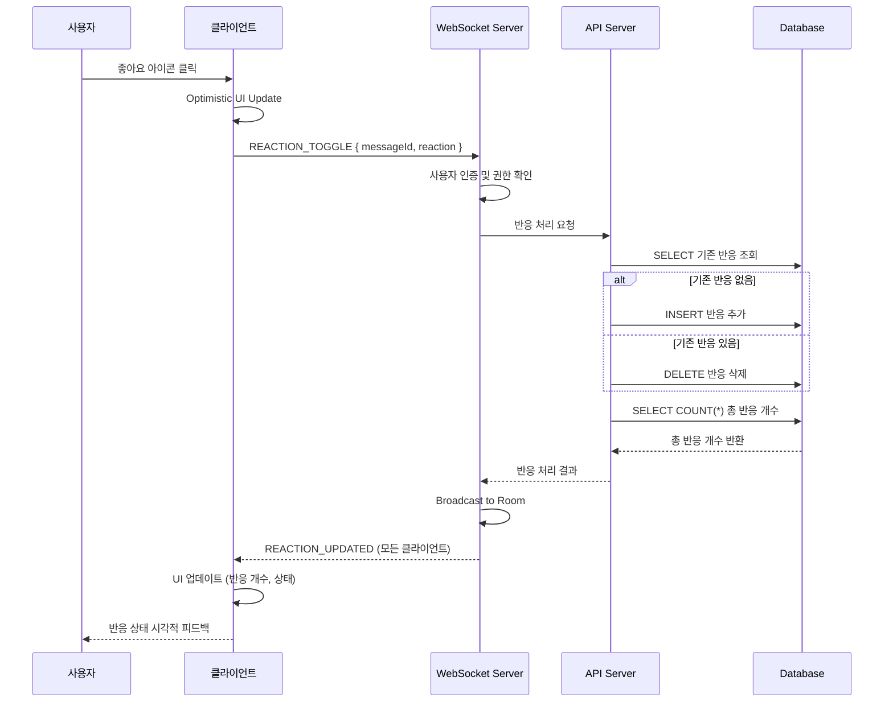

# 유스케이스 ID: UC-007

## 메시지에 반응하기 (React to a Message)

---

## 1. 개요

### 1.1 목적
채팅방에서 사용자들이 특정 메시지에 '좋아요(❤️)' 반응을 추가하거나 제거할 수 있는 기능을 제공하여, 간편한 감정 표현과 메시지에 대한 피드백을 가능하게 합니다.

### 1.2 범위
- **포함 사항**:
  - 메시지에 '좋아요(❤️)' 반응 추가/제거 (토글 방식)
  - 실시간 반응 개수 업데이트
  - 모든 사용자에게 반응 변경사항 실시간 전파
  - 사용자별 반응 상태 관리 (중복 방지)

- **제외 사항**:
  - 다양한 반응 타입 (현재는 '좋아요'만 지원)
  - 반응한 사용자 목록 표시
  - 반응 통계 및 분석 기능

### 1.3 액터
- **주요 액터**: 로그인한 채팅방 참여자
- **부 액터**: 같은 채팅방의 다른 참여자들 (실시간 업데이트 수신)

---

## 2. 선행 조건

- 사용자가 로그인되어 있어야 함
- 사용자가 특정 채팅방에 입장해 있어야 함
- 반응하려는 메시지가 데이터베이스에 존재해야 함
- WebSocket 연결이 활성화되어 있어야 함

---

## 3. 참여 컴포넌트

- **클라이언트 (React Component)**: 메시지 반응 UI 렌더링 및 사용자 상호작용 처리
- **WebSocket Client**: 실시간 반응 이벤트 송수신
- **WebSocket Server**: 반응 요청 수신 및 브로드캐스트
- **API Server (Hono)**: 반응 데이터 검증 및 비즈니스 로직 처리
- **Database (PostgreSQL)**: `message_reactions` 테이블에서 반응 정보 CRUD

---

## 4. 기본 플로우 (Basic Flow)

### 4.1 단계별 흐름

1. **[사용자]**: 특정 메시지의 '좋아요(❤️)' 아이콘을 클릭
   - 입력: 메시지 ID, 사용자 정보 (세션에서 추출)
   - 처리: 클라이언트가 현재 반응 상태(활성/비활성)를 토글
   - 출력: UI에서 즉시 낙관적 업데이트 (Optimistic Update)

2. **[클라이언트]**: WebSocket을 통해 반응 토글 요청 전송
   - 입력: `{ messageId, reaction: 'like' }`
   - 처리: WebSocket 메시지 전송
   - 출력: 서버로 반응 요청 전달

3. **[WebSocket Server]**: 반응 요청 수신 및 검증
   - 입력: WebSocket 메시지, 사용자 세션 정보
   - 처리:
     - 사용자 인증 상태 확인
     - 메시지 ID 유효성 검증
     - 채팅방 접근 권한 확인
   - 출력: 검증된 요청을 API Server로 전달

4. **[API Server]**: 반응 정보 처리
   - 입력: `messageId`, `userId`, `reaction`
   - 처리:
     - `message_reactions` 테이블에서 기존 반응 조회:
       ```sql
       SELECT * FROM message_reactions
       WHERE message_id = $1 AND user_id = $2
       ```
     - **기존 반응이 없는 경우**: 새로운 반응 추가
       ```sql
       INSERT INTO message_reactions (message_id, user_id, reaction)
       VALUES ($1, $2, 'like')
       ```
     - **기존 반응이 있는 경우**: 반응 삭제
       ```sql
       DELETE FROM message_reactions
       WHERE message_id = $1 AND user_id = $2
       ```
     - 해당 메시지의 총 반응 개수 계산:
       ```sql
       SELECT COUNT(*) FROM message_reactions
       WHERE message_id = $1
       ```
   - 출력: 반응 처리 결과 (추가/삭제 여부, 총 반응 개수)

5. **[WebSocket Server]**: 변경사항 전파
   - 입력: 반응 처리 결과
   - 처리: 해당 채팅방의 모든 연결된 클라이언트에게 브로드캐스트
   - 출력: WebSocket 이벤트 전송
     ```json
     {
       "type": "REACTION_UPDATED",
       "payload": {
         "messageId": 123,
         "reactionType": "like",
         "totalCount": 5,
         "isActive": true,
         "userId": 456
       }
     }
     ```

6. **[모든 클라이언트]**: 반응 업데이트 수신 및 UI 갱신
   - 입력: WebSocket 이벤트 데이터
   - 처리:
     - 해당 메시지의 반응 개수 업데이트
     - 현재 사용자의 반응 상태 업데이트 (활성/비활성)
     - 애니메이션 효과 적용 (하트 아이콘 확대/축소)
   - 출력: 모든 사용자에게 일관된 반응 상태 표시

### 4.2 시퀀스 다이어그램



---

## 5. 대안 플로우 (Alternative Flows)

### 5.1 대안 플로우 1: 네트워크 지연으로 인한 중복 클릭

**시작 조건**: 사용자가 서버 응답을 받기 전에 좋아요 아이콘을 빠르게 여러 번 클릭

**단계**:
1. 클라이언트는 첫 번째 클릭 이후 버튼을 비활성화 (debounce)
2. 서버 응답을 받기 전까지 추가 클릭 무시
3. 서버 응답 수신 후 버튼 재활성화

**결과**: 중복 요청 방지, 일관된 상태 유지

---

## 6. 예외 플로우 (Exception Flows)

### 6.1 예외 상황 1: 메시지 ID가 유효하지 않음

**발생 조건**: 클라이언트가 존재하지 않는 메시지 ID로 반응 요청을 전송

**처리 방법**:
1. API Server에서 메시지 존재 여부 확인
2. 메시지가 존재하지 않으면 에러 응답 반환
3. 클라이언트는 Optimistic Update 롤백
4. 사용자에게 토스트 메시지 표시: "메시지를 찾을 수 없습니다"

**에러 코드**: `MESSAGE_NOT_FOUND` (HTTP 404)

**사용자 메시지**: "메시지를 찾을 수 없습니다. 페이지를 새로고침해주세요."

---

### 6.2 예외 상황 2: 데이터베이스 처리 실패

**발생 조건**: DB 연결 끊김 또는 트랜잭션 실패

**처리 방법**:
1. API Server에서 DB 에러 감지
2. 트랜잭션 롤백
3. 에러 로그 기록
4. 클라이언트에게 실패 응답 전송
5. 클라이언트는 Optimistic Update 롤백
6. 사용자에게 재시도 안내

**에러 코드**: `DB_TRANSACTION_FAILED` (HTTP 500)

**사용자 메시지**: "일시적인 오류가 발생했습니다. 잠시 후 다시 시도해주세요."

---

### 6.3 예외 상황 3: WebSocket 연결 끊김

**발생 조건**: 사용자의 네트워크 연결이 불안정하여 WebSocket 연결이 끊어짐

**처리 방법**:
1. 클라이언트에서 WebSocket 연결 상태 감지
2. 자동 재연결 시도 (최대 3회, 지수 백오프)
3. 재연결 성공 시 현재 채팅방 데이터 다시 로드
4. 재연결 실패 시 사용자에게 수동 새로고침 안내

**에러 코드**: `WEBSOCKET_DISCONNECTED`

**사용자 메시지**: "연결이 끊어졌습니다. 자동으로 재연결을 시도합니다..."

---

### 6.4 예외 상황 4: 권한 없는 접근

**발생 조건**: 로그인하지 않은 사용자 또는 채팅방 접근 권한이 없는 사용자의 반응 요청

**처리 방법**:
1. WebSocket Server에서 사용자 세션 확인
2. 인증되지 않은 경우 요청 거부
3. 클라이언트에게 인증 실패 응답 전송
4. 사용자를 로그인 페이지로 리디렉션

**에러 코드**: `UNAUTHORIZED` (HTTP 401)

**사용자 메시지**: "로그인이 필요한 기능입니다."

---

## 7. 후행 조건 (Post-conditions)

### 7.1 성공 시

- **데이터베이스 변경**:
  - `message_reactions` 테이블에 새로운 레코드 추가 (반응 추가 시)
  - 또는 기존 레코드 삭제 (반응 제거 시)
  - 복합 키 `(message_id, user_id)` 제약으로 중복 방지

- **시스템 상태**:
  - 해당 메시지의 총 반응 개수가 정확하게 업데이트됨
  - 모든 클라이언트가 동일한 반응 상태를 공유

- **외부 시스템**:
  - 채팅방 목록 페이지의 최근 활동 시간이 갱신될 수 있음

### 7.2 실패 시

- **데이터 롤백**:
  - DB 트랜잭션 실패 시 모든 변경사항 자동 롤백
  - 클라이언트의 Optimistic Update 취소

- **시스템 상태**:
  - 반응 요청 이전 상태로 복구
  - 에러 로그 기록 (디버깅 및 모니터링용)

---

## 8. 비기능 요구사항

### 8.1 성능
- **응답 시간**: 반응 토글 후 서버 응답까지 평균 200ms 이내
- **Optimistic Update**: 사용자 클릭 후 즉시 UI 업데이트 (0ms 체감)
- **브로드캐스트 지연**: 같은 채팅방의 다른 사용자에게 500ms 이내 전파
- **동시 처리**: 채팅방당 초당 100개 이상의 반응 요청 처리 가능

### 8.2 보안
- **인증**: 모든 반응 요청은 유효한 세션 토큰 필요
- **권한 검증**: 사용자가 해당 채팅방에 접근 권한이 있는지 확인
- **SQL Injection 방지**: Prepared Statement 사용
- **XSS 방지**: 반응 타입은 서버에서 화이트리스트로 검증

### 8.3 가용성
- **실시간성 보장**: WebSocket 연결 끊김 시 자동 재연결
- **데이터 일관성**: DB 트랜잭션으로 원자성 보장
- **장애 복구**: API Server 장애 시에도 읽기 기능은 캐싱으로 유지 가능

---

## 9. UI/UX 요구사항

### 9.1 화면 구성

**메시지 카드 영역**:
```
┌─────────────────────────────────────────┐
│ [사용자 닉네임]          [타임스탬프]   │
│ 메시지 내용 텍스트                      │
│                                         │
│ [답장] [❤️ 5]                           │
└─────────────────────────────────────────┘
```

**반응 아이콘 상태**:
- **비활성 (반응하지 않음)**: ♡ (빈 하트, 회색, `text-gray-400`)
- **활성 (반응함)**: ❤️ (꽉 찬 하트, 빨간색, `text-red-500`)
- **호버 상태**: 크기 살짝 확대 (`scale-110`), 커서 포인터

### 9.2 사용자 경험

**인터랙션 플로우**:
1. **클릭 전**: 비활성 하트 아이콘, 총 반응 개수 표시
2. **클릭 순간**:
   - 아이콘 즉시 활성/비활성 전환 (Optimistic Update)
   - 하트 확대 애니메이션 (`scale-125` → `scale-100`, 300ms)
   - 개수 증가/감소 애니메이션 (fade-in/out)
3. **서버 응답 수신**:
   - 성공 시: 애니메이션 종료, 최종 상태 유지
   - 실패 시: 원래 상태로 롤백, 토스트 메시지 표시

**애니메이션 스펙**:
- **하트 아이콘**: `transition-all duration-300 ease-in-out`
- **반응 개수**: `transition-opacity duration-200`
- **호버 효과**: `hover:scale-110 transition-transform duration-150`

**접근성**:
- **키보드 네비게이션**: Tab 키로 포커스 이동, Enter/Space로 토글
- **ARIA 레이블**: `aria-label="좋아요 5개, 반응하기"` 또는 `"좋아요 취소"`
- **시각적 피드백**: 포커스 링 표시 (`focus-visible:ring-2 ring-primary`)

---

## 10. 데이터 모델

### 10.1 message_reactions 테이블

```sql
CREATE TABLE message_reactions (
    message_id INTEGER NOT NULL REFERENCES messages(id) ON DELETE CASCADE,
    user_id INTEGER NOT NULL REFERENCES users(id) ON DELETE CASCADE,
    reaction VARCHAR(50) NOT NULL DEFAULT 'like', -- 현재는 'like'만 사용
    created_at TIMESTAMP WITH TIME ZONE NOT NULL DEFAULT NOW(),
    PRIMARY KEY (message_id, user_id) -- 한 사용자는 한 메시지에 하나의 반응만
);
```

**제약 조건**:
- **복합 Primary Key**: `(message_id, user_id)` - 사용자당 메시지당 하나의 반응만 허용
- **Foreign Key (CASCADE)**: 메시지 또는 사용자 삭제 시 반응도 함께 삭제
- **Default Value**: `reaction` 필드는 기본값 'like'

**인덱스**:
- Primary Key 자동 인덱스: `(message_id, user_id)`
- 추가 인덱스 권장: `CREATE INDEX idx_message_reactions_message_id ON message_reactions(message_id)` (반응 개수 집계 최적화)

---

## 11. WebSocket 이벤트 명세

### 11.1 클라이언트 → 서버 이벤트

**이벤트 이름**: `REACTION_TOGGLE`

**Payload**:
```typescript
{
  type: 'REACTION_TOGGLE',
  payload: {
    messageId: number,      // 반응할 메시지 ID
    reaction: 'like'        // 반응 타입 (확장 가능)
  }
}
```

### 11.2 서버 → 클라이언트 이벤트

**이벤트 이름**: `REACTION_UPDATED`

**Payload**:
```typescript
{
  type: 'REACTION_UPDATED',
  payload: {
    messageId: number,      // 대상 메시지 ID
    reactionType: 'like',   // 반응 타입
    totalCount: number,     // 해당 메시지의 총 반응 개수
    isActive: boolean,      // 현재 사용자가 반응했는지 여부
    userId: number          // 반응을 토글한 사용자 ID
  }
}
```

**브로드캐스트 범위**: 해당 채팅방의 모든 연결된 클라이언트

---

## 12. 검증 규칙

### 12.1 클라이언트 검증
- 메시지 ID가 유효한 숫자인지 확인
- 사용자가 로그인 상태인지 확인
- WebSocket 연결이 활성화되어 있는지 확인

### 12.2 서버 검증
- **인증 검증**: 유효한 세션 토큰 존재 여부
- **메시지 존재 검증**: `messages` 테이블에서 메시지 ID 조회
- **권한 검증**: 사용자가 해당 채팅방 접근 권한이 있는지 확인
- **반응 타입 검증**: `reaction` 필드가 허용된 값 ('like')인지 확인

### 12.3 데이터베이스 제약
- **복합 키 제약**: 동일한 `(message_id, user_id)` 조합 중복 불가
- **외래 키 제약**: `message_id`와 `user_id`가 각각 `messages`, `users` 테이블에 존재해야 함

---

## 13. 테스트 시나리오

### 13.1 성공 케이스

| 테스트 케이스 ID | 입력값 | 기대 결과 |
|----------------|--------|----------|
| TC-007-01      | 반응하지 않은 메시지에 좋아요 클릭 | DB에 반응 추가, UI에서 하트 활성화, 개수 1 증가 |
| TC-007-02      | 이미 반응한 메시지에 좋아요 클릭 | DB에서 반응 삭제, UI에서 하트 비활성화, 개수 1 감소 |
| TC-007-03      | 여러 사용자가 동시에 같은 메시지에 반응 | 모든 반응이 정확히 기록, 총 개수가 정확히 표시 |
| TC-007-04      | 반응 후 페이지 새로고침 | 반응 상태가 유지됨 (DB에서 조회) |

### 13.2 실패 케이스

| 테스트 케이스 ID | 입력값 | 기대 결과 |
|----------------|--------|----------|
| TC-007-05      | 존재하지 않는 메시지 ID로 반응 요청 | 에러 응답, Optimistic Update 롤백, 토스트 메시지 표시 |
| TC-007-06      | 로그인하지 않은 상태에서 반응 시도 | 401 Unauthorized, 로그인 페이지로 리디렉션 |
| TC-007-07      | WebSocket 연결 끊김 상태에서 반응 클릭 | 재연결 시도 후 요청 재전송 또는 에러 안내 |
| TC-007-08      | DB 연결 실패 상황 | 500 에러, Optimistic Update 롤백, 재시도 안내 |

---

## 14. 관련 유스케이스

- **선행 유스케이스**:
  - UC-002: 사용자 로그인
  - UC-004: 기존 채팅방 입장
  - UC-005: 메시지 전송 (반응할 메시지가 존재해야 함)

- **후행 유스케이스**:
  - (없음 - 독립적인 기능)

- **연관 유스케이스**:
  - UC-006: 메시지에 답장하기 (메시지 상호작용의 다른 형태)

---

## 15. 변경 이력

| 버전 | 날짜 | 작성자 | 변경 내용 |
|------|------|--------|-----------|
| 1.0  | 2025-10-17 | Claude | 초기 작성 |

---

## 부록

### A. 용어 정의
- **Optimistic Update**: 서버 응답을 기다리지 않고 클라이언트에서 먼저 UI를 업데이트하는 패턴
- **토글 (Toggle)**: 클릭할 때마다 활성/비활성 상태가 전환되는 동작
- **브로드캐스트 (Broadcast)**: 하나의 이벤트를 여러 클라이언트에게 동시에 전송
- **복합 Primary Key**: 두 개 이상의 컬럼을 조합한 기본 키

### B. 참고 자료
- [docs/userflow.md](../userflow.md) - 유저플로우 문서 섹션 7
- [docs/database.md](../database.md) - 데이터베이스 스키마 정의
- [docs/prd.md](../prd.md) - 제품 요구사항 문서
