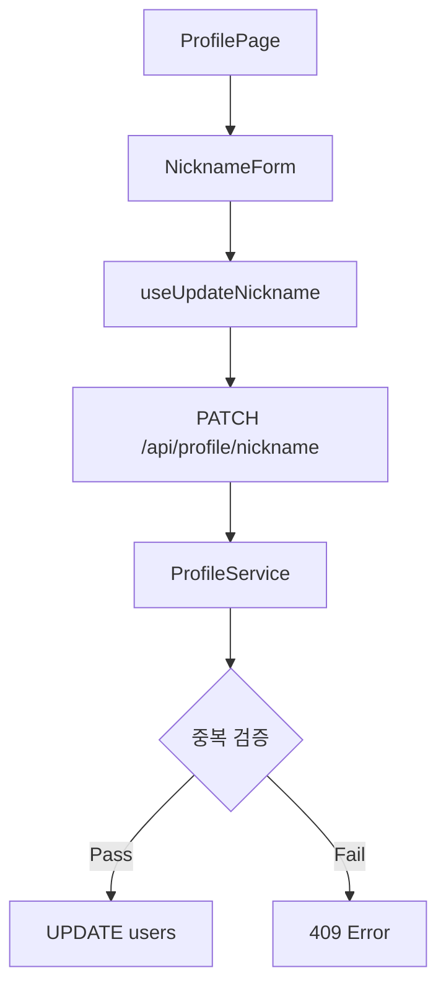

# UC-008: 닉네임 변경 구현 계획

## 개요

### 모듈 목록

| 모듈명 | 경로 | 설명 |
|--------|------|------|
| **Backend Modules** |
| ProfileRoute | `src/features/profile/backend/route.ts` | PATCH /api/profile/nickname |
| ProfileService | `src/features/profile/backend/service.ts` | 닉네임 변경 로직 |
| ProfileSchema | `src/features/profile/backend/schema.ts` | 요청/응답 스키마 |
| **Frontend Modules** |
| ProfilePage | `src/app/profile/page.tsx` | 마이페이지 |
| NicknameForm | `src/features/profile/components/NicknameForm.tsx` | 닉네임 변경 폼 |
| useUpdateNickname | `src/features/profile/hooks/useUpdateNickname.ts` | 닉네임 변경 훅 |

## Diagram



## Implementation Plan

### Backend
```typescript
export const profileRoute = new Hono()
  .patch('/api/profile/nickname', authMiddleware, async (c) => {
    const { nickname } = await c.req.json();
    const userId = c.get('userId');

    // 1. 닉네임 중복 검증
    // 2. users 테이블 UPDATE
    // 3. 응답 반환
  });
```

### Frontend
- NicknameForm: 입력 필드 + 저장 버튼
- 성공 시 React Query 캐시 무효화
- 모든 UI (헤더, 메시지 등)에서 닉네임 즉시 반영

## 완료 조건
- [ ] 닉네임 중복 검증
- [ ] DB 업데이트
- [ ] 캐시 무효화
- [ ] 전역 UI 업데이트
