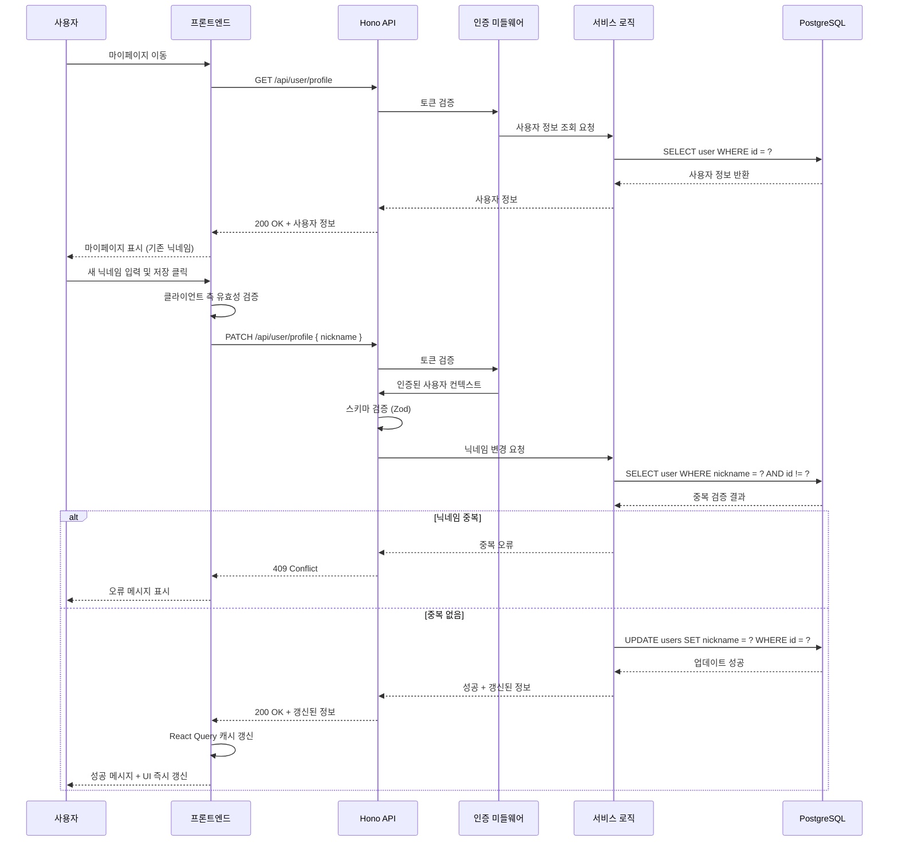

# 유스케이스 작성 문서

## 유스케이스 ID: UC-008

### 제목
사용자 닉네임 변경 (Change Nickname)

---

## 1. 개요

### 1.1 목적
로그인한 사용자가 마이페이지에서 자신의 닉네임을 변경하여 채팅방 및 모든 UI에서 새로운 닉네임으로 표시되도록 합니다. 이를 통해 사용자는 자신의 정체성을 원하는 대로 표현할 수 있으며, 서비스 내에서 일관된 사용자 경험을 제공받습니다.

### 1.2 범위
- **포함**:
  - 마이페이지에서의 닉네임 변경 UI 제공
  - 닉네임 중복 검증
  - 닉네임 유효성 검증 (길이, 특수문자 등)
  - 데이터베이스 닉네임 업데이트
  - UI 전체(헤더, 마이페이지, 채팅방 등)에서 닉네임 즉시 반영

- **제외**:
  - 이전에 전송된 메시지의 닉네임은 변경되지 않음 (이력 보존)
  - 닉네임 변경 이력 추적 기능
  - 닉네임 변경 빈도 제한 (향후 확장 가능)

### 1.3 액터
- **주요 액터**: 로그인한 사용자 (Authenticated User)
- **부 액터**:
  - 백엔드 API 서버
  - 데이터베이스 (PostgreSQL)
  - 프론트엔드 UI 컴포넌트 (헤더, 마이페이지 등)

---

## 2. 선행 조건

- 사용자가 이미 회원가입을 완료하고 이메일 인증을 마친 상태여야 함
- 사용자가 로그인되어 있어야 함 (유효한 세션/토큰 보유)
- 사용자가 마이페이지(`/my-page`)에 접근할 수 있어야 함
- 브라우저에서 JavaScript가 활성화되어 있어야 함

---

## 3. 참여 컴포넌트

- **프론트엔드 (Next.js App Router)**:
  - `/my-page` 페이지 컴포넌트
  - 헤더(Header) 컴포넌트
  - API 클라이언트 (`@/lib/remote/api-client`)
  - React Query 훅 (서버 상태 관리)

- **백엔드 (Hono API)**:
  - 닉네임 변경 라우터 (`src/features/user/backend/route.ts`)
  - 닉네임 변경 서비스 로직 (`src/features/user/backend/service.ts`)
  - 요청/응답 스키마 검증 (`src/features/user/backend/schema.ts`)

- **데이터베이스 (PostgreSQL via Supabase)**:
  - `users` 테이블

- **미들웨어**:
  - 인증 미들웨어 (세션 검증)
  - 에러 핸들링 미들웨어

---

## 4. 기본 플로우 (Basic Flow)

### 4.1 단계별 흐름

1. **사용자**: 헤더 또는 네비게이션에서 "마이페이지" 메뉴를 클릭
   - 입력: 마이페이지 링크 클릭
   - 처리: 브라우저가 `/my-page` 경로로 라우팅
   - 출력: 마이페이지 화면 렌더링

2. **프론트엔드**: 마이페이지 로드 시 현재 사용자 정보 조회
   - 입력: 로그인 세션 토큰
   - 처리: API를 통해 현재 사용자 정보(닉네임, 이메일, 가입일) 조회
   - 출력: 기존 닉네임이 입력 필드에 표시됨

3. **사용자**: 닉네임 입력 필드에 새로운 닉네임 입력
   - 입력: 새 닉네임 문자열
   - 처리: 클라이언트 측 실시간 유효성 검증 (길이, 특수문자 등)
   - 출력: 유효성 검증 결과 피드백 (실시간)

4. **사용자**: "저장" 버튼 클릭
   - 입력: 저장 버튼 클릭 이벤트
   - 처리: 폼 제출 이벤트 발생
   - 출력: API 요청 준비

5. **프론트엔드**: 닉네임 변경 API 요청 전송
   - 입력: `{ nickname: "새닉네임" }` + 인증 토큰
   - 처리: `PATCH /api/user/profile` 엔드포인트로 요청 전송
   - 출력: 로딩 상태 표시 (버튼 비활성화, 스피너 등)

6. **백엔드 - 인증 미들웨어**: 요청 검증
   - 입력: HTTP 요청 헤더의 인증 토큰
   - 처리: 토큰 유효성 검증 및 사용자 식별
   - 출력: 인증된 사용자 컨텍스트 (`c.var.user`)

7. **백엔드 - 라우터**: 요청 스키마 검증
   - 입력: 요청 본문 (`{ nickname: "새닉네임" }`)
   - 처리: Zod 스키마를 통한 데이터 유효성 검증
   - 출력: 검증된 데이터 객체

8. **백엔드 - 서비스 로직**: 닉네임 중복 검증
   - 입력: 새 닉네임
   - 처리: `users` 테이블에서 동일한 닉네임이 존재하는지 조회 (`SELECT`)
   - 출력: 중복 여부 결과 (true/false)

9. **백엔드 - 서비스 로직**: 닉네임 업데이트
   - 입력: 사용자 ID, 새 닉네임
   - 처리: `users` 테이블의 해당 사용자 레코드 업데이트 (`UPDATE users SET nickname = ? WHERE id = ?`)
   - 출력: 업데이트된 사용자 정보

10. **백엔드 - 라우터**: 성공 응답 반환
    - 입력: 업데이트된 사용자 정보
    - 처리: HTTP 200 응답과 함께 성공 메시지 및 갱신된 사용자 정보 반환
    - 출력: `{ success: true, data: { nickname: "새닉네임", ... } }`

11. **프론트엔드**: 응답 처리 및 UI 갱신
    - 입력: API 응답
    - 처리:
      - React Query 캐시 갱신
      - 로컬 상태 업데이트
      - 성공 토스트 메시지 표시
    - 출력:
      - 마이페이지의 닉네임이 새 닉네임으로 즉시 변경
      - 헤더의 닉네임도 즉시 변경
      - 성공 피드백 표시 ("닉네임이 성공적으로 변경되었습니다")

12. **사용자**: 닉네임 변경 완료 확인
    - 입력: UI 변경 사항 확인
    - 처리: 변경된 닉네임 확인
    - 출력: 사용자 만족

### 4.2 시퀀스 다이어그램



---

## 5. 대안 플로우 (Alternative Flows)

### 5.1 대안 플로우 1: 기존 닉네임과 동일한 닉네임 입력

**시작 조건**: 사용자가 현재 자신의 닉네임과 동일한 값을 입력하고 저장 버튼을 클릭

**단계**:
1. 프론트엔드가 클라이언트 측에서 기존 닉네임과 비교
2. 동일한 경우, API 요청 없이 "이미 사용 중인 닉네임입니다" 메시지 표시
3. 또는 API 요청을 보내더라도 백엔드에서 중복 검증 시 자신의 ID는 제외하여 검증

**결과**: 불필요한 API 요청 방지 또는 백엔드에서 자신의 닉네임은 허용

### 5.2 대안 플로우 2: 네트워크 오류

**시작 조건**: API 요청 중 네트워크 연결 끊김 또는 서버 오류 발생

**단계**:
1. 프론트엔드가 API 요청 타임아웃 또는 네트워크 오류 감지
2. React Query의 retry 로직 실행 (최대 3회 재시도)
3. 모든 재시도 실패 시, 사용자에게 "네트워크 오류가 발생했습니다. 다시 시도해주세요" 메시지 표시
4. 로딩 상태 해제, 버튼 재활성화

**결과**: 사용자가 재시도 가능한 상태로 복구

---

## 6. 예외 플로우 (Exception Flows)

### 6.1 예외 상황 1: 인증되지 않은 요청

**발생 조건**:
- 세션 토큰이 만료되었거나 유효하지 않음
- 로그인하지 않은 상태에서 API 요청 시도

**처리 방법**:
1. 인증 미들웨어가 토큰 검증 실패 감지
2. 401 Unauthorized 응답 반환
3. 프론트엔드가 401 감지 시 자동으로 로그인 페이지로 리디렉션
4. "세션이 만료되었습니다. 다시 로그인해주세요" 메시지 표시

**에러 코드**: `UNAUTHORIZED` (HTTP 401)

**사용자 메시지**: "세션이 만료되었습니다. 다시 로그인해주세요."

### 6.2 예외 상황 2: 닉네임 중복

**발생 조건**:
- 입력한 닉네임이 다른 사용자에 의해 이미 사용 중

**처리 방법**:
1. 백엔드 서비스 로직에서 중복 검증 시 중복 감지
2. 409 Conflict 응답 반환
3. 프론트엔드가 닉네임 입력 필드 하단에 오류 메시지 표시
4. 입력 필드에 포커스 및 오류 스타일 적용 (빨간색 테두리 등)

**에러 코드**: `NICKNAME_ALREADY_EXISTS` (HTTP 409)

**사용자 메시지**: "이미 사용 중인 닉네임입니다. 다른 닉네임을 입력해주세요."

### 6.3 예외 상황 3: 유효하지 않은 닉네임 형식

**발생 조건**:
- 닉네임이 비어있음
- 닉네임 길이가 2자 미만 또는 50자 초과
- 닉네임에 허용되지 않는 특수문자 포함 (예: `<`, `>`, `&`, 스크립트 태그 등)

**처리 방법**:
1. 클라이언트 측 유효성 검증 실패 시 즉시 피드백 (입력 중)
2. API 요청 시 백엔드 스키마 검증에서도 이중 검증
3. 400 Bad Request 응답 반환 (백엔드 검증 실패 시)
4. 구체적인 유효성 오류 메시지 표시

**에러 코드**: `INVALID_NICKNAME_FORMAT` (HTTP 400)

**사용자 메시지**:
- "닉네임은 2자 이상 50자 이하로 입력해주세요."
- "닉네임에 특수문자는 사용할 수 없습니다."
- "닉네임을 입력해주세요."

### 6.4 예외 상황 4: 데이터베이스 오류

**발생 조건**:
- DB 연결 끊김
- UPDATE 쿼리 실행 중 오류 발생
- 트랜잭션 실패

**처리 방법**:
1. 백엔드 서비스 로직에서 DB 오류 감지
2. 에러 로거를 통해 오류 상세 내용 기록
3. 500 Internal Server Error 응답 반환
4. 프론트엔드가 일반적인 오류 메시지 표시

**에러 코드**: `DATABASE_ERROR` (HTTP 500)

**사용자 메시지**: "일시적인 오류가 발생했습니다. 잠시 후 다시 시도해주세요."

### 6.5 예외 상황 5: Rate Limiting (향후 확장)

**발생 조건**:
- 사용자가 짧은 시간 내에 너무 많은 닉네임 변경 요청 시도

**처리 방법**:
1. Rate Limiting 미들웨어에서 요청 빈도 초과 감지
2. 429 Too Many Requests 응답 반환
3. Retry-After 헤더 포함
4. 프론트엔드가 재시도 가능 시간 표시

**에러 코드**: `TOO_MANY_REQUESTS` (HTTP 429)

**사용자 메시지**: "너무 많은 요청이 발생했습니다. 잠시 후 다시 시도해주세요."

---

## 7. 후행 조건 (Post-conditions)

### 7.1 성공 시

- **데이터베이스 변경**:
  - `users` 테이블의 해당 사용자 레코드에서 `nickname` 컬럼 값이 새 닉네임으로 업데이트됨
  - `updated_at` 컬럼이 현재 시간으로 자동 갱신됨 (트리거 사용 시)

- **시스템 상태**:
  - 사용자 세션은 그대로 유지됨 (재로그인 불필요)
  - React Query 캐시의 사용자 정보가 갱신됨
  - 모든 UI 컴포넌트(헤더, 마이페이지 등)에 새 닉네임이 즉시 반영됨

- **외부 시스템**:
  - 해당 없음 (향후 알림 시스템 연동 시 닉네임 변경 알림 가능)

### 7.2 실패 시

- **데이터 롤백**:
  - DB 트랜잭션 사용 시 자동 롤백
  - 사용자의 닉네임은 변경 전 상태 유지

- **시스템 상태**:
  - 사용자 세션 유지됨
  - UI는 기존 상태로 유지됨
  - 오류 메시지 표시 후 사용자가 재시도 가능한 상태로 복구

---

## 8. 비기능 요구사항

### 8.1 성능
- **응답 시간**:
  - 닉네임 중복 검증 포함 전체 처리 시간 < 500ms (p95)
  - 일반적인 경우 < 200ms (p50)
- **처리량**:
  - 동시 닉네임 변경 요청 최소 100 TPS 처리 가능
- **데이터베이스 쿼리 최적화**:
  - `users.nickname` 컬럼에 UNIQUE INDEX 적용
  - 중복 검증 쿼리 실행 계획 최적화

### 8.2 보안
- **인증**:
  - 모든 닉네임 변경 요청에 유효한 세션 토큰 필수
  - 토큰 검증 실패 시 401 Unauthorized 반환
- **권한**:
  - 사용자는 자신의 닉네임만 변경 가능 (다른 사용자 닉네임 변경 불가)
  - 관리자 권한 확장 시 별도 인가 로직 필요
- **입력 검증**:
  - 클라이언트 + 서버 이중 검증
  - XSS 방지: 닉네임 입력 시 HTML 태그, 스크립트 필터링
  - SQL Injection 방지: Prepared Statement 사용 (Supabase SDK 기본 제공)
- **Rate Limiting**:
  - 향후 확장: IP별, 사용자별 요청 빈도 제한 (예: 1분에 5회)

### 8.3 가용성
- **시스템 가동 시간**:
  - 99.9% 이상 (Supabase SLA 기준)
- **복구 시간**:
  - DB 연결 실패 시 자동 재시도 로직 (exponential backoff)
  - 일시적 오류 시 사용자에게 재시도 옵션 제공
- **데이터 일관성**:
  - 트랜잭션 보장으로 부분 업데이트 방지

---

## 9. UI/UX 요구사항

### 9.1 화면 구성

**마이페이지 (`/my-page`)**:
- **상단 섹션**:
  - 페이지 제목: "마이페이지"
  - 사용자 프로필 이미지 (기본 아바타 또는 향후 업로드 기능)

- **프로필 정보 섹션**:
  - 이메일 주소 (읽기 전용, 변경 불가)
  - 가입일 (읽기 전용)
  - 현재 닉네임 (초기값으로 표시)

- **닉네임 변경 폼**:
  - 라벨: "닉네임"
  - 입력 필드:
    - Placeholder: "새 닉네임을 입력하세요"
    - 기본값: 현재 닉네임
    - 최대 길이: 50자
    - 실시간 유효성 검증 피드백
  - 헬퍼 텍스트: "2자 이상 50자 이하, 특수문자 사용 불가"
  - 오류 메시지 영역: 유효성 오류 또는 서버 오류 표시
  - 저장 버튼:
    - 텍스트: "저장"
    - 상태:
      - 기본 (활성)
      - 로딩 중 (비활성 + 스피너)
      - 성공 (체크 아이콘 + 녹색)
      - 실패 (X 아이콘 + 빨간색)

- **토스트 알림**:
  - 성공 시: "닉네임이 성공적으로 변경되었습니다"
  - 실패 시: 구체적인 오류 메시지

**헤더 컴포넌트**:
- 닉네임 변경 시 즉시 반영
- 드롭다운 메뉴에서 "마이페이지" 링크 제공

### 9.2 사용자 경험

**인터랙션 플로우**:
1. **입력 중**:
   - 입력 필드에 포커스 시 테두리 색상 변경 (브랜드 컬러)
   - 글자 수 실시간 표시 (예: "5/50")
   - 유효성 검증 실패 시 즉시 피드백 (빨간색 테두리 + 오류 메시지)

2. **저장 클릭**:
   - 버튼 텍스트 "저장" → 스피너 + "저장 중..."
   - 버튼 비활성화 (중복 클릭 방지)
   - 입력 필드 비활성화 (수정 방지)

3. **성공 시**:
   - 버튼 아이콘 체크 마크로 변경 (1초간 유지)
   - 녹색 토스트 알림 표시 (3초 후 자동 사라짐)
   - 마이페이지 및 헤더의 닉네임 즉시 갱신
   - 버튼 및 입력 필드 재활성화

4. **실패 시**:
   - 버튼 아이콘 X 마크로 변경 (1초간 유지)
   - 빨간색 토스트 알림 표시 (5초 후 자동 사라짐 또는 사용자가 닫기)
   - 입력 필드에 오류 스타일 적용 (빨간색 테두리)
   - 오류 메시지 표시 (입력 필드 하단)
   - 버튼 및 입력 필드 재활성화 (재시도 가능)

**접근성 (Accessibility)**:
- ARIA 라벨 적용: `aria-label="닉네임 입력"`
- 오류 메시지: `aria-live="polite"` 또는 `aria-describedby` 연결
- 키보드 네비게이션 지원: Tab, Enter 키로 저장 가능
- 스크린 리더 지원: 성공/실패 메시지 읽기 가능

**반응형 디자인**:
- 모바일: 전체 너비 입력 필드, 버튼 터치 영역 최소 44px
- 태블릿/데스크톱: 최대 너비 제한 (600px), 중앙 정렬

---

## 10. 테스트 시나리오

### 10.1 성공 케이스

| 테스트 케이스 ID | 입력값 | 기대 결과 |
|----------------|--------|----------|
| TC-008-01      | 유효한 새 닉네임 (예: "새로운닉네임") | 닉네임 변경 성공, DB 업데이트, UI 즉시 갱신, 성공 메시지 표시 |
| TC-008-02      | 2자 닉네임 (예: "AB") | 닉네임 변경 성공 (최소 길이 통과) |
| TC-008-03      | 50자 닉네임 (예: "A" × 50) | 닉네임 변경 성공 (최대 길이 통과) |
| TC-008-04      | 한글 닉네임 (예: "테스트유저") | 닉네임 변경 성공 (다국어 지원) |
| TC-008-05      | 영문+숫자 닉네임 (예: "User123") | 닉네임 변경 성공 (영숫자 허용) |

### 10.2 실패 케이스

| 테스트 케이스 ID | 입력값 | 기대 결과 |
|----------------|--------|----------|
| TC-008-06      | 빈 문자열 ("") | 클라이언트 측 유효성 검증 실패, "닉네임을 입력해주세요" 오류 메시지 |
| TC-008-07      | 1자 닉네임 ("A") | 클라이언트 측 유효성 검증 실패, "닉네임은 2자 이상이어야 합니다" 오류 메시지 |
| TC-008-08      | 51자 닉네임 ("A" × 51) | 클라이언트 측 유효성 검증 실패, "닉네임은 50자 이하여야 합니다" 오류 메시지 |
| TC-008-09      | 중복된 닉네임 (다른 사용자가 사용 중) | 서버 측 중복 검증 실패, 409 Conflict, "이미 사용 중인 닉네임입니다" 오류 메시지 |
| TC-008-10      | 특수문자 포함 닉네임 (예: "User<script>") | 클라이언트 측 유효성 검증 실패, "닉네임에 특수문자는 사용할 수 없습니다" 오류 메시지 |
| TC-008-11      | 만료된 세션 토큰으로 요청 | 인증 실패, 401 Unauthorized, 로그인 페이지로 리디렉션 |
| TC-008-12      | 네트워크 오류 (서버 연결 불가) | 네트워크 오류 감지, "네트워크 오류가 발생했습니다" 오류 메시지, 재시도 가능 |
| TC-008-13      | DB 연결 오류 (시뮬레이션) | 서버 오류, 500 Internal Server Error, "일시적인 오류가 발생했습니다" 오류 메시지 |

### 10.3 경계값 테스트

| 테스트 케이스 ID | 입력값 | 기대 결과 |
|----------------|--------|----------|
| TC-008-14      | 정확히 2자 | 성공 |
| TC-008-15      | 정확히 50자 | 성공 |
| TC-008-16      | 공백만 포함 ("   ") | 실패, "닉네임을 입력해주세요" |
| TC-008-17      | 앞뒤 공백 포함 (" User ") | 성공 (trim 처리 후 "User") 또는 실패 (정책에 따라) |

### 10.4 보안 테스트

| 테스트 케이스 ID | 입력값 | 기대 결과 |
|----------------|--------|----------|
| TC-008-18      | XSS 시도 (``) | 입력 필터링, 특수문자 제거 또는 인코딩 |
| TC-008-19      | SQL Injection 시도 (`'; DROP TABLE users; --`) | Prepared Statement로 방어, 쿼리 실행 안전 |
| TC-008-20      | 다른 사용자 ID로 요청 (권한 우회 시도) | 인가 실패, 403 Forbidden |

---

## 11. 관련 유스케이스

- **선행 유스케이스**:
  - UC-001: 사용자 회원가입 (Change Nickname은 회원가입 후 가능)
  - UC-002: 사용자 로그인 (로그인 필수)

- **후행 유스케이스**:
  - UC-005: 메시지 전송 (변경된 닉네임으로 메시지 전송)
  - UC-004: 기존 채팅방 입장 (변경된 닉네임으로 채팅방 표시)

- **연관 유스케이스**:
  - UC-마이페이지-조회: 마이페이지에서 사용자 정보 조회
  - UC-프로필-이미지-변경: 향후 프로필 이미지 변경 기능 (유사 패턴)

---

## 12. 변경 이력

| 버전 | 날짜 | 작성자 | 변경 내용 |
|------|------|--------|-----------|
| 1.0  | 2025-10-17 | AI Assistant | 초기 작성 |

---

## 부록

### A. 용어 정의

- **닉네임 (Nickname)**: 사용자가 서비스 내에서 사용하는 별명 또는 표시명. 실명이 아닌 가명 사용 가능.
- **중복 검증 (Duplicate Validation)**: 동일한 닉네임이 다른 사용자에 의해 이미 사용되고 있는지 확인하는 과정.
- **세션 토큰 (Session Token)**: 사용자가 로그인 후 서버로부터 발급받은 인증 토큰. 이후 모든 요청에 포함되어 사용자 식별 및 인증에 사용됨.
- **React Query 캐시**: 프론트엔드에서 서버 상태를 관리하기 위한 캐시. API 응답 데이터를 저장하고 재사용하여 성능 최적화.
- **Zod 스키마**: TypeScript 기반의 스키마 검증 라이브러리. 요청/응답 데이터의 유효성을 검증하는 데 사용됨.

### B. 참고 자료

- **관련 문서**:
  - PRD (Product Requirements Document): `/docs/prd.md`
  - 유저플로우 문서: `/docs/userflow.md`
  - 데이터베이스 설계 문서: `/docs/database.md`

- **API 명세**:
  - `PATCH /api/user/profile` - 사용자 프로필 업데이트 (닉네임 변경 포함)
  - 요청 본문: `{ nickname: string }`
  - 응답 (성공): `{ success: true, data: { id, nickname, email, created_at } }`
  - 응답 (실패): `{ success: false, error: { code, message } }`

- **스키마 정의**:
  - 요청 스키마 (`src/features/user/backend/schema.ts`):
    ```typescript
    export const updateProfileSchema = z.object({
      nickname: z.string()
        .min(2, "닉네임은 2자 이상이어야 합니다")
        .max(50, "닉네임은 50자 이하여야 합니다")
        .regex(/^[a-zA-Z0-9가-힣]+$/, "닉네임에 특수문자는 사용할 수 없습니다")
    });
    ```

- **외부 링크**:
  - Hono 공식 문서: https://hono.dev/
  - React Query 공식 문서: https://tanstack.com/query/latest
  - Zod 공식 문서: https://zod.dev/
  - Supabase 공식 문서: https://supabase.com/docs
  - WCAG 접근성 가이드라인: https://www.w3.org/WAI/WCAG21/quickref/

---

**문서 종료**
