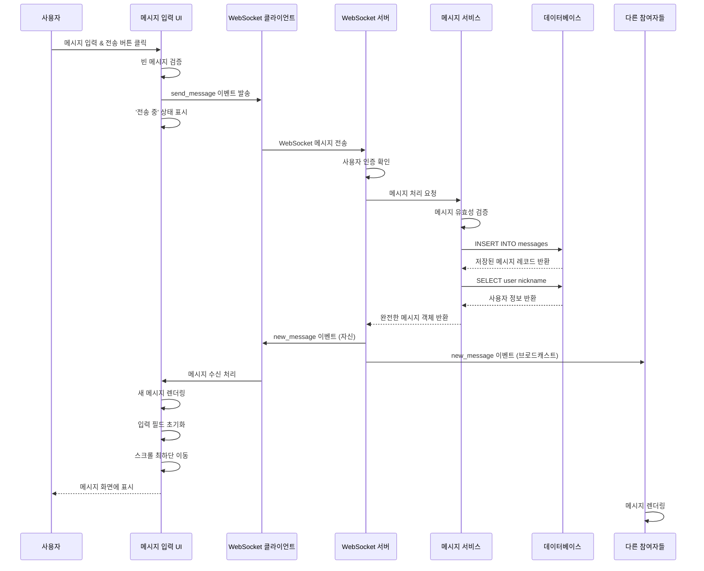

# 유스케이스 작성 문서

## 유스케이스 ID: UC-005

### 제목
채팅방에서 메시지 전송하기 (Send a Message in Chat Room)

---

## 1. 개요

### 1.1 목적
채팅방에 입장한 사용자가 텍스트 또는 이모지 형태의 메시지를 작성하여 실시간으로 전송하고, 같은 채팅방에 있는 모든 사용자들이 즉시 해당 메시지를 확인할 수 있도록 하는 기능입니다. 이를 통해 실시간 커뮤니케이션 환경을 제공하며, 사용자 간 원활한 정보 교환을 가능하게 합니다.

### 1.2 범위
이 유스케이스는 다음을 포함합니다:
- 채팅방 내에서 텍스트/이모지 메시지 입력 및 전송
- WebSocket을 통한 실시간 메시지 전달
- 메시지 데이터베이스 저장
- 채팅방 전체 사용자에게 메시지 Broadcast
- 메시지 전송 실패 시 사용자 피드백 제공

이 유스케이스는 다음을 제외합니다:
- 파일 또는 이미지 업로드 기능
- 메시지 수정 및 삭제 기능
- 메시지 답장(Reply) 기능 (별도 UC-006에서 다룸)
- 메시지 반응(Reaction) 기능 (별도 UC-007에서 다룸)

### 1.3 액터
- **주요 액터**: 로그인된 사용자 (채팅방 참여자)
- **부 액터**:
  - WebSocket 서버 (실시간 메시지 처리)
  - 데이터베이스 시스템 (메시지 영구 저장)
  - 같은 채팅방의 다른 참여자들 (메시지 수신자)

---

## 2. 선행 조건

이 유스케이스를 실행하기 위해 다음 조건들이 반드시 충족되어야 합니다:

- 사용자가 로그인 상태여야 함 (유효한 세션 토큰 보유)
- 사용자가 특정 채팅방에 입장한 상태여야 함 (UC-004 완료)
- 채팅방이 데이터베이스에 존재하고 유효한 상태여야 함
- 클라이언트와 WebSocket 서버 간 연결이 정상적으로 수립되어 있어야 함
- 사용자가 해당 채팅방에 메시지를 전송할 권한이 있어야 함

---

## 3. 참여 컴포넌트

### 3.1 클라이언트 레이어
- **메시지 입력 컴포넌트**: 사용자 입력을 수집하고 유효성 검증
- **채팅 UI 컴포넌트**: 메시지 전송 상태 표시 및 결과 렌더링
- **WebSocket 클라이언트**: 서버와의 실시간 양방향 통신 담당

### 3.2 서버 레이어
- **WebSocket 서버**: 실시간 메시지 수신, 검증, 브로드캐스팅
- **메시지 서비스 (Message Service)**: 비즈니스 로직 처리
- **데이터베이스 접근 계층**: messages 테이블 CRUD 작업

### 3.3 데이터 레이어
- **messages 테이블**: 메시지 영구 저장
- **chat_rooms 테이블**: 채팅방 유효성 검증
- **users 테이블**: 사용자 정보 조회

---

## 4. 기본 플로우 (Basic Flow)

### 4.1 단계별 흐름

**1. [사용자]**: 메시지 입력 필드에 텍스트 또는 이모지 입력
   - **입력**: 메시지 내용 (텍스트 문자열)
   - **처리**: 클라이언트 측 실시간 입력 값 상태 관리
   - **출력**: 입력 필드에 입력값 표시

**2. [사용자]**: 메시지 전송 액션 수행
   - **입력**: '전송' 버튼 클릭 또는 `Enter` 키 입력
   - **처리**: 클라이언트 측 기본 유효성 검증 (빈 메시지 여부)
   - **출력**: 유효성 검증 통과 시 다음 단계 진행

**3. [WebSocket 클라이언트]**: 서버로 메시지 전송 이벤트 발송
   - **입력**:
     - `event_type`: "send_message"
     - `room_id`: 현재 채팅방 ID
     - `content`: 메시지 내용
     - `timestamp`: 클라이언트 타임스탬프
   - **처리**: WebSocket 연결을 통해 JSON 형태로 서버에 전송
   - **출력**: UI에 '전송 중' 상태 표시 (로딩 인디케이터)

**4. [WebSocket 서버]**: 메시지 수신 및 사용자 인증 확인
   - **입력**: WebSocket 메시지 페이로드
   - **처리**:
     - WebSocket 세션에서 사용자 정보 추출
     - 사용자의 로그인 상태 확인
     - 사용자가 해당 채팅방에 접근 권한이 있는지 확인
   - **출력**: 인증 성공 시 다음 단계 진행

**5. [메시지 서비스]**: 메시지 내용 유효성 검증
   - **입력**: 메시지 페이로드 (room_id, content, user_id)
   - **처리**:
     - `content`가 빈 문자열이 아닌지 확인
     - `content` 길이가 최대 허용 길이(예: 2000자) 이내인지 확인
     - `room_id`가 유효한 채팅방 ID인지 데이터베이스에서 확인
   - **출력**: 검증 결과 (통과/실패)

**6. [메시지 서비스]**: 메시지 데이터베이스 저장
   - **입력**: 검증된 메시지 데이터
   - **처리**: `messages` 테이블에 다음 레코드 INSERT
     ```sql
     INSERT INTO messages (room_id, user_id, content, created_at)
     VALUES ($1, $2, $3, NOW())
     RETURNING id, room_id, user_id, content, created_at;
     ```
   - **출력**: 저장된 메시지의 완전한 레코드 (ID 포함)

**7. [메시지 서비스]**: 사용자 정보와 메시지 데이터 결합
   - **입력**: 저장된 메시지 레코드, 사용자 ID
   - **처리**: `users` 테이블에서 사용자 닉네임 조회 및 데이터 결합
   - **출력**: 완전한 메시지 객체
     ```typescript
     {
       id: number,
       room_id: number,
       user: {
         id: number,
         nickname: string
       },
       content: string,
       created_at: string (ISO 8601),
       parent_message_id: null
     }
     ```

**8. [WebSocket 서버]**: 해당 채팅방의 모든 클라이언트에게 메시지 브로드캐스트
   - **입력**: 완전한 메시지 객체
   - **처리**:
     - 해당 `room_id`에 연결된 모든 WebSocket 세션 조회
     - 각 세션에 메시지 전송 이벤트 전달
   - **출력**: 모든 연결된 클라이언트에게 다음 이벤트 전송
     ```json
     {
       "event_type": "new_message",
       "data": { /* 메시지 객체 */ }
     }
     ```

**9. [WebSocket 클라이언트]**: 메시지 수신 및 UI 업데이트
   - **입력**: "new_message" 이벤트
   - **처리**:
     - 메시지 데이터를 클라이언트 상태에 추가
     - 채팅 화면에 새 메시지 렌더링
     - 자신이 보낸 메시지인 경우 입력 필드 초기화
     - 스크롤을 최하단으로 이동
   - **출력**: UI에 새 메시지 표시

**10. [채팅방 목록 업데이트]**: 최근 활동 시간 갱신
   - **입력**: 새 메시지 데이터
   - **처리**: 해당 채팅방의 `last_activity_at` 시간 업데이트 (옵션)
   - **출력**: 채팅방 목록에서 해당 방의 최근 활동 시간 갱신

### 4.2 시퀀스 다이어그램



---

## 5. 대안 플로우 (Alternative Flows)

### 5.1 대안 플로우 1: Enter 키로 메시지 전송

**시작 조건**: 기본 플로우의 2단계에서 분기

**단계**:
1. 사용자가 메시지 입력 필드에 포커스된 상태에서 `Enter` 키를 누름
2. Shift+Enter는 줄바꿈으로 처리하고, 단순 Enter는 전송으로 처리
3. 기본 플로우의 3단계로 진행

**결과**: 버튼 클릭과 동일하게 메시지 전송 처리

### 5.2 대안 플로우 2: 이모지만 포함된 메시지 전송

**시작 조건**: 기본 플로우의 1단계에서 분기

**단계**:
1. 사용자가 이모지 선택기를 통해 이모지 선택
2. 입력 필드에 이모지가 유니코드 문자열로 추가됨
3. 기본 플로우의 2단계로 진행

**결과**: 텍스트와 동일하게 처리되어 전송됨

### 5.3 대안 플로우 3: 메시지 전송 중 연결 복구

**시작 조건**: 기본 플로우의 3단계에서 WebSocket 연결 일시 끊김

**단계**:
1. WebSocket 클라이언트가 자동 재연결 시도
2. 재연결 성공 시, 대기 중이던 메시지를 재전송
3. 서버에서 정상적으로 메시지 처리

**결과**: 사용자는 약간의 지연 후 메시지 전송 완료 확인

---

## 6. 예외 플로우 (Exception Flows)

### 6.1 예외 상황 1: 빈 메시지 전송 시도

**발생 조건**:
- 기본 플로우의 2단계에서 사용자가 빈 문자열 또는 공백만 있는 메시지 전송 시도

**처리 방법**:
1. 클라이언트가 전송 버튼 클릭 시 즉시 검증
2. 빈 메시지인 경우 서버로 전송하지 않음
3. 사용자에게 아무 피드백 제공하지 않거나 전송 버튼 비활성화 유지

**에러 코드**: 해당 없음 (클라이언트 측에서 차단)

**사용자 메시지**: 없음 (전송 버튼이 비활성화 상태 유지)

---

### 6.2 예외 상황 2: 메시지 길이 초과

**발생 조건**:
- 기본 플로우의 5단계에서 메시지 내용이 최대 허용 길이(2000자)를 초과

**처리 방법**:
1. 서버가 유효성 검증 단계에서 길이 초과 감지
2. 메시지를 데이터베이스에 저장하지 않음
3. 전송한 클라이언트에게만 에러 응답 전송

**에러 코드**: `MESSAGE_TOO_LONG` (HTTP 상태 코드: 400 Bad Request)

**사용자 메시지**: "메시지가 너무 깁니다. 2000자 이내로 작성해주세요."

---

### 6.3 예외 상황 3: 존재하지 않는 채팅방에 메시지 전송

**발생 조건**:
- 기본 플로우의 5단계에서 `room_id`가 데이터베이스에 존재하지 않음

**처리 방법**:
1. 서버가 유효성 검증 시 채팅방 부재 감지
2. 메시지를 저장하지 않음
3. 사용자에게 에러 응답 전송 및 채팅방 목록으로 리디렉션

**에러 코드**: `ROOM_NOT_FOUND` (HTTP 상태 코드: 404 Not Found)

**사용자 메시지**: "채팅방을 찾을 수 없습니다. 목록으로 돌아갑니다."

---

### 6.4 예외 상황 4: 데이터베이스 저장 실패

**발생 조건**:
- 기본 플로우의 6단계에서 데이터베이스 연결 오류 또는 쿼리 실행 실패

**처리 방법**:
1. 메시지 서비스가 데이터베이스 에러 캐치
2. 에러를 로그에 기록
3. 전송한 사용자에게만 실패 피드백 전송
4. 다른 사용자들에게는 메시지를 브로드캐스트하지 않음

**에러 코드**: `DB_SAVE_FAILED` (HTTP 상태 코드: 500 Internal Server Error)

**사용자 메시지**: "메시지 전송에 실패했습니다. 잠시 후 다시 시도해주세요."

---

### 6.5 예외 상황 5: WebSocket 연결 끊김

**발생 조건**:
- 기본 플로우의 3단계에서 클라이언트와 서버 간 WebSocket 연결이 끊어진 상태

**처리 방법**:
1. 클라이언트가 전송 시도 시 연결 상태 확인
2. 연결이 끊어진 경우 메시지를 로컬 큐에 임시 저장
3. WebSocket 재연결 시도
4. 재연결 성공 시 큐에 있는 메시지 재전송
5. 재연결 실패 시 사용자에게 에러 피드백

**에러 코드**: `WEBSOCKET_DISCONNECTED` (클라이언트 측 에러)

**사용자 메시지**: "연결이 끊어졌습니다. 재연결을 시도 중입니다..."

**재연결 실패 시**: "서버와 연결할 수 없습니다. 인터넷 연결을 확인해주세요."

---

### 6.6 예외 상황 6: 권한 없는 사용자의 메시지 전송 시도

**발생 조건**:
- 기본 플로우의 4단계에서 사용자의 세션이 만료되었거나 권한이 없음

**처리 방법**:
1. 서버가 인증 검증 단계에서 권한 부족 감지
2. 메시지를 처리하지 않음
3. 클라이언트에게 인증 실패 응답 전송
4. 클라이언트를 로그인 페이지로 리디렉션

**에러 코드**: `UNAUTHORIZED` (HTTP 상태 코드: 401 Unauthorized)

**사용자 메시지**: "로그인이 필요합니다. 로그인 페이지로 이동합니다."

---

## 7. 후행 조건 (Post-conditions)

### 7.1 성공 시

**데이터베이스 변경**:
- `messages` 테이블에 새로운 레코드 1건 추가
  - `id`: 자동 생성된 고유 ID
  - `room_id`: 메시지가 전송된 채팅방 ID
  - `user_id`: 메시지를 보낸 사용자 ID
  - `content`: 메시지 내용
  - `parent_message_id`: NULL (일반 메시지)
  - `created_at`: 서버 타임스탬프

**시스템 상태**:
- 모든 채팅방 참여자의 클라이언트 상태에 새 메시지가 추가됨
- 메시지를 보낸 사용자의 입력 필드가 초기화됨
- 채팅 화면의 스크롤이 최하단으로 이동됨
- 채팅방 목록에서 해당 방의 최근 활동 시간이 갱신됨 (옵션)

**외부 시스템**:
- 해당 없음 (내부 시스템만 사용)

### 7.2 실패 시

**데이터 롤백**:
- 데이터베이스 저장이 실패한 경우, 해당 메시지는 데이터베이스에 저장되지 않음
- 트랜잭션이 자동으로 롤백되어 데이터 무결성 유지

**시스템 상태**:
- 메시지를 보낸 사용자에게만 에러 피드백 표시
- 다른 참여자들은 영향을 받지 않음
- 입력 필드는 초기화되지 않고 사용자가 작성한 내용 유지 (재전송 가능)
- WebSocket 연결 끊김의 경우, 재연결 시도 및 상태 표시

---

## 8. 비기능 요구사항

### 8.1 성능

**응답 시간**:
- 메시지 전송 버튼 클릭 후 UI에 메시지가 표시되기까지 **300ms 이내** (정상 네트워크 환경)
- 서버의 메시지 처리 시간: **100ms 이내**
- 데이터베이스 INSERT 작업: **50ms 이내**

**처리량**:
- 단일 채팅방에서 초당 **최대 100개의 메시지** 처리 가능
- WebSocket 서버가 동시에 **10,000개 이상의 활성 연결** 유지 가능
- 단일 사용자의 메시지 전송 제한: 초당 **최대 5개** (Rate Limiting)

**확장성**:
- 수평적 확장을 통해 WebSocket 서버 추가 가능
- Redis Pub/Sub을 활용한 다중 서버 간 메시지 브로드캐스트 지원 (향후 확장)

### 8.2 보안

**인증 및 권한**:
- 모든 WebSocket 연결은 유효한 세션 토큰 필요
- 메시지 전송 시 사용자가 해당 채팅방에 접근 권한이 있는지 확인
- 세션 만료 시 자동으로 연결 종료 및 재인증 요구

**데이터 보호**:
- WebSocket 연결은 **WSS (WebSocket Secure)** 프로토콜 사용
- 메시지 내용은 암호화되지 않지만 HTTPS/WSS를 통해 전송 중 보호
- XSS 방지를 위해 메시지 내용을 렌더링할 때 HTML 이스케이프 처리

**Rate Limiting**:
- 단일 사용자가 초당 5개 이상의 메시지 전송 시 일시적으로 차단
- 스팸 방지를 위한 동일 메시지 연속 전송 제한

### 8.3 가용성

**서비스 가동 시간**:
- WebSocket 서버 가동률: **99.9%** 이상
- 데이터베이스 가용성: **99.95%** 이상

**복구 시간**:
- WebSocket 연결 끊김 시 자동 재연결 시도: **3초 이내**
- 서버 장애 시 다른 서버로 자동 페일오버: **10초 이내**

**데이터 내구성**:
- 메시지는 데이터베이스에 영구 저장되며, 백업 주기: **일 1회**
- 데이터베이스 장애 시에도 메시지 손실 방지를 위한 복제 구성

---

## 9. UI/UX 요구사항

### 9.1 화면 구성

**메시지 입력 영역**:
- **위치**: 채팅방 화면 하단에 고정
- **구성 요소**:
  - 텍스트 입력 필드 (다중 라인 지원, 최대 5줄)
  - '전송' 버튼 (메시지가 비어있을 때 비활성화)
  - 이모지 선택기 버튼 (옵션)
  - 글자 수 카운터 (선택사항, 1800자 이상일 때 표시)

**메시지 표시 영역**:
- **위치**: 채팅방 화면 중앙, 스크롤 가능
- **구성 요소**:
  - 각 메시지 카드: 프로필 이미지(옵션), 닉네임, 메시지 내용, 타임스탬프
  - 자신이 보낸 메시지는 오른쪽 정렬, 다른 사용자는 왼쪽 정렬
  - 시간 구분선 (예: "오늘", "어제" 등)

**상태 인디케이터**:
- 메시지 전송 중: 입력 필드 옆에 스피너 표시
- 전송 실패: 메시지 옆에 빨간색 경고 아이콘 및 재전송 버튼
- WebSocket 연결 상태: 헤더에 연결 상태 표시 (연결됨/재연결 중)

### 9.2 사용자 경험

**입력 편의성**:
- Enter 키로 메시지 전송, Shift+Enter로 줄바꿈
- 메시지 전송 후 입력 필드 자동 포커스 유지
- 긴 메시지 작성 시 입력 필드가 최대 5줄까지 자동 확장

**실시간 피드백**:
- 메시지 전송 즉시 UI에 낙관적 업데이트 (Optimistic Update)
- 전송 완료 시 임시 메시지를 서버 응답으로 교체
- 전송 실패 시 임시 메시지를 에러 상태로 표시

**자동 스크롤**:
- 새 메시지 수신 시 사용자가 최하단에 있으면 자동 스크롤
- 사용자가 이전 메시지를 읽고 있을 때는 스크롤하지 않고 "새 메시지" 알림 표시

**접근성**:
- 키보드 네비게이션 지원 (Tab, Enter, Shift+Enter)
- 스크린 리더 지원 (ARIA 레이블 및 역할 지정)
- 고대비 모드에서도 메시지 구분 가능

**오류 처리**:
- 에러 메시지는 사용자 친화적이고 명확한 언어로 표시
- 재시도 가능한 에러의 경우 '재전송' 버튼 제공
- 네트워크 오류 시 로컬에 메시지 임시 저장 및 재연결 시 자동 전송

---

## 10. 테스트 시나리오

### 10.1 성공 케이스

| 테스트 케이스 ID | 입력값 | 기대 결과 |
|----------------|--------|----------|
| TC-005-01 | 일반 텍스트 메시지 "안녕하세요" 전송 | 모든 참여자에게 메시지 즉시 표시, DB에 저장 완료 |
| TC-005-02 | 이모지만 포함된 메시지 "😀👍" 전송 | 이모지가 정상적으로 표시되고 DB에 유니코드로 저장됨 |
| TC-005-03 | Enter 키로 메시지 전송 | 버튼 클릭과 동일하게 메시지 전송됨 |
| TC-005-04 | 1000자 길이의 긴 메시지 전송 | 메시지 전체가 정상적으로 표시되고 저장됨 |
| TC-005-05 | 동시에 여러 사용자가 메시지 전송 | 모든 메시지가 순서대로 표시되고 충돌 없음 |
| TC-005-06 | Shift+Enter로 줄바꿈 입력 | 메시지가 전송되지 않고 줄바꿈만 추가됨 |
| TC-005-07 | 메시지 전송 후 즉시 새 메시지 작성 | 입력 필드가 초기화되고 포커스 유지됨 |

### 10.2 실패 케이스

| 테스트 케이스 ID | 입력값 | 기대 결과 |
|----------------|--------|----------|
| TC-005-08 | 빈 메시지 (공백만 있는 문자열) 전송 | 전송 버튼 비활성화 상태 유지, 서버로 전송되지 않음 |
| TC-005-09 | 2001자 길이의 메시지 전송 | "메시지가 너무 깁니다" 에러 메시지 표시, DB 저장 안 됨 |
| TC-005-10 | 존재하지 않는 채팅방 ID로 메시지 전송 | "채팅방을 찾을 수 없습니다" 에러 표시, 목록으로 리디렉션 |
| TC-005-11 | WebSocket 연결 끊긴 상태에서 전송 | "연결이 끊어졌습니다" 메시지 표시, 재연결 시도 |
| TC-005-12 | 세션 만료 상태에서 메시지 전송 | "로그인이 필요합니다" 메시지 표시, 로그인 페이지로 리디렉션 |
| TC-005-13 | DB 저장 실패 시뮬레이션 | "전송에 실패했습니다" 에러 표시, 재전송 버튼 제공 |
| TC-005-14 | 초당 6개 이상의 메시지 연속 전송 (Rate Limit) | "너무 빠르게 메시지를 전송하고 있습니다" 경고 표시 |

---

## 11. WebSocket 이벤트 명세

### 11.1 클라이언트 → 서버 이벤트

**이벤트명**: `send_message`

**페이로드 구조**:
```typescript
{
  event_type: "send_message",
  data: {
    room_id: number,         // 채팅방 ID
    content: string,         // 메시지 내용 (1~2000자)
    timestamp: string        // 클라이언트 타임스탬프 (ISO 8601)
  }
}
```

**예시**:
```json
{
  "event_type": "send_message",
  "data": {
    "room_id": 42,
    "content": "안녕하세요! 반갑습니다 😊",
    "timestamp": "2025-10-18T14:32:15.123Z"
  }
}
```

### 11.2 서버 → 클라이언트 이벤트

**이벤트명**: `new_message`

**페이로드 구조**:
```typescript
{
  event_type: "new_message",
  data: {
    id: number,                   // 메시지 ID
    room_id: number,              // 채팅방 ID
    user: {
      id: number,                 // 사용자 ID
      nickname: string            // 사용자 닉네임
    },
    content: string,              // 메시지 내용
    parent_message_id: null,      // 일반 메시지는 null
    created_at: string            // 서버 타임스탬프 (ISO 8601)
  }
}
```

**예시**:
```json
{
  "event_type": "new_message",
  "data": {
    "id": 1523,
    "room_id": 42,
    "user": {
      "id": 7,
      "nickname": "홍길동"
    },
    "content": "안녕하세요! 반갑습니다 😊",
    "parent_message_id": null,
    "created_at": "2025-10-18T14:32:15.456Z"
  }
}
```

### 11.3 서버 → 클라이언트 에러 이벤트

**이벤트명**: `message_error`

**페이로드 구조**:
```typescript
{
  event_type: "message_error",
  data: {
    error_code: string,           // 에러 코드
    message: string,              // 사용자 친화적 에러 메시지
    retry_allowed: boolean,       // 재시도 가능 여부
    original_content?: string     // 전송 시도한 메시지 내용 (재전송용)
  }
}
```

**예시**:
```json
{
  "event_type": "message_error",
  "data": {
    "error_code": "MESSAGE_TOO_LONG",
    "message": "메시지가 너무 깁니다. 2000자 이내로 작성해주세요.",
    "retry_allowed": true,
    "original_content": "매우 긴 메시지 내용..."
  }
}
```

---

## 12. 실시간 통신 요구사항

### 12.1 WebSocket 연결 관리

**연결 수립**:
- 사용자가 채팅방 페이지에 진입하면 자동으로 WebSocket 연결 시도
- 연결 URL: `wss://api.superchat.com/ws?token={session_token}&room_id={room_id}`
- 핸드셰이크 시 세션 토큰을 통한 인증 수행

**연결 유지 (Keep-Alive)**:
- 서버와 클라이언트 간 **30초마다** ping/pong 메시지 교환
- 60초 동안 응답이 없으면 연결 끊김으로 간주

**재연결 정책**:
- 연결 끊김 감지 시 즉시 재연결 시도
- 재연결 시도 간격: 1초, 2초, 4초, 8초 (최대 8초로 제한, Exponential Backoff)
- 최대 재연결 시도 횟수: **10회**
- 10회 실패 시 사용자에게 수동 새로고침 안내

### 12.2 메시지 순서 보장

**타임스탬프 기준 정렬**:
- 모든 메시지는 서버 타임스탬프(`created_at`) 기준으로 정렬
- 클라이언트는 수신한 메시지를 타임스탬프 순서대로 삽입

**동시성 제어**:
- 여러 사용자가 동시에 메시지를 전송해도 서버에서 순차적으로 처리
- 데이터베이스 트랜잭션을 통해 메시지 순서 무결성 보장

### 12.3 Optimistic Update (낙관적 업데이트)

**클라이언트 측 즉시 렌더링**:
- 사용자가 메시지 전송 시 서버 응답 전에 UI에 임시 메시지 표시
- 임시 메시지는 "전송 중" 상태로 표시 (흐리게 또는 스피너)

**서버 응답 후 교체**:
- 서버에서 `new_message` 이벤트 수신 시 임시 메시지를 실제 메시지로 교체
- 메시지 ID와 서버 타임스탬프를 업데이트

**실패 시 처리**:
- 서버에서 에러 응답 수신 시 임시 메시지를 에러 상태로 변경
- 사용자에게 재전송 옵션 제공

### 12.4 오프라인 메시지 처리 (선택사항)

**메시지 큐잉**:
- WebSocket 연결이 끊긴 상태에서 사용자가 메시지 전송 시 로컬 큐에 저장
- 재연결 성공 시 큐에 저장된 메시지를 순서대로 서버에 전송

**로컬 저장소**:
- IndexedDB 또는 localStorage를 활용한 메시지 임시 저장
- 브라우저 종료 후에도 큐에 있는 메시지 유지 (24시간 이내)

---

## 13. 관련 유스케이스

### 13.1 선행 유스케이스
- **UC-002**: 사용자 로그인 - 메시지 전송을 위해서는 로그인 상태 필요
- **UC-004**: 기존 채팅방 입장 - 특정 채팅방에 입장해야 메시지 전송 가능

### 13.2 후행 유스케이스
- **UC-006**: 메시지에 답장하기 - 메시지 전송 후 다른 사용자가 답장 가능
- **UC-007**: 메시지에 반응하기 - 메시지 전송 후 다른 사용자가 반응(좋아요) 가능

### 13.3 연관 유스케이스
- **UC-003**: 새로운 채팅방 생성 - 채팅방 생성 후 메시지 전송 시작
- **UC-008**: 닉네임 변경 - 닉네임 변경 후 전송된 메시지에 새 닉네임 표시

---

## 14. 변경 이력

| 버전 | 날짜 | 작성자 | 변경 내용 |
|------|------|--------|-----------|
| 1.0  | 2025-10-18 | Claude | 초기 작성 - 메시지 전송 기능 유스케이스 정의 |

---

## 부록

### A. 용어 정의

- **WebSocket**: 클라이언트와 서버 간 양방향 실시간 통신을 지원하는 프로토콜
- **Broadcast**: 하나의 메시지를 여러 수신자에게 동시에 전송하는 방식
- **Optimistic Update**: 서버 응답을 기다리지 않고 UI를 먼저 업데이트하는 기법
- **Rate Limiting**: 일정 시간 내 요청 횟수를 제한하는 보안 기법
- **Session Token**: 사용자 인증 상태를 유지하기 위한 토큰
- **Exponential Backoff**: 재시도 간격을 지수적으로 증가시키는 재시도 전략

### B. 참고 자료

- **프로젝트 문서**:
  - `docs/prd.md`: SuperChat 서비스 제품 요구사항 문서
  - `docs/userflow.md`: 전체 유저 플로우 정의
  - `docs/database.md`: 데이터베이스 스키마 및 데이터 플로우

- **기술 문서**:
  - WebSocket API 명세: [MDN WebSocket](https://developer.mozilla.org/en-US/docs/Web/API/WebSocket)
  - Supabase Realtime 문서: [Supabase Realtime](https://supabase.com/docs/guides/realtime)
  - Next.js API Routes: [Next.js API Routes](https://nextjs.org/docs/api-routes/introduction)

- **디자인 참고**:
  - 메시지 UI 디자인: `/figma/chat-room-wireframe` (내부 문서)
  - 에러 핸들링 가이드: `/docs/error-handling-guide.md` (내부 문서)
