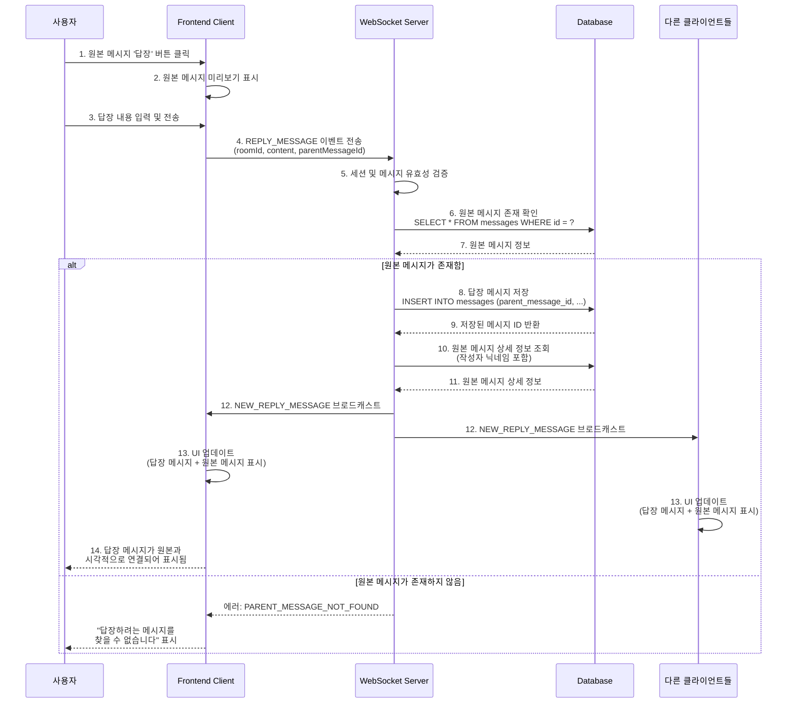

# 유스케이스: 메시지에 답장하기 (Reply to a Message)

## 유스케이스 ID: UC-006

### 제목
채팅방 내에서 특정 메시지를 선택하여 답장 메시지를 작성하고 전송하는 기능

---

## 1. 개요

### 1.1 목적
사용자가 대화의 맥락을 명확히 유지하면서 특정 메시지에 대한 응답을 작성할 수 있도록 하여, 복잡한 대화 흐름에서도 원활한 커뮤니케이션을 지원합니다. 이를 통해 사용자 경험을 향상시키고 대화의 연속성을 강화합니다.

### 1.2 범위
- **포함 사항**:
  - 특정 메시지 선택을 통한 답장 기능
  - 답장 메시지와 원본 메시지 간의 시각적 연결
  - 원본 메시지 유효성 검증
  - 실시간 답장 메시지 전파
  - 답장 메시지의 영구 저장

- **제외 사항**:
  - 답장에 대한 답장(Nested Reply)은 현재 버전에서 지원하지 않음
  - 답장 메시지 편집 또는 삭제 기능
  - 특정 사용자에게만 답장 메시지를 보이게 하는 Private Reply 기능

### 1.3 액터
- **주요 액터**: 로그인된 사용자 (채팅방에 입장한 상태)
- **부 액터**:
  - WebSocket 서버 (메시지 처리 및 전파)
  - 데이터베이스 (메시지 저장 및 조회)
  - 채팅방의 다른 참여자들 (답장 메시지 수신)

---

## 2. 선행 조건

- 사용자가 로그인되어 있어야 함
- 사용자가 특정 채팅방에 입장한 상태여야 함
- WebSocket 연결이 활성화되어 있어야 함
- 답장하려는 원본 메시지가 데이터베이스에 존재해야 함
- 사용자의 세션이 유효해야 함
- 채팅방이 활성 상태여야 함

---

## 3. 참여 컴포넌트

- **Frontend (React Client)**:
  - 역할: 답장 UI 제공, 사용자 입력 수집, WebSocket 메시지 전송, 답장 메시지 시각화

- **WebSocket Server**:
  - 역할: 답장 메시지 수신, 유효성 검증, 데이터베이스 저장 조율, 실시간 메시지 브로드캐스트

- **Database (Supabase PostgreSQL)**:
  - 역할: 답장 메시지 영구 저장, 원본 메시지 유효성 확인, parent_message_id 관계 관리

- **Authentication Service**:
  - 역할: 사용자 세션 검증, 권한 확인

---

## 4. 기본 플로우 (Basic Flow)

### 4.1 단계별 흐름

1. **[사용자]**: 원본 메시지 선택
   - **입력**: 채팅방 UI에서 특정 메시지의 '답장' 버튼/옵션 클릭
   - **처리**: 클라이언트가 선택된 메시지의 ID와 내용을 UI 상태에 저장
   - **출력**: 메시지 입력 필드 상단에 원본 메시지 미리보기 표시

2. **[사용자]**: 답장 내용 입력
   - **입력**: 메시지 입력 필드에 답장 텍스트 또는 이모지 입력
   - **처리**: 입력 필드에 실시간으로 텍스트가 표시됨
   - **출력**: 입력된 내용이 화면에 표시되며, 전송 버튼이 활성화됨

3. **[사용자]**: 답장 메시지 전송
   - **입력**: '전송' 버튼 클릭 또는 Enter 키 입력
   - **처리**: 클라이언트가 WebSocket을 통해 다음 데이터를 서버로 전송
     ```json
     {
       "type": "REPLY_MESSAGE",
       "payload": {
         "roomId": "<채팅방_ID>",
         "content": "<답장_내용>",
         "parentMessageId": "<원본_메시지_ID>",
         "userId": "<사용자_ID>",
         "timestamp": "<전송_시각>"
       }
     }
     ```
   - **출력**: 메시지 입력 필드 초기화, 원본 메시지 미리보기 제거

4. **[WebSocket Server]**: 메시지 수신 및 검증
   - **입력**: 클라이언트로부터 답장 메시지 데이터 수신
   - **처리**:
     - 사용자 세션 유효성 검증 (토큰 확인)
     - 채팅방 접근 권한 확인
     - 메시지 내용 검증 (빈 메시지, 최대 길이 확인)
     - `parentMessageId` 필수 필드 존재 확인
   - **출력**: 검증 결과 (성공/실패)

5. **[WebSocket Server]**: 원본 메시지 유효성 확인
   - **입력**: `parentMessageId`
   - **처리**: 데이터베이스에 다음 쿼리 실행
     ```sql
     SELECT id FROM messages
     WHERE id = <parentMessageId>
       AND room_id = <roomId>
     LIMIT 1;
     ```
   - **출력**: 원본 메시지 존재 여부

6. **[Database]**: 답장 메시지 저장
   - **입력**: 검증된 답장 메시지 데이터
   - **처리**: `messages` 테이블에 새 레코드 삽입
     ```sql
     INSERT INTO messages (
       room_id,
       user_id,
       content,
       parent_message_id,
       created_at
     ) VALUES (
       <roomId>,
       <userId>,
       <content>,
       <parentMessageId>,
       NOW()
     ) RETURNING id, created_at;
     ```
   - **출력**: 생성된 메시지 ID와 타임스탬프

7. **[WebSocket Server]**: 원본 메시지 정보 조회
   - **입력**: `parentMessageId`
   - **처리**: 원본 메시지의 상세 정보를 데이터베이스에서 조회
     ```sql
     SELECT m.id, m.content, m.user_id, u.nickname, m.created_at
     FROM messages m
     JOIN users u ON m.user_id = u.id
     WHERE m.id = <parentMessageId>;
     ```
   - **출력**: 원본 메시지 정보 (ID, 내용, 작성자 닉네임 등)

8. **[WebSocket Server]**: 메시지 브로드캐스트
   - **입력**: 저장된 답장 메시지 + 원본 메시지 정보
   - **처리**: 해당 채팅방의 모든 연결된 클라이언트에게 전송
     ```json
     {
       "type": "NEW_REPLY_MESSAGE",
       "payload": {
         "messageId": "<새_메시지_ID>",
         "roomId": "<채팅방_ID>",
         "userId": "<사용자_ID>",
         "userNickname": "<사용자_닉네임>",
         "content": "<답장_내용>",
         "createdAt": "<생성_시각>",
         "parentMessage": {
           "id": "<원본_메시지_ID>",
           "content": "<원본_내용>",
           "userNickname": "<원본_작성자_닉네임>",
           "createdAt": "<원본_생성_시각>"
         }
       }
     }
     ```
   - **출력**: 모든 클라이언트가 메시지 수신

9. **[Frontend (All Clients)]**: UI 업데이트
   - **입력**: 서버로부터 수신한 답장 메시지 데이터
   - **처리**:
     - 답장 메시지를 채팅 메시지 리스트에 추가
     - 원본 메시지와 시각적 연결 표시 (인용 스타일, 연결선 등)
     - 채팅 스크롤을 최신 메시지로 이동
   - **출력**: 모든 사용자의 화면에 답장 메시지가 원본 메시지와 연결되어 표시됨

### 4.2 시퀀스 다이어그램



---

## 5. 대안 플로우 (Alternative Flows)

### 5.1 대안 플로우 1: 원본 메시지가 이미 삭제된 경우

**시작 조건**: 사용자가 답장하려는 메시지가 UI에는 표시되어 있지만 데이터베이스에서 이미 삭제된 경우

**단계**:
1. 사용자가 원본 메시지에 답장을 시도함
2. WebSocket 서버가 원본 메시지 유효성 확인 시 해당 메시지를 찾지 못함
3. 서버가 `PARENT_MESSAGE_NOT_FOUND` 에러를 반환
4. 클라이언트가 사용자에게 에러 메시지를 표시
5. 클라이언트가 UI를 새로고침하여 삭제된 메시지를 제거

**결과**: 답장 메시지가 전송되지 않으며, 사용자는 해당 메시지가 더 이상 존재하지 않음을 인지함

### 5.2 대안 플로우 2: 네트워크 연결이 불안정한 경우

**시작 조건**: 사용자가 답장 메시지를 전송하는 순간 WebSocket 연결이 끊어짐

**단계**:
1. 사용자가 답장 메시지를 전송함
2. 클라이언트가 WebSocket 전송 시도 중 연결 끊김을 감지
3. 클라이언트가 메시지를 로컬 큐에 임시 저장
4. 클라이언트가 재연결을 시도함
5. 재연결 성공 시, 큐에 저장된 메시지를 다시 전송함
6. 재연결 실패 시, 사용자에게 연결 오류를 표시하고 수동 재전송 옵션을 제공함

**결과**: 네트워크가 복구되면 메시지가 정상적으로 전송되거나, 사용자가 수동으로 재전송을 시도할 수 있음

### 5.3 대안 플로우 3: 다른 채팅방의 메시지에 답장하려는 경우

**시작 조건**: 사용자가 여러 채팅방을 열어두고 있으며, 잘못된 채팅방에서 다른 채팅방의 메시지에 답장하려는 시도

**단계**:
1. 사용자가 채팅방 A에서 채팅방 B의 메시지 ID를 가진 답장을 시도함
2. WebSocket 서버가 원본 메시지 유효성 확인 시 `room_id`도 함께 검증함
3. `parentMessageId`는 존재하지만 `room_id`가 일치하지 않음을 감지
4. 서버가 `INVALID_PARENT_MESSAGE` 에러를 반환

**결과**: 답장이 전송되지 않으며, 사용자에게 에러 메시지가 표시됨

---

## 6. 예외 플로우 (Exception Flows)

### 6.1 예외 상황 1: 원본 메시지가 존재하지 않음

**발생 조건**:
- `parentMessageId`에 해당하는 메시지가 데이터베이스에 존재하지 않음
- 원본 메시지가 삭제되었거나 잘못된 ID가 전송된 경우

**처리 방법**:
1. WebSocket 서버가 원본 메시지 존재 여부 확인 실패
2. 메시지 저장을 중단하고 에러 응답 생성
3. 요청한 클라이언트에게만 에러 메시지 전송
4. 클라이언트가 사용자에게 친화적인 에러 메시지 표시

**에러 코드**: `PARENT_MESSAGE_NOT_FOUND` (WebSocket 에러)

**사용자 메시지**: "답장하려는 메시지를 찾을 수 없습니다. 페이지를 새로고침해주세요."

**로그 기록**:
```
ERROR: Parent message not found
- User ID: <userId>
- Room ID: <roomId>
- Parent Message ID: <parentMessageId>
- Timestamp: <timestamp>
```

### 6.2 예외 상황 2: 메시지 내용이 비어있음

**발생 조건**:
- 사용자가 답장 내용을 입력하지 않고 전송 버튼을 클릭
- 클라이언트 측 검증을 우회한 경우

**처리 방법**:
1. WebSocket 서버가 메시지 내용 검증 단계에서 빈 문자열 감지
2. 메시지 저장을 중단하고 에러 응답 생성
3. 클라이언트에게 유효성 검증 에러 전송

**에러 코드**: `EMPTY_MESSAGE_CONTENT` (WebSocket 에러)

**사용자 메시지**: "메시지 내용을 입력해주세요."

### 6.3 예외 상황 3: 메시지 내용이 최대 길이를 초과함

**발생 조건**:
- 메시지 내용이 허용된 최대 길이(예: 5000자)를 초과

**처리 방법**:
1. WebSocket 서버가 메시지 내용의 길이를 확인
2. 최대 길이 초과 시 메시지 저장을 중단
3. 클라이언트에게 길이 제한 에러 전송

**에러 코드**: `MESSAGE_TOO_LONG` (WebSocket 에러)

**사용자 메시지**: "메시지가 너무 깁니다. 5000자 이내로 입력해주세요."

### 6.4 예외 상황 4: 데이터베이스 저장 실패

**발생 조건**:
- 데이터베이스 연결 오류
- 트랜잭션 충돌
- 디스크 용량 부족 등

**처리 방법**:
1. WebSocket 서버가 데이터베이스 INSERT 쿼리 실행 중 예외 발생 감지
2. 트랜잭션 롤백 수행
3. 에러 로그 기록 (상세 에러 정보 포함)
4. 클라이언트에게 일반적인 서버 에러 메시지 전송
5. 필요 시 재시도 로직 수행

**에러 코드**: `DATABASE_ERROR` (WebSocket 에러)

**사용자 메시지**: "메시지 전송에 실패했습니다. 잠시 후 다시 시도해주세요."

**로그 기록**:
```
ERROR: Database insertion failed for reply message
- User ID: <userId>
- Room ID: <roomId>
- Parent Message ID: <parentMessageId>
- Error: <detailedError>
- Timestamp: <timestamp>
```

### 6.5 예외 상황 5: 사용자 권한 부족

**발생 조건**:
- 사용자 세션이 만료됨
- 사용자가 채팅방에 대한 접근 권한이 없음
- 인증 토큰이 유효하지 않음

**처리 방법**:
1. WebSocket 서버가 세션 검증 단계에서 권한 부족 감지
2. 메시지 처리를 즉시 중단
3. 클라이언트에게 인증 에러 전송
4. 클라이언트가 사용자를 로그인 페이지로 리다이렉트하거나 재인증 요청

**에러 코드**: `UNAUTHORIZED` (WebSocket 에러)

**사용자 메시지**: "세션이 만료되었습니다. 다시 로그인해주세요."

### 6.6 예외 상황 6: WebSocket 연결 끊김

**발생 조건**:
- 네트워크 불안정
- 서버 재시작
- 클라이언트 측 연결 타임아웃

**처리 방법**:
1. 클라이언트가 WebSocket 연결 끊김 이벤트를 감지
2. 전송 중이던 메시지를 로컬 스토리지 또는 메모리에 임시 저장
3. 자동 재연결 시도 (exponential backoff 방식)
4. 재연결 성공 시 저장된 메시지를 재전송
5. 사용자에게 연결 상태 피드백 제공

**에러 코드**: `CONNECTION_LOST` (클라이언트 측 에러)

**사용자 메시지**: "연결이 끊어졌습니다. 재연결 중..."

---

## 7. 후행 조건 (Post-conditions)

### 7.1 성공 시

**데이터베이스 변경**:
- `messages` 테이블에 새로운 레코드가 생성됨
  - `id`: 자동 생성된 고유 ID
  - `room_id`: 해당 채팅방 ID
  - `user_id`: 답장을 작성한 사용자 ID
  - `content`: 답장 메시지 내용
  - `parent_message_id`: 원본 메시지 ID (NOT NULL)
  - `created_at`: 메시지 생성 타임스탬프
  - `updated_at`: 메시지 생성 타임스탬프 (최초 생성 시 created_at과 동일)

**시스템 상태**:
- 채팅방의 모든 연결된 클라이언트가 새로운 답장 메시지를 수신한 상태
- 메시지 전송자의 입력 필드가 초기화된 상태
- 모든 클라이언트의 UI에 답장 메시지가 원본 메시지와 시각적으로 연결되어 표시된 상태
- 채팅방의 "최근 활동 시간"이 업데이트될 수 있음

**외부 시스템**:
- WebSocket 서버의 해당 채팅방 채널에 답장 메시지가 브로드캐스트됨
- 필요 시 푸시 알림 서비스에 답장 이벤트가 전달될 수 있음

### 7.2 실패 시

**데이터 롤백**:
- 데이터베이스에 어떠한 변경도 발생하지 않음
- 원본 메시지 존재 확인 실패 시 INSERT 쿼리가 실행되지 않음
- 트랜잭션 오류 발생 시 자동 롤백

**시스템 상태**:
- 메시지 전송자의 입력 필드에 작성하던 내용이 유지됨 (재시도 가능)
- 다른 클라이언트들은 어떠한 영향도 받지 않음
- 에러 메시지가 해당 사용자에게만 표시됨
- WebSocket 연결이 유지되며, 재시도 가능한 상태

**에러 로그**:
- 서버 로그에 에러 원인, 사용자 정보, 타임스탬프가 기록됨
- 필요 시 모니터링 시스템에 알림 전송

---

## 8. 비기능 요구사항

### 8.1 성능

**응답 시간**:
- 메시지 전송부터 모든 클라이언트에 브로드캐스트까지: 평균 200ms 이하
- 원본 메시지 유효성 확인 쿼리: 50ms 이하
- 데이터베이스 INSERT 작업: 100ms 이하

**처리량**:
- 단일 채팅방에서 초당 100개의 답장 메시지 처리 가능
- 전체 시스템에서 초당 1000개의 답장 메시지 처리 가능

**확장성**:
- 동시 접속자 수가 증가해도 응답 시간이 선형적으로 증가하지 않아야 함
- 수평적 확장이 가능한 아키텍처

### 8.2 보안

**인증**:
- 모든 WebSocket 메시지는 유효한 세션 토큰을 포함해야 함
- 토큰 검증 실패 시 메시지 처리를 즉시 중단

**권한**:
- 사용자가 해당 채팅방에 접근 권한이 있는지 확인
- 원본 메시지가 동일한 채팅방에 속하는지 검증

**데이터 보호**:
- 메시지 내용은 전송 중 암호화됨 (WSS 프로토콜 사용)
- 민감한 정보(비밀번호 등)가 메시지에 포함되지 않도록 클라이언트 측 필터링

**입력 검증**:
- SQL Injection 방지를 위한 Prepared Statement 사용
- XSS 방지를 위한 메시지 내용 이스케이핑
- 메시지 길이 제한 검증

### 8.3 가용성

**시스템 가동 시간**:
- 99.9% 이상의 가동률 목표 (월 43분 이하의 다운타임)

**복구 시간**:
- WebSocket 서버 장애 시 자동 페일오버: 10초 이내
- 데이터베이스 장애 시 복구: 5분 이내

**데이터 내구성**:
- 메시지 저장 후 데이터 손실 확률: 0.001% 미만
- 데이터베이스 정기 백업 (일일 1회 이상)

**오류 처리**:
- 일시적인 오류 발생 시 자동 재시도 (최대 3회)
- 재시도 실패 시 사용자에게 명확한 에러 메시지 제공

---

## 9. UI/UX 요구사항

### 9.1 화면 구성

**답장 시작 UI**:
- 각 메시지에 '답장' 버튼 또는 아이콘 표시
  - 위치: 메시지 호버 시 또는 메시지 옵션 메뉴 내
  - 아이콘: 회신 화살표 (reply arrow) 또는 텍스트 "답장"
  - 크기: 터치하기 쉬운 최소 44x44px 크기

**답장 작성 중 UI**:
- 메시지 입력 필드 상단에 원본 메시지 미리보기 표시
  - 내용: 원본 메시지 작성자 닉네임 + 메시지 내용 일부 (100자 이내)
  - 배경색: 연한 회색 또는 브랜드 컬러의 연한 버전
  - 닫기 버튼: 답장 취소를 위한 'X' 버튼
  - 예시:
    ```
    ┌─────────────────────────────────────┐
    │ 답장 대상: @홍길동                     │
    │ "안녕하세요. 오늘 회의 시간이..."      │  [X]
    └─────────────────────────────────────┘
    [메시지를 입력하세요...]
    ```

**답장 메시지 표시 UI**:
- 답장 메시지와 원본 메시지의 시각적 연결
  - 방법 1 (인용 스타일): 답장 메시지 내부에 원본 메시지를 축약하여 인용 형태로 표시
    ```
    ┌─────────────────────────────────────┐
    │ 홍길동                               │
    │ ┌─────────────────────────────────┐ │
    │ │ @김철수: "회의 시간이..."        │ │
    │ └─────────────────────────────────┘ │
    │ 오후 3시로 변경되었습니다.          │
    │                          14:32      │
    └─────────────────────────────────────┘
    ```

  - 방법 2 (연결선 스타일): 원본 메시지와 답장 메시지 사이에 시각적 연결선 표시
    ```
    ┌─────────────────────────────────────┐
    │ 김철수                              │
    │ 회의 시간이 언제인가요?             │
    │                          14:30      │
    └─────────────────────────────────────┘
         │ (연결선)
         ↓
    ┌─────────────────────────────────────┐
    │ 홍길동                              │
    │ 오후 3시로 변경되었습니다.          │
    │                          14:32      │
    └─────────────────────────────────────┘
    ```

**원본 메시지로 이동**:
- 답장 메시지의 원본 메시지 미리보기를 클릭하면 스크롤이 원본 메시지로 이동
- 원본 메시지가 화면에 강조 표시됨 (하이라이트 효과)

### 9.2 사용자 경험

**즉각적인 피드백**:
- '전송' 버튼 클릭 시 즉시 메시지가 UI에 표시 (Optimistic Update)
- 서버 확인 전까지 '전송 중...' 상태 표시 (예: 메시지 옆 스피너)
- 서버 확인 후 '전송 완료' 상태로 변경 (예: 체크 표시)

**에러 처리**:
- 에러 발생 시 사용자가 작성한 내용이 사라지지 않음
- 명확한 에러 메시지와 함께 재시도 옵션 제공
- Toast 알림 또는 인라인 에러 메시지로 표시

**접근성**:
- 키보드만으로도 답장 기능 사용 가능
  - Tab 키로 '답장' 버튼 포커스
  - Enter 키로 답장 시작
  - Esc 키로 답장 취소
- 스크린 리더를 위한 적절한 ARIA 레이블 제공
  - "홍길동의 메시지에 답장하기"
  - "답장 작성 중: 홍길동의 '회의 시간이 언제인가요?'"

**모바일 최적화**:
- 터치 친화적인 버튼 크기 (최소 44x44px)
- 모바일 키보드 표시 시 원본 메시지 미리보기가 가려지지 않도록 레이아웃 조정
- 스와이프 제스처를 통한 답장 시작 옵션 제공

**성능 최적화**:
- 답장 메시지 로딩 시 레이아웃 시프트 최소화
- 이미지나 첨부 파일이 포함된 원본 메시지의 경우 썸네일만 표시

---

## 10. 테스트 시나리오

### 10.1 성공 케이스

| 테스트 케이스 ID | 입력값 | 기대 결과 |
|-----------------|--------|----------|
| TC-006-01 | 유효한 원본 메시지에 "동의합니다" 답장 전송 | 답장 메시지가 원본 메시지와 연결되어 모든 클라이언트에 표시됨 |
| TC-006-02 | 이모지만 포함된 답장 "👍" 전송 | 답장 메시지가 정상적으로 전송되고 표시됨 |
| TC-006-03 | 최대 길이(5000자)의 답장 메시지 전송 | 메시지가 정상적으로 저장되고 전송됨 |
| TC-006-04 | 여러 사용자가 동일한 원본 메시지에 동시 답장 | 모든 답장이 순서대로 저장되고 표시됨 |
| TC-006-05 | 원본 메시지 미리보기 클릭하여 원본 위치로 이동 | 스크롤이 원본 메시지로 이동하고 하이라이트됨 |
| TC-006-06 | 답장 작성 중 'X' 버튼으로 취소 | 답장 모드가 해제되고 일반 메시지 입력 모드로 전환됨 |
| TC-006-07 | 키보드 Enter 키로 답장 전송 | 메시지가 정상적으로 전송됨 |

### 10.2 실패 케이스

| 테스트 케이스 ID | 입력값 | 기대 결과 |
|-----------------|--------|----------|
| TC-006-08 | 빈 내용으로 답장 전송 시도 | "메시지 내용을 입력해주세요" 에러 표시 |
| TC-006-09 | 5001자 이상의 답장 메시지 전송 | "메시지가 너무 깁니다" 에러 표시, 전송 차단 |
| TC-006-10 | 삭제된 원본 메시지에 답장 시도 | "원본 메시지를 찾을 수 없습니다" 에러 표시 |
| TC-006-11 | 잘못된 parentMessageId로 답장 시도 | "잘못된 요청입니다" 에러 표시, 메시지 저장 안됨 |
| TC-006-12 | 세션 만료 상태에서 답장 시도 | "세션이 만료되었습니다" 에러 표시, 로그인 페이지로 리다이렉트 |
| TC-006-13 | WebSocket 연결 끊긴 상태에서 답장 시도 | "연결이 끊어졌습니다. 재연결 중..." 표시, 재연결 후 자동 재전송 |
| TC-006-14 | 다른 채팅방의 메시지 ID로 답장 시도 | "잘못된 요청입니다" 에러 표시 |
| TC-006-15 | 데이터베이스 오류 발생 시 | "메시지 전송에 실패했습니다" 에러 표시, 재시도 옵션 제공 |

### 10.3 Edge Case 테스트

| 테스트 케이스 ID | 시나리오 | 기대 결과 |
|-----------------|---------|----------|
| TC-006-16 | 네트워크 지연으로 인한 타임아웃 | 타임아웃 에러 표시, 재전송 옵션 제공 |
| TC-006-17 | 여러 사용자가 동일 원본 메시지에 동시 답장 (동시성 테스트) | 모든 답장이 손실 없이 저장되고 전송됨, 순서는 서버 수신 순서대로 |
| TC-006-18 | 매우 오래된 메시지에 답장 (예: 1년 전 메시지) | 정상적으로 답장 가능, 성능 저하 없음 |
| TC-006-19 | 특수문자, HTML 태그가 포함된 답장 | 모든 특수문자가 이스케이핑되어 안전하게 표시됨 |
| TC-006-20 | 모바일 환경에서 키보드 표시 시 | 원본 메시지 미리보기가 가려지지 않음, 레이아웃 정상 작동 |

---

## 11. 데이터 모델

### 11.1 데이터베이스 스키마

**messages 테이블** (PostgreSQL):

```sql
CREATE TABLE messages (
    id SERIAL PRIMARY KEY,
    room_id INTEGER NOT NULL REFERENCES chat_rooms(id) ON DELETE CASCADE,
    user_id INTEGER NOT NULL REFERENCES users(id),
    content TEXT NOT NULL,
    parent_message_id INTEGER REFERENCES messages(id),  -- 답장 관계를 나타내는 자기 참조 외래 키
    created_at TIMESTAMP WITH TIME ZONE NOT NULL DEFAULT NOW(),
    updated_at TIMESTAMP WITH TIME ZONE NOT NULL DEFAULT NOW()
);

-- 답장 메시지 조회 성능을 위한 인덱스
CREATE INDEX idx_messages_parent_message_id ON messages (parent_message_id);

-- 채팅방별 메시지 조회 성능을 위한 인덱스 (기존)
CREATE INDEX idx_messages_room_id_created_at ON messages (room_id, created_at DESC);

COMMENT ON COLUMN messages.parent_message_id IS '답장한 원본 메시지의 ID. 일반 메시지는 NULL. 자기 참조 외래 키로 답장 관계를 나타냄.';
```

### 11.2 데이터 관계

**1. 일반 메시지 (Original Message)**:
```
messages
├─ id: 1
├─ room_id: 101
├─ user_id: 10
├─ content: "회의 시간이 언제인가요?"
├─ parent_message_id: NULL  ← 원본 메시지는 NULL
├─ created_at: 2025-10-17 14:30:00
└─ updated_at: 2025-10-17 14:30:00
```

**2. 답장 메시지 (Reply Message)**:
```
messages
├─ id: 2
├─ room_id: 101
├─ user_id: 20
├─ content: "오후 3시로 변경되었습니다."
├─ parent_message_id: 1  ← 원본 메시지 ID를 참조
├─ created_at: 2025-10-17 14:32:00
└─ updated_at: 2025-10-17 14:32:00
```

**3. 답장 체인 (Reply Chain)**:

현재 버전에서는 Nested Reply(답장에 대한 답장)를 지원하지 않으므로, `parent_message_id`는 항상 최상위 원본 메시지만 참조합니다.

```
원본 메시지 (id: 1, parent_message_id: NULL)
    ├─ 답장 1 (id: 2, parent_message_id: 1)
    ├─ 답장 2 (id: 3, parent_message_id: 1)
    └─ 답장 3 (id: 4, parent_message_id: 1)
```

### 11.3 데이터 무결성 제약

**외래 키 제약**:
- `parent_message_id`는 `messages.id`를 참조하는 자기 참조 외래 키
- 원본 메시지가 삭제될 경우의 동작은 비즈니스 요구사항에 따라 결정:
  - 옵션 1: `ON DELETE CASCADE` - 원본 메시지 삭제 시 모든 답장도 함께 삭제
  - 옵션 2: `ON DELETE SET NULL` - 원본 메시지 삭제 시 답장의 `parent_message_id`를 NULL로 설정
  - 현재 권장: `ON DELETE SET NULL` (답장 메시지는 유지하되, 원본 메시지 참조만 제거)

**비즈니스 로직 검증**:
- 답장 메시지(`parent_message_id`가 NOT NULL)의 `room_id`는 원본 메시지의 `room_id`와 동일해야 함
- 이 검증은 애플리케이션 레벨에서 수행됨 (WebSocket 서버의 유효성 검증 단계)

### 11.4 답장 메시지 조회 쿼리

**특정 메시지의 모든 답장 조회**:
```sql
SELECT m.id, m.content, m.user_id, u.nickname, m.created_at
FROM messages m
JOIN users u ON m.user_id = u.id
WHERE m.parent_message_id = <원본_메시지_ID>
ORDER BY m.created_at ASC;
```

**원본 메시지 정보와 함께 답장 조회** (JOIN 사용):
```sql
SELECT
    reply.id AS reply_id,
    reply.content AS reply_content,
    reply.user_id AS reply_user_id,
    reply_user.nickname AS reply_user_nickname,
    reply.created_at AS reply_created_at,
    parent.id AS parent_id,
    parent.content AS parent_content,
    parent.user_id AS parent_user_id,
    parent_user.nickname AS parent_user_nickname,
    parent.created_at AS parent_created_at
FROM messages reply
JOIN users reply_user ON reply.user_id = reply_user.id
LEFT JOIN messages parent ON reply.parent_message_id = parent.id
LEFT JOIN users parent_user ON parent.user_id = parent_user.id
WHERE reply.room_id = <채팅방_ID>
  AND reply.parent_message_id IS NOT NULL
ORDER BY reply.created_at DESC;
```

**채팅방의 모든 메시지 조회 (답장 정보 포함)**:
```sql
SELECT
    m.id,
    m.content,
    m.user_id,
    u.nickname,
    m.created_at,
    m.parent_message_id,
    parent.content AS parent_content,
    parent_user.nickname AS parent_user_nickname
FROM messages m
JOIN users u ON m.user_id = u.id
LEFT JOIN messages parent ON m.parent_message_id = parent.id
LEFT JOIN users parent_user ON parent.user_id = parent_user.id
WHERE m.room_id = <채팅방_ID>
ORDER BY m.created_at ASC;
```

---

## 12. WebSocket 이벤트 명세

### 12.1 클라이언트 → 서버 이벤트

**이벤트명**: `REPLY_MESSAGE`

**Payload 구조**:
```typescript
interface ReplyMessagePayload {
  roomId: string;           // 채팅방 ID (필수)
  content: string;          // 답장 메시지 내용 (필수, 1-5000자)
  parentMessageId: string;  // 원본 메시지 ID (필수)
  userId: string;           // 답장 작성자 ID (세션에서 추출, 필수)
  timestamp: string;        // 클라이언트 전송 시각 (ISO 8601 형식, 선택)
}
```

**전송 예시**:
```json
{
  "type": "REPLY_MESSAGE",
  "payload": {
    "roomId": "101",
    "content": "오후 3시로 변경되었습니다.",
    "parentMessageId": "1",
    "userId": "20",
    "timestamp": "2025-10-17T14:32:00Z"
  }
}
```

### 12.2 서버 → 클라이언트 이벤트

**이벤트명**: `NEW_REPLY_MESSAGE`

**Payload 구조**:
```typescript
interface NewReplyMessagePayload {
  messageId: string;         // 새로 생성된 답장 메시지 ID
  roomId: string;            // 채팅방 ID
  userId: string;            // 답장 작성자 ID
  userNickname: string;      // 답장 작성자 닉네임
  content: string;           // 답장 메시지 내용
  createdAt: string;         // 서버에서 생성된 타임스탬프 (ISO 8601)
  parentMessage: {           // 원본 메시지 정보
    id: string;              // 원본 메시지 ID
    content: string;         // 원본 메시지 내용
    userNickname: string;    // 원본 메시지 작성자 닉네임
    createdAt: string;       // 원본 메시지 생성 타임스탬프
  };
}
```

**브로드캐스트 예시**:
```json
{
  "type": "NEW_REPLY_MESSAGE",
  "payload": {
    "messageId": "2",
    "roomId": "101",
    "userId": "20",
    "userNickname": "홍길동",
    "content": "오후 3시로 변경되었습니다.",
    "createdAt": "2025-10-17T14:32:15Z",
    "parentMessage": {
      "id": "1",
      "content": "회의 시간이 언제인가요?",
      "userNickname": "김철수",
      "createdAt": "2025-10-17T14:30:00Z"
    }
  }
}
```

### 12.3 에러 이벤트

**이벤트명**: `MESSAGE_ERROR`

**Payload 구조**:
```typescript
interface MessageErrorPayload {
  errorCode: string;        // 에러 코드
  errorMessage: string;     // 사용자 친화적인 에러 메시지
  details?: string;         // 추가 에러 상세 정보 (선택)
  originalPayload?: any;    // 원래 요청 페이로드 (디버깅용, 선택)
}
```

**에러 코드 목록**:
- `PARENT_MESSAGE_NOT_FOUND`: 원본 메시지를 찾을 수 없음
- `EMPTY_MESSAGE_CONTENT`: 메시지 내용이 비어있음
- `MESSAGE_TOO_LONG`: 메시지 내용이 최대 길이를 초과함
- `INVALID_PARENT_MESSAGE`: 유효하지 않은 원본 메시지 (다른 채팅방 등)
- `DATABASE_ERROR`: 데이터베이스 저장 실패
- `UNAUTHORIZED`: 인증 실패 또는 권한 부족
- `VALIDATION_ERROR`: 일반적인 유효성 검증 오류

**에러 응답 예시**:
```json
{
  "type": "MESSAGE_ERROR",
  "payload": {
    "errorCode": "PARENT_MESSAGE_NOT_FOUND",
    "errorMessage": "답장하려는 메시지를 찾을 수 없습니다. 페이지를 새로고침해주세요.",
    "details": "Parent message ID 999 does not exist in room 101",
    "originalPayload": {
      "roomId": "101",
      "content": "답장 내용",
      "parentMessageId": "999"
    }
  }
}
```

### 12.4 재연결 시 동기화 이벤트

**이벤트명**: `SYNC_MESSAGES_REQUEST` (클라이언트 → 서버)

WebSocket 재연결 후 누락된 메시지를 동기화하기 위한 요청:

```json
{
  "type": "SYNC_MESSAGES_REQUEST",
  "payload": {
    "roomId": "101",
    "lastReceivedMessageId": "150"  // 클라이언트가 마지막으로 수신한 메시지 ID
  }
}
```

**이벤트명**: `SYNC_MESSAGES_RESPONSE` (서버 → 클라이언트)

```json
{
  "type": "SYNC_MESSAGES_RESPONSE",
  "payload": {
    "roomId": "101",
    "messages": [
      {
        "messageId": "151",
        "userId": "20",
        "userNickname": "홍길동",
        "content": "답장 내용",
        "parentMessageId": "1",
        "createdAt": "2025-10-17T14:35:00Z"
      },
      // ... 추가 메시지
    ]
  }
}
```

---

## 13. 관련 유스케이스

### 선행 유스케이스
- **UC-001: 사용자 회원가입** - 답장 기능을 사용하기 위해 사용자 계정이 필요함
- **UC-002: 사용자 로그인** - 로그인 상태에서만 답장 가능
- **UC-004: 기존 채팅방 입장** - 채팅방에 입장해야 메시지에 답장 가능
- **UC-005: 메시지 전송** - 답장할 원본 메시지가 먼저 존재해야 함

### 후행 유스케이스
- **UC-007: 메시지에 반응하기** - 답장 메시지에도 반응(좋아요) 가능
- **UC-009: 채팅 내역 조회** - 답장 메시지도 채팅 내역에 포함되어 조회됨

### 연관 유스케이스
- **UC-005: 메시지 전송** - 답장도 메시지 전송의 한 형태로, 동일한 WebSocket 인프라 사용
- **UC-010: 실시간 알림** - 답장 메시지 수신 시 푸시 알림 발송 가능
- **UC-011: 메시지 검색** - 답장 메시지도 검색 대상에 포함될 수 있음

---

## 14. 비즈니스 가치 및 KPI

### 14.1 비즈니스 가치
- **사용자 참여도 향상**: 답장 기능으로 대화의 맥락이 명확해져 사용자 간 상호작용이 증가함
- **대화 품질 개선**: 복잡한 대화에서도 누가 누구에게 응답하는지 명확하여 오해를 줄임
- **사용자 만족도 증가**: 현대적인 채팅 서비스의 표준 기능 제공으로 사용자 경험 향상

### 14.2 주요 성과 지표 (KPI)
- **답장 사용률**: 전체 메시지 중 답장 메시지의 비율 (목표: 30% 이상)
- **답장 성공률**: 답장 시도 대비 성공적으로 전송된 비율 (목표: 99% 이상)
- **평균 응답 시간**: 원본 메시지부터 답장까지의 평균 시간 감소 (목표: 20% 감소)
- **에러 발생률**: 답장 기능 사용 중 에러 발생 비율 (목표: 1% 이하)
- **사용자 만족도**: 답장 기능에 대한 사용자 만족도 설문 점수 (목표: 5점 만점 중 4점 이상)

---

## 15. 구현 우선순위 및 단계

### Phase 1: MVP (최소 기능 제품)
- 기본 답장 기능 구현 (메시지 선택, 답장 작성, 전송)
- 답장 메시지와 원본 메시지의 시각적 연결 (인용 스타일)
- 원본 메시지 유효성 검증
- 기본 에러 처리

### Phase 2: 안정화 및 최적화
- 성능 최적화 (데이터베이스 쿼리, WebSocket 처리)
- 에러 처리 강화 (모든 Edge Case 대응)
- 재연결 및 동기화 로직 구현
- 모바일 최적화

### Phase 3: 고급 기능
- 답장 메시지 삭제 시 원본 메시지 참조 처리
- 답장 알림 기능 (원본 메시지 작성자에게 푸시 알림)
- 답장 통계 및 분석 (가장 많이 답장받은 메시지 등)
- 답장 미리보기 클릭 시 원본 메시지로 스크롤 애니메이션

### Phase 4: 미래 확장
- Nested Reply (답장에 대한 답장) 지원 검토
- 답장 스레드 그룹화 및 접기/펼치기 기능
- 답장 메시지 편집 기능

---

## 16. 변경 이력

| 버전 | 날짜 | 작성자 | 변경 내용 |
|------|------|--------|-----------|
| 1.0  | 2025-10-17 | AI Assistant | 초기 작성 - "메시지에 답장하기" 유스케이스 상세 명세 작성 |

---

## 부록

### A. 용어 정의

**답장 메시지 (Reply Message)**:
- 특정 원본 메시지를 참조하는 메시지로, `parent_message_id` 필드가 NOT NULL인 메시지

**원본 메시지 (Parent Message)**:
- 답장 메시지가 참조하는 대상 메시지로, 답장의 `parent_message_id` 값에 해당하는 메시지

**Nested Reply**:
- 답장에 대한 답장. 현재 버전에서는 지원하지 않으며, 모든 답장은 최상위 원본 메시지만 참조함

**Optimistic Update**:
- 서버 응답을 기다리지 않고 UI를 먼저 업데이트하여 사용자 경험을 향상시키는 기법

**WebSocket Broadcast**:
- 특정 채팅방의 모든 연결된 클라이언트에게 메시지를 전송하는 것

### B. 참고 자료

**관련 문서**:
- `/docs/prd.md` - SuperChat 서비스 제품 요구사항 문서
- `/docs/userflow.md` - 기능 단위 유저플로우 정의
- `/docs/database.md` - 데이터베이스 설계 문서
- `/supabase/migrations/0002_create_superchat_schema.sql` - 데이터베이스 스키마 마이그레이션

**기술 스택**:
- **Frontend**: React, TypeScript, WebSocket Client
- **Backend**: Node.js, WebSocket Server (Socket.io 또는 ws)
- **Database**: Supabase (PostgreSQL)
- **인증**: Supabase Auth

**참고 서비스**:
- Slack의 Thread Reply 기능
- Discord의 Reply 기능
- Telegram의 Reply 기능

**WebSocket 라이브러리**:
- [Socket.io](https://socket.io/) - 실시간 양방향 통신 라이브러리
- [ws](https://github.com/websockets/ws) - Node.js WebSocket 라이브러리

**UI/UX 디자인 참고**:
- [Material Design - Chat UI Patterns](https://material.io/design/communication/)
- [Apple HIG - Messaging](https://developer.apple.com/design/human-interface-guidelines/)
